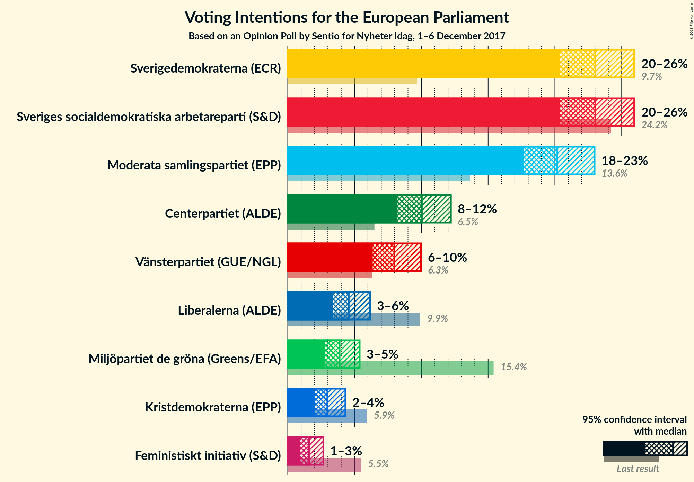
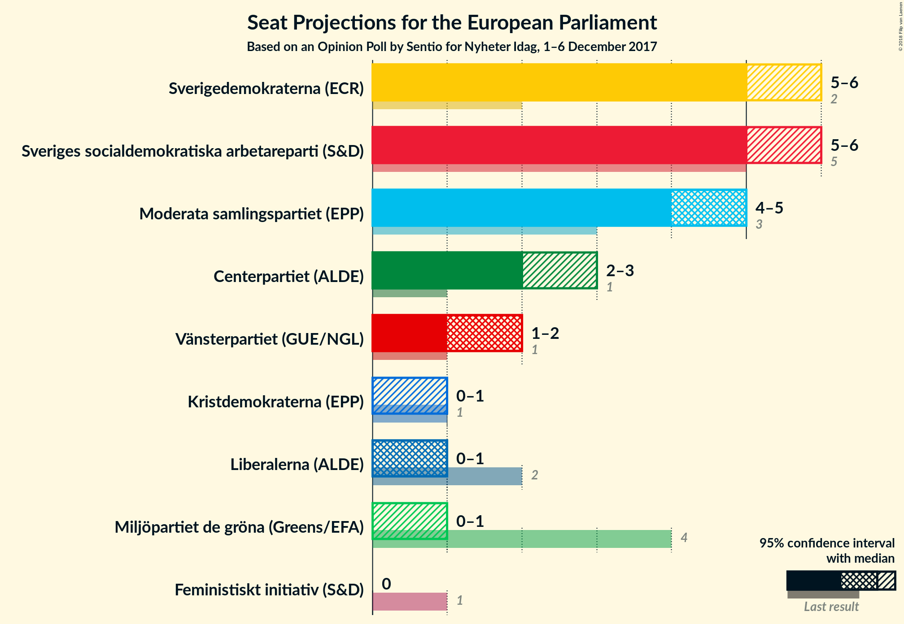
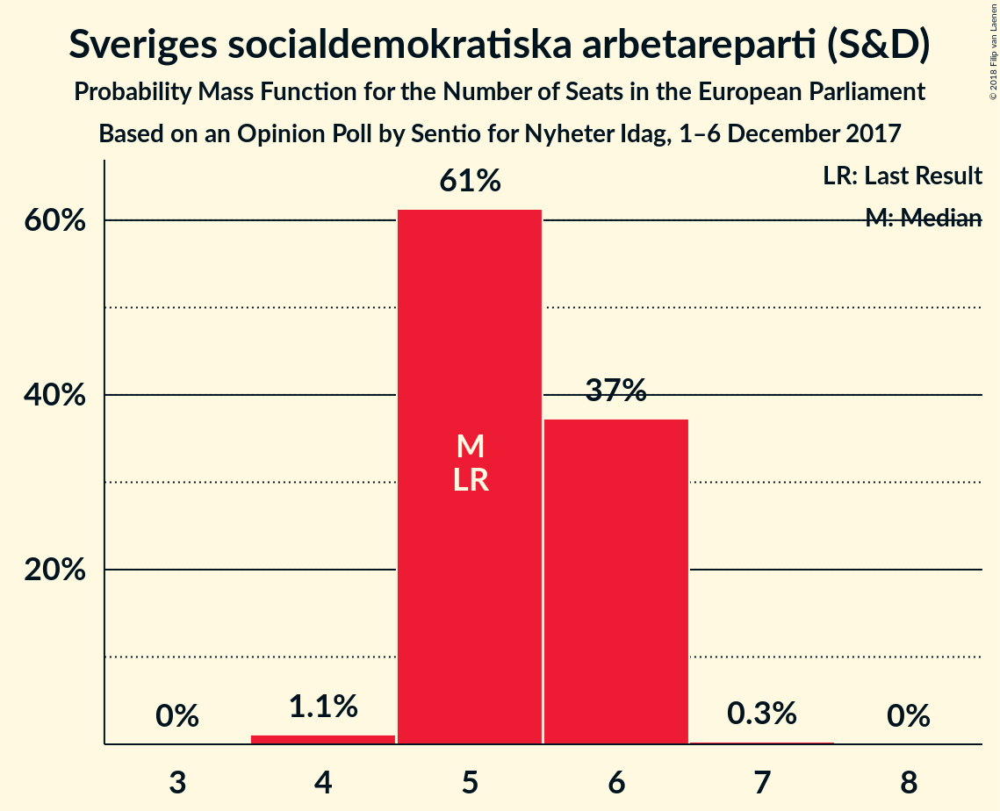
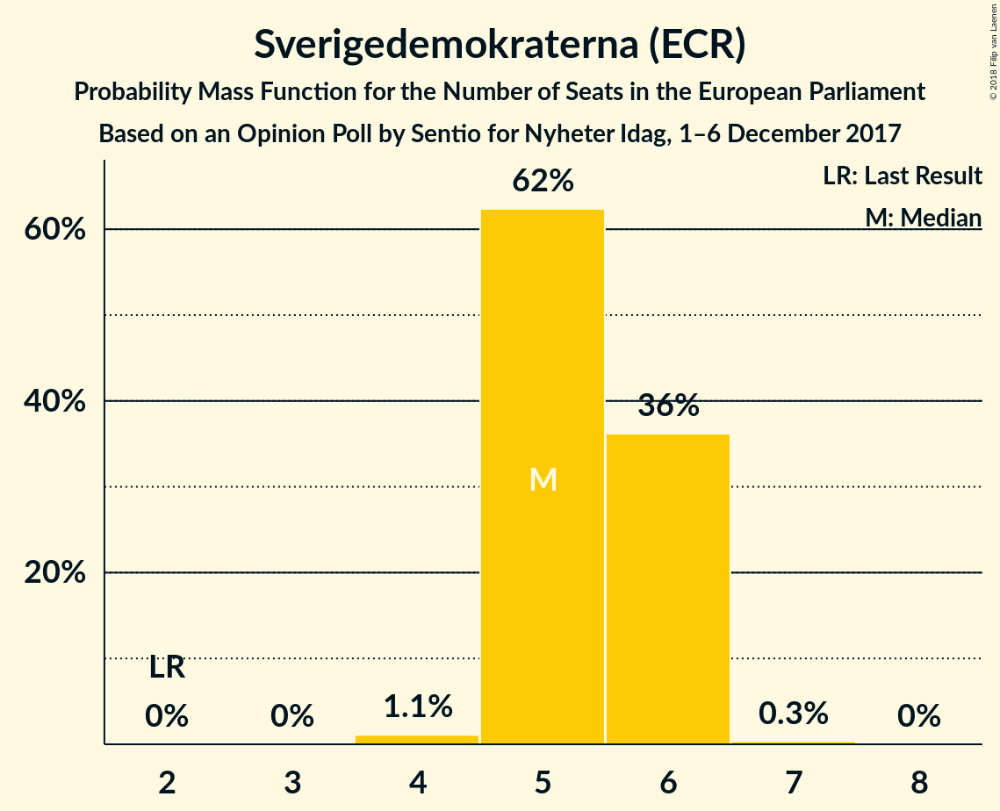
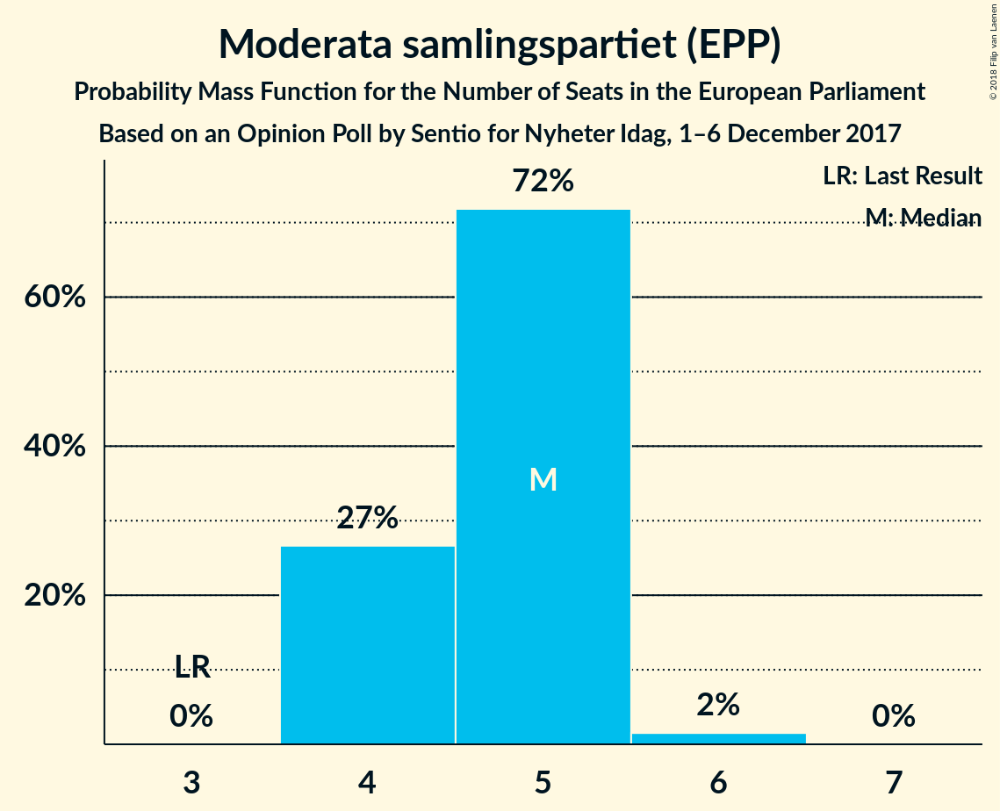
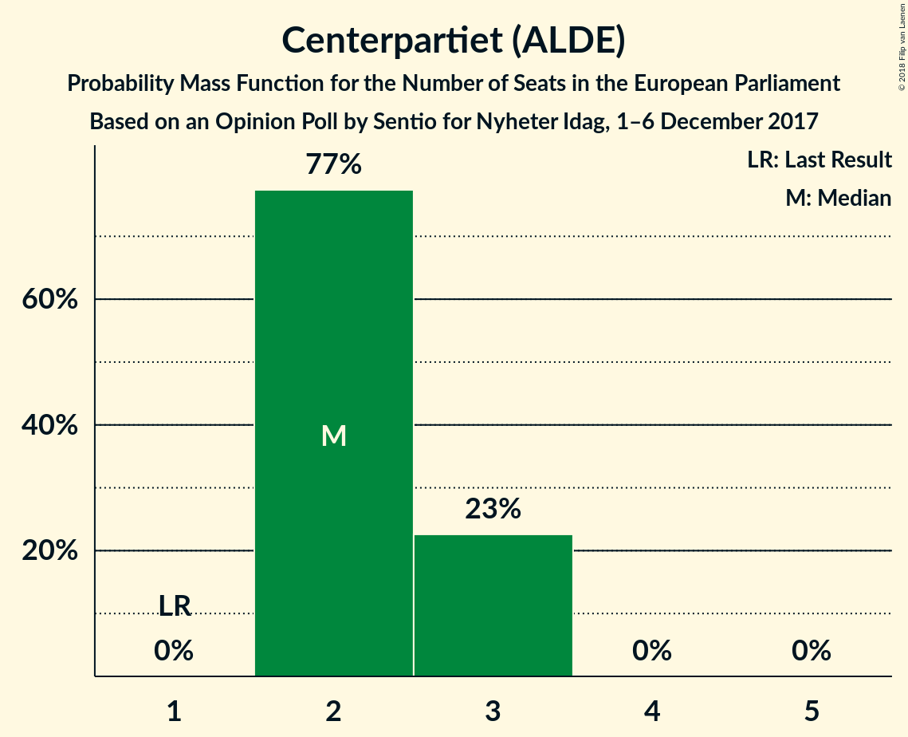
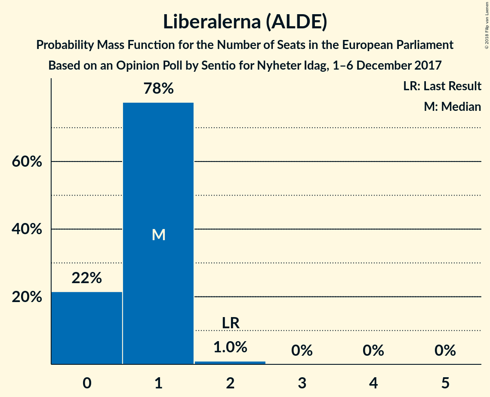
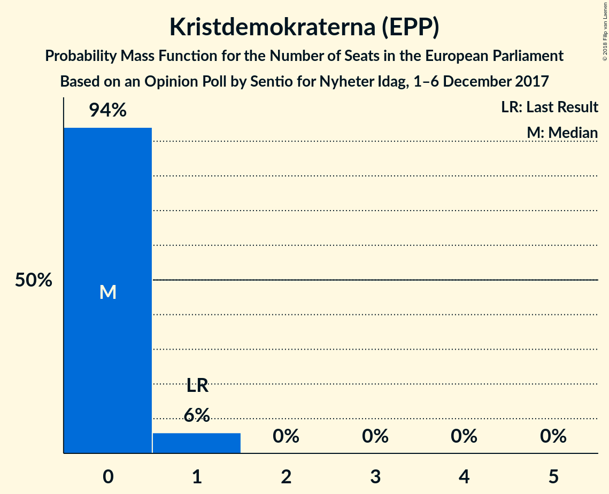
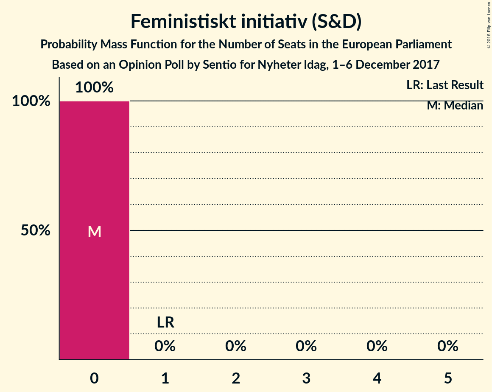
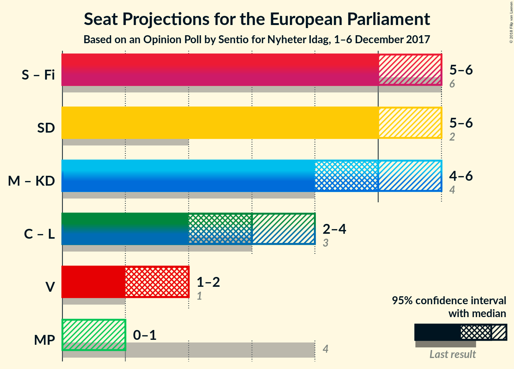

# Opinion Poll by Sentio for Nyheter Idag, 1–6 December 2017

<a href="#voting-intentions">Voting Intentions</a> | <a href="#seats">Seats</a> | <a href="#coalitions">Coalitions</a> | <a href="#technical-information">Technical Information</a>

## Voting Intentions

### Confidence Intervals

| Party | Last Result | Poll Result | 80% Confidence Interval | 90% Confidence Interval | 95% Confidence Interval | 99% Confidence Interval |
|:-----:|:-----------:|:-----------:|:-----------------------:|:-----------------------:|:-----------------------:|:-----------------------:|
| Sveriges socialdemokratiska arbetareparti (S&D) | 24.2% | 23.0% | 21.3–24.9% |20.8–25.5% |20.4–25.9% |19.5–26.9% |
| Sverigedemokraterna (ECR) | 9.7% | 23.0% | 21.3–24.9% |20.8–25.5% |20.4–25.9% |19.5–26.9% |
| Moderata samlingspartiet (EPP) | 13.6% | 20.2% | 18.5–22.0% |18.0–22.5% |17.6–23.0% |16.9–23.9% |
| Centerpartiet (ALDE) | 6.5% | 10.0% | 8.8–11.5% |8.5–11.9% |8.2–12.2% |7.7–12.9% |
| Vänsterpartiet (GUE/NGL) | 6.3% | 8.0% | 6.9–9.3% |6.6–9.6% |6.4–10.0% |5.9–10.6% |
| Liberalerna (ALDE) | 9.9% | 4.6% | 3.8–5.6% |3.6–5.9% |3.4–6.2% |3.0–6.7% |
| Miljöpartiet de gröna (Greens/EFA) | 15.4% | 3.9% | 3.2–4.8% |3.0–5.1% |2.8–5.4% |2.5–5.9% |
| Kristdemokraterna (EPP) | 5.9% | 3.0% | 2.3–3.8% |2.2–4.1% |2.0–4.3% |1.8–4.8% |
| Feministiskt initiativ (S&D) | 5.5% | 1.6% | 1.2–2.3% |1.1–2.5% |0.9–2.7% |0.8–3.0% |

*Note:* The poll result column reflects the actual value used in the calculations. Published results may vary slightly, and in addition be rounded to fewer digits.

## Seats

### Confidence Intervals

| Party | Last Result | Median | 80% Confidence Interval | 90% Confidence Interval | 95% Confidence Interval | 99% Confidence Interval |
|:-----:|:-----------:|:------:|:-----------------------:|:-----------------------:|:-----------------------:|:-----------------------:|
| <a href="#sveriges-socialdemokratiska-arbetareparti-(s&d)">Sveriges socialdemokratiska arbetareparti (S&D)</a> | 5 | 5 | 5–6 |5–6 |5–6 |4–6 |
| <a href="#sverigedemokraterna-(ecr)">Sverigedemokraterna (ECR)</a> | 2 | 5 | 5–6 |5–6 |5–6 |4–6 |
| <a href="#moderata-samlingspartiet-(epp)">Moderata samlingspartiet (EPP)</a> | 3 | 5 | 4–5 |4–5 |4–5 |4–6 |
| <a href="#centerpartiet-(alde)">Centerpartiet (ALDE)</a> | 1 | 2 | 2–3 |2–3 |2–3 |2–3 |
| <a href="#vänsterpartiet-(gue/ngl)">Vänsterpartiet (GUE/NGL)</a> | 1 | 2 | 2 |2 |1–2 |1–3 |
| <a href="#liberalerna-(alde)">Liberalerna (ALDE)</a> | 2 | 1 | 0–1 |0–1 |0–1 |0–2 |
| <a href="#miljöpartiet-de-gröna-(greens/efa)">Miljöpartiet de gröna (Greens/EFA)</a> | 4 | 0 | 0–1 |0–1 |0–1 |0–1 |
| <a href="#kristdemokraterna-(epp)">Kristdemokraterna (EPP)</a> | 1 | 0 | 0 |0–1 |0–1 |0–1 |
| <a href="#feministiskt-initiativ-(s&d)">Feministiskt initiativ (S&D)</a> | 1 | 0 | 0 |0 |0 |0 |

### Sveriges socialdemokratiska arbetareparti (S&D)

*For a full overview of the results for this party, see the [Sveriges socialdemokratiska arbetareparti (S&D)](party-sverigessocialdemokratiskaarbetarepartisd.html) page.*

| Number of Seats | Probability | Accumulated | Special Marks |
|:---------------:|:-----------:|:-----------:|:-------------:|
| 4 | 1.1% | 100% |  |
| 5 | 61% | 98.9% | Last Result, Median |
| 6 | 37% | 38% |  |
| 7 | 0.3% | 0.3% |  |
| 8 | 0% | 0% |  |

### Sverigedemokraterna (ECR)

*For a full overview of the results for this party, see the [Sverigedemokraterna (ECR)](party-sverigedemokraternaecr.html) page.*

| Number of Seats | Probability | Accumulated | Special Marks |
|:---------------:|:-----------:|:-----------:|:-------------:|
| 2 | 0% | 100% | Last Result |
| 3 | 0% | 100% |  |
| 4 | 1.1% | 100% |  |
| 5 | 62% | 98.9% | Median |
| 6 | 36% | 37% |  |
| 7 | 0.3% | 0.3% |  |
| 8 | 0% | 0% |  |

### Moderata samlingspartiet (EPP)

*For a full overview of the results for this party, see the [Moderata samlingspartiet (EPP)](party-moderatasamlingspartietepp.html) page.*

| Number of Seats | Probability | Accumulated | Special Marks |
|:---------------:|:-----------:|:-----------:|:-------------:|
| 3 | 0% | 100% | Last Result |
| 4 | 27% | 100% |  |
| 5 | 72% | 73% | Median |
| 6 | 2% | 2% |  |
| 7 | 0% | 0% |  |

### Centerpartiet (ALDE)

*For a full overview of the results for this party, see the [Centerpartiet (ALDE)](party-centerpartietalde.html) page.*

| Number of Seats | Probability | Accumulated | Special Marks |
|:---------------:|:-----------:|:-----------:|:-------------:|
| 1 | 0% | 100% | Last Result |
| 2 | 77% | 100% | Median |
| 3 | 23% | 23% |  |
| 4 | 0% | 0% |  |

### Vänsterpartiet (GUE/NGL)

*For a full overview of the results for this party, see the [Vänsterpartiet (GUE/NGL)](party-vänsterpartietguengl.html) page.*

| Number of Seats | Probability | Accumulated | Special Marks |
|:---------------:|:-----------:|:-----------:|:-------------:|
| 1 | 3% | 100% | Last Result |
| 2 | 96% | 97% | Median |
| 3 | 0.6% | 0.6% |  |
| 4 | 0% | 0% |  |

### Liberalerna (ALDE)

*For a full overview of the results for this party, see the [Liberalerna (ALDE)](party-liberalernaalde.html) page.*

| Number of Seats | Probability | Accumulated | Special Marks |
|:---------------:|:-----------:|:-----------:|:-------------:|
| 0 | 22% | 100% |  |
| 1 | 78% | 78% | Median |
| 2 | 1.0% | 1.0% | Last Result |
| 3 | 0% | 0% |  |

### Miljöpartiet de gröna (Greens/EFA)

*For a full overview of the results for this party, see the [Miljöpartiet de gröna (Greens/EFA)](party-miljöpartietdegrönagreensefa.html) page.*

| Number of Seats | Probability | Accumulated | Special Marks |
|:---------------:|:-----------:|:-----------:|:-------------:|
| 0 | 55% | 100% | Median |
| 1 | 45% | 45% |  |
| 2 | 0% | 0% |  |
| 3 | 0% | 0% |  |
| 4 | 0% | 0% | Last Result |

### Kristdemokraterna (EPP)

*For a full overview of the results for this party, see the [Kristdemokraterna (EPP)](party-kristdemokraternaepp.html) page.*

| Number of Seats | Probability | Accumulated | Special Marks |
|:---------------:|:-----------:|:-----------:|:-------------:|
| 0 | 94% | 100% | Median |
| 1 | 6% | 6% | Last Result |
| 2 | 0% | 0% |  |

### Feministiskt initiativ (S&D)

*For a full overview of the results for this party, see the [Feministiskt initiativ (S&D)](party-feministisktinitiativsd.html) page.*

| Number of Seats | Probability | Accumulated | Special Marks |
|:---------------:|:-----------:|:-----------:|:-------------:|
| 0 | 100% | 100% | Median |
| 1 | 0% | 0% | Last Result |

## Coalitions

### Confidence Intervals

| Coalition | Last Result | Median | Majority? | 80% Confidence Interval | 90% Confidence Interval | 95% Confidence Interval | 99% Confidence Interval |
|:---------:|:-----------:|:------:|:---------:|:-----------------------:|:-----------------------:|:-----------------------:|:-----------------------:|
| Sveriges socialdemokratiska arbetareparti (S&D) – Feministiskt initiativ (S&D) | 6 | 5 | 0% | 5–6 | 5–6 | 5–6 | 4–6 |
| Sverigedemokraterna (ECR) | 2 | 5 | 0% | 5–6 | 5–6 | 5–6 | 4–6 |
| Moderata samlingspartiet (EPP) – Kristdemokraterna (EPP) | 4 | 5 | 0% | 4–5 | 4–5 | 4–6 | 4–6 |
| Centerpartiet (ALDE) – Liberalerna (ALDE) | 3 | 3 | 0% | 2–4 | 2–4 | 2–4 | 2–4 |
| Vänsterpartiet (GUE/NGL) | 1 | 2 | 0% | 2 | 2 | 1–2 | 1–3 |
| Miljöpartiet de gröna (Greens/EFA) | 4 | 0 | 0% | 0–1 | 0–1 | 0–1 | 0–1 |

### Sveriges socialdemokratiska arbetareparti (S&D) – Feministiskt initiativ (S&D)

| Number of Seats | Probability | Accumulated | Special Marks |
|:---------------:|:-----------:|:-----------:|:-------------:|
| 4 | 1.1% | 100% |  |
| 5 | 61% | 98.9% | Median |
| 6 | 37% | 38% | Last Result |
| 7 | 0.3% | 0.3% |  |
| 8 | 0% | 0% |  |

### Sverigedemokraterna (ECR)

| Number of Seats | Probability | Accumulated | Special Marks |
|:---------------:|:-----------:|:-----------:|:-------------:|
| 2 | 0% | 100% | Last Result |
| 3 | 0% | 100% |  |
| 4 | 1.1% | 100% |  |
| 5 | 62% | 98.9% | Median |
| 6 | 36% | 37% |  |
| 7 | 0.3% | 0.3% |  |
| 8 | 0% | 0% |  |

### Moderata samlingspartiet (EPP) – Kristdemokraterna (EPP)

| Number of Seats | Probability | Accumulated | Special Marks |
|:---------------:|:-----------:|:-----------:|:-------------:|
| 4 | 24% | 100% | Last Result |
| 5 | 71% | 76% | Median |
| 6 | 5% | 5% |  |
| 7 | 0% | 0% |  |

### Centerpartiet (ALDE) – Liberalerna (ALDE)

| Number of Seats | Probability | Accumulated | Special Marks |
|:---------------:|:-----------:|:-----------:|:-------------:|
| 2 | 13% | 100% |  |
| 3 | 71% | 87% | Last Result, Median |
| 4 | 15% | 15% |  |
| 5 | 0.1% | 0.1% |  |
| 6 | 0% | 0% |  |

### Vänsterpartiet (GUE/NGL)

| Number of Seats | Probability | Accumulated | Special Marks |
|:---------------:|:-----------:|:-----------:|:-------------:|
| 1 | 3% | 100% | Last Result |
| 2 | 96% | 97% | Median |
| 3 | 0.6% | 0.6% |  |
| 4 | 0% | 0% |  |

### Miljöpartiet de gröna (Greens/EFA)

| Number of Seats | Probability | Accumulated | Special Marks |
|:---------------:|:-----------:|:-----------:|:-------------:|
| 0 | 55% | 100% | Median |
| 1 | 45% | 45% |  |
| 2 | 0% | 0% |  |
| 3 | 0% | 0% |  |
| 4 | 0% | 0% | Last Result |

## Technical Information

### Opinion Poll

+ **Polling firm:** Sentio
+ **Commissioner(s):** Nyheter Idag
+ **Fieldwork period:** 1–6 December 2017

### Calculations

+ **Sample size:** 877
+ **Simulations done:** 1,048,576
+ **Error estimate:** 1.11%

