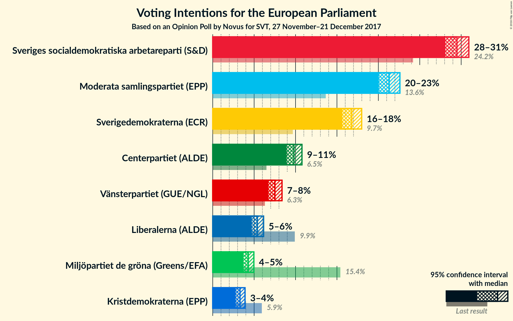
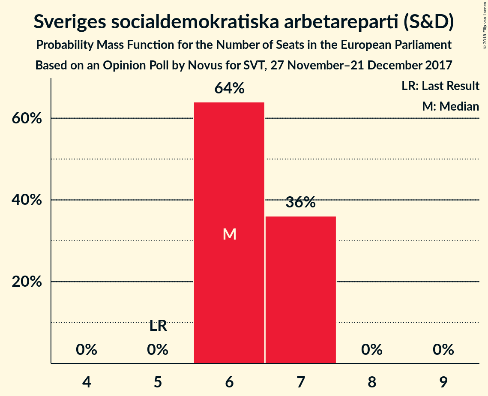
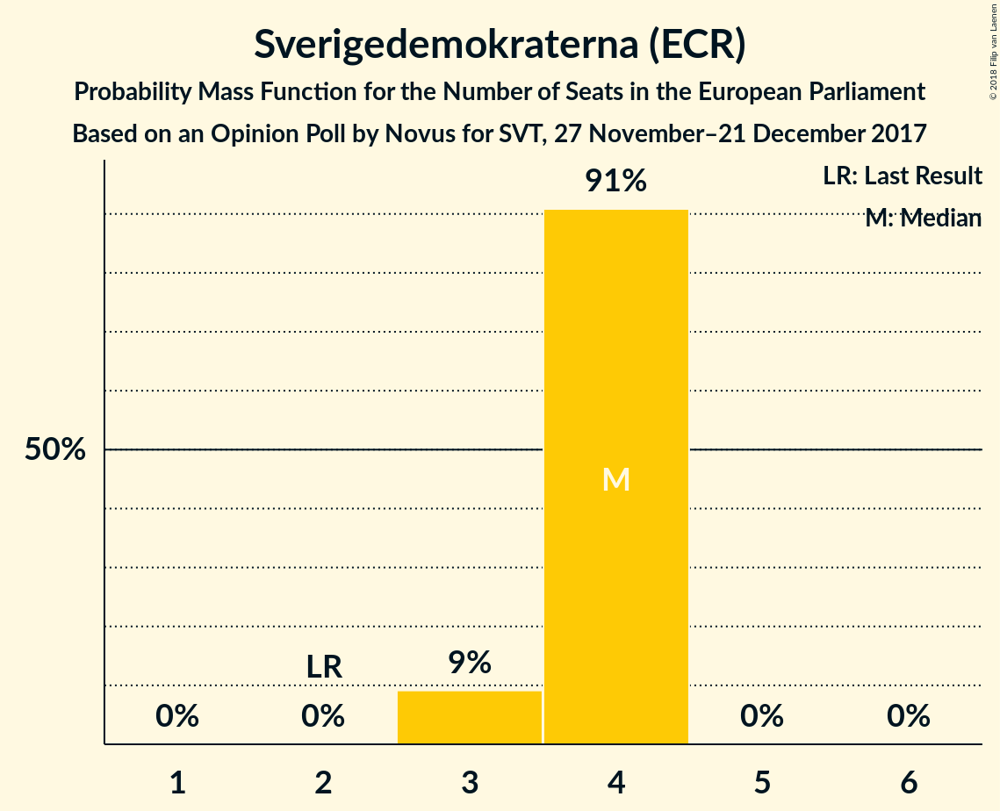
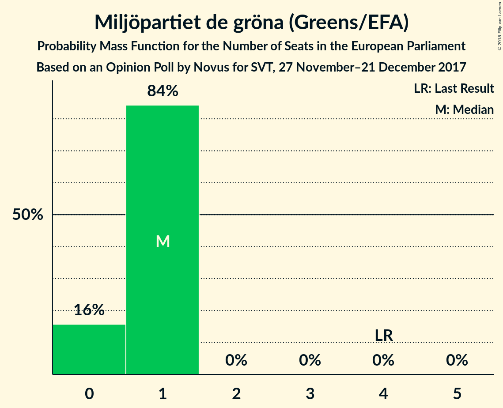
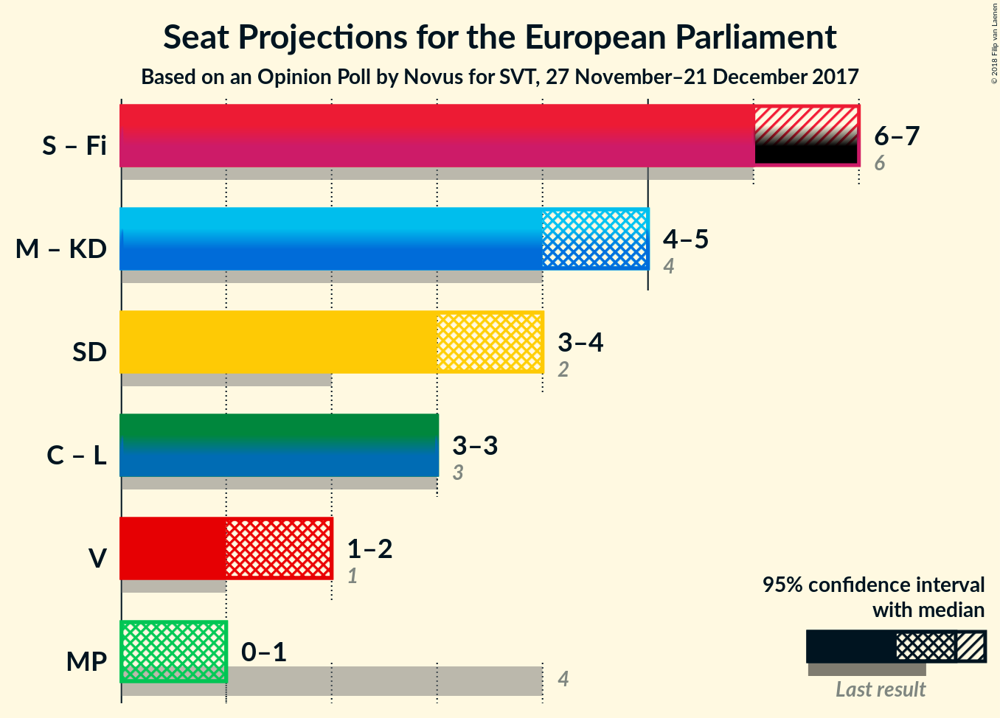

# Opinion Poll by Novus for SVT, 27 November–21 December 2017

<a href="#voting-intentions">Voting Intentions</a> | <a href="#seats">Seats</a> | <a href="#coalitions">Coalitions</a> | <a href="#technical-information">Technical Information</a>

## Voting Intentions

### Confidence Intervals

| Party | Last Result | Poll Result | 80% Confidence Interval | 90% Confidence Interval | 95% Confidence Interval | 99% Confidence Interval |
|:-----:|:-----------:|:-----------:|:-----------------------:|:-----------------------:|:-----------------------:|:-----------------------:|
| Sveriges socialdemokratiska arbetareparti (S&D) | 24.2% | 29.5% | 28.6–30.4% |28.3–30.7% |28.1–30.9% |27.7–31.4% |
| Moderata samlingspartiet (EPP) | 13.6% | 21.3% | 20.5–22.2% |20.3–22.4% |20.1–22.6% |19.7–23.0% |
| Sverigedemokraterna (ECR) | 9.7% | 16.8% | 16.0–17.6% |15.8–17.8% |15.7–18.0% |15.3–18.4% |
| Centerpartiet (ALDE) | 6.5% | 9.8% | 9.2–10.4% |9.1–10.6% |8.9–10.8% |8.6–11.1% |
| Vänsterpartiet (GUE/NGL) | 6.3% | 7.5% | 7.0–8.1% |6.8–8.2% |6.7–8.4% |6.5–8.7% |
| Liberalerna (ALDE) | 9.9% | 5.4% | 5.0–5.9% |4.8–6.0% |4.7–6.1% |4.5–6.4% |
| Miljöpartiet de gröna (Greens/EFA) | 15.4% | 4.3% | 3.9–4.7% |3.8–4.9% |3.7–5.0% |3.5–5.2% |
| Kristdemokraterna (EPP) | 5.9% | 3.3% | 3.0–3.7% |2.9–3.8% |2.8–3.9% |2.6–4.1% |

*Note:* The poll result column reflects the actual value used in the calculations. Published results may vary slightly, and in addition be rounded to fewer digits.

## Seats

### Confidence Intervals

| Party | Last Result | Median | 80% Confidence Interval | 90% Confidence Interval | 95% Confidence Interval | 99% Confidence Interval |
|:-----:|:-----------:|:------:|:-----------------------:|:-----------------------:|:-----------------------:|:-----------------------:|
| <a href="#sveriges-socialdemokratiska-arbetareparti-(s&d)">Sveriges socialdemokratiska arbetareparti (S&D)</a> | 5 | 6 | 6–7 |6–7 |6–7 |6–7 |
| <a href="#moderata-samlingspartiet-(epp)">Moderata samlingspartiet (EPP)</a> | 3 | 5 | 5 |4–5 |4–5 |4–5 |
| <a href="#sverigedemokraterna-(ecr)">Sverigedemokraterna (ECR)</a> | 2 | 4 | 4 |3–4 |3–4 |3–4 |
| <a href="#centerpartiet-(alde)">Centerpartiet (ALDE)</a> | 1 | 2 | 2 |2 |2 |2 |
| <a href="#vänsterpartiet-(gue/ngl)">Vänsterpartiet (GUE/NGL)</a> | 1 | 2 | 2 |1–2 |1–2 |1–2 |
| <a href="#liberalerna-(alde)">Liberalerna (ALDE)</a> | 2 | 1 | 1 |1 |1 |1 |
| <a href="#miljöpartiet-de-gröna-(greens/efa)">Miljöpartiet de gröna (Greens/EFA)</a> | 4 | 1 | 1 |0–1 |0–1 |0–1 |
| <a href="#kristdemokraterna-(epp)">Kristdemokraterna (EPP)</a> | 1 | 0 | 0 |0 |0 |0–1 |

### Sveriges socialdemokratiska arbetareparti (S&D)

*For a full overview of the results for this party, see the [Sveriges socialdemokratiska arbetareparti (S&D)](party-sverigessocialdemokratiskaarbetarepartisd.html) page.*

| Number of Seats | Probability | Accumulated | Special Marks |
|:---------------:|:-----------:|:-----------:|:-------------:|
| 5 | 0% | 100% | Last Result |
| 6 | 69% | 100% | Median |
| 7 | 31% | 31% |  |
| 8 | 0% | 0% |  |

### Moderata samlingspartiet (EPP)

*For a full overview of the results for this party, see the [Moderata samlingspartiet (EPP)](party-moderatasamlingspartietepp.html) page.*

| Number of Seats | Probability | Accumulated | Special Marks |
|:---------------:|:-----------:|:-----------:|:-------------:|
| 3 | 0% | 100% | Last Result |
| 4 | 8% | 100% |  |
| 5 | 92% | 92% | Median |
| 6 | 0% | 0% |  |

### Sverigedemokraterna (ECR)

*For a full overview of the results for this party, see the [Sverigedemokraterna (ECR)](party-sverigedemokraternaecr.html) page.*

| Number of Seats | Probability | Accumulated | Special Marks |
|:---------------:|:-----------:|:-----------:|:-------------:|
| 2 | 0% | 100% | Last Result |
| 3 | 8% | 100% |  |
| 4 | 92% | 92% | Median |
| 5 | 0% | 0% |  |

### Centerpartiet (ALDE)

*For a full overview of the results for this party, see the [Centerpartiet (ALDE)](party-centerpartietalde.html) page.*

| Number of Seats | Probability | Accumulated | Special Marks |
|:---------------:|:-----------:|:-----------:|:-------------:|
| 1 | 0% | 100% | Last Result |
| 2 | 99.8% | 100% | Median |
| 3 | 0.2% | 0.2% |  |
| 4 | 0% | 0% |  |

### Vänsterpartiet (GUE/NGL)

*For a full overview of the results for this party, see the [Vänsterpartiet (GUE/NGL)](party-vänsterpartietguengl.html) page.*

| Number of Seats | Probability | Accumulated | Special Marks |
|:---------------:|:-----------:|:-----------:|:-------------:|
| 1 | 8% | 100% | Last Result |
| 2 | 92% | 92% | Median |
| 3 | 0% | 0% |  |

### Liberalerna (ALDE)

*For a full overview of the results for this party, see the [Liberalerna (ALDE)](party-liberalernaalde.html) page.*

| Number of Seats | Probability | Accumulated | Special Marks |
|:---------------:|:-----------:|:-----------:|:-------------:|
| 1 | 100% | 100% | Median |
| 2 | 0% | 0% | Last Result |

### Miljöpartiet de gröna (Greens/EFA)

*For a full overview of the results for this party, see the [Miljöpartiet de gröna (Greens/EFA)](party-miljöpartietdegrönagreensefa.html) page.*

| Number of Seats | Probability | Accumulated | Special Marks |
|:---------------:|:-----------:|:-----------:|:-------------:|
| 0 | 7% | 100% |  |
| 1 | 93% | 93% | Median |
| 2 | 0% | 0% |  |
| 3 | 0% | 0% |  |
| 4 | 0% | 0% | Last Result |

### Kristdemokraterna (EPP)

*For a full overview of the results for this party, see the [Kristdemokraterna (EPP)](party-kristdemokraternaepp.html) page.*

| Number of Seats | Probability | Accumulated | Special Marks |
|:---------------:|:-----------:|:-----------:|:-------------:|
| 0 | 99.3% | 100% | Median |
| 1 | 0.7% | 0.7% | Last Result |
| 2 | 0% | 0% |  |

## Coalitions

### Confidence Intervals

| Coalition | Last Result | Median | Majority? | 80% Confidence Interval | 90% Confidence Interval | 95% Confidence Interval | 99% Confidence Interval |
|:---------:|:-----------:|:------:|:---------:|:-----------------------:|:-----------------------:|:-----------------------:|:-----------------------:|
| Moderata samlingspartiet (EPP) – Kristdemokraterna (EPP) | 4 | 5 | 0% | 5 | 4–5 | 4–5 | 4–6 |
| Sverigedemokraterna (ECR) | 2 | 4 | 0% | 4 | 3–4 | 3–4 | 3–4 |
| Centerpartiet (ALDE) – Liberalerna (ALDE) | 3 | 3 | 0% | 3 | 3 | 3 | 3 |
| Vänsterpartiet (GUE/NGL) | 1 | 2 | 0% | 2 | 1–2 | 1–2 | 1–2 |
| Miljöpartiet de gröna (Greens/EFA) | 4 | 1 | 0% | 1 | 0–1 | 0–1 | 0–1 |

### Moderata samlingspartiet (EPP) – Kristdemokraterna (EPP)

| Number of Seats | Probability | Accumulated | Special Marks |
|:---------------:|:-----------:|:-----------:|:-------------:|
| 4 | 8% | 100% | Last Result |
| 5 | 92% | 92% | Median |
| 6 | 0.6% | 0.6% |  |
| 7 | 0% | 0% |  |

### Sverigedemokraterna (ECR)

| Number of Seats | Probability | Accumulated | Special Marks |
|:---------------:|:-----------:|:-----------:|:-------------:|
| 2 | 0% | 100% | Last Result |
| 3 | 8% | 100% |  |
| 4 | 92% | 92% | Median |
| 5 | 0% | 0% |  |

### Centerpartiet (ALDE) – Liberalerna (ALDE)

| Number of Seats | Probability | Accumulated | Special Marks |
|:---------------:|:-----------:|:-----------:|:-------------:|
| 3 | 99.8% | 100% | Last Result, Median |
| 4 | 0.2% | 0.2% |  |
| 5 | 0% | 0% |  |

### Vänsterpartiet (GUE/NGL)

| Number of Seats | Probability | Accumulated | Special Marks |
|:---------------:|:-----------:|:-----------:|:-------------:|
| 1 | 8% | 100% | Last Result |
| 2 | 92% | 92% | Median |
| 3 | 0% | 0% |  |

### Miljöpartiet de gröna (Greens/EFA)

| Number of Seats | Probability | Accumulated | Special Marks |
|:---------------:|:-----------:|:-----------:|:-------------:|
| 0 | 7% | 100% |  |
| 1 | 93% | 93% | Median |
| 2 | 0% | 0% |  |
| 3 | 0% | 0% |  |
| 4 | 0% | 0% | Last Result |

## Technical Information

### Opinion Poll

+ **Polling firm:** Novus
+ **Commissioner(s):** SVT
+ **Fieldwork period:** 27 November–21 December 2017

### Calculations

+ **Sample size:** 4008
+ **Simulations done:** 131,072
+ **Error estimate:** 0.49%

