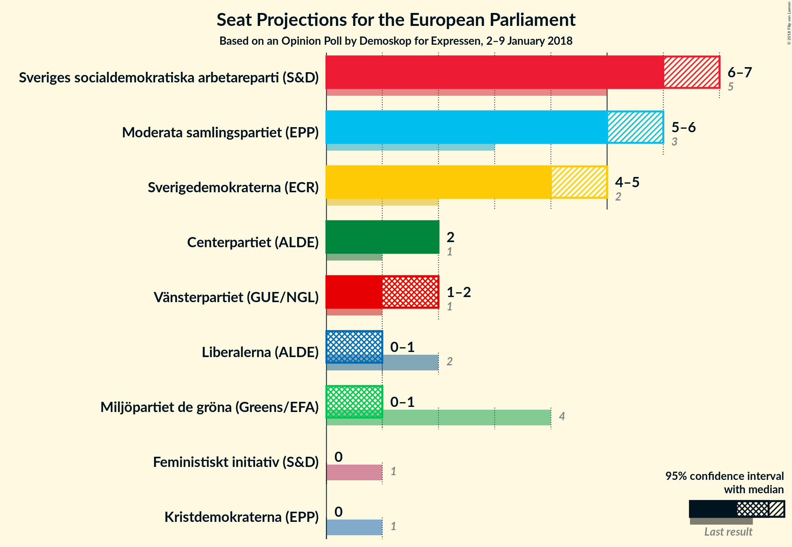
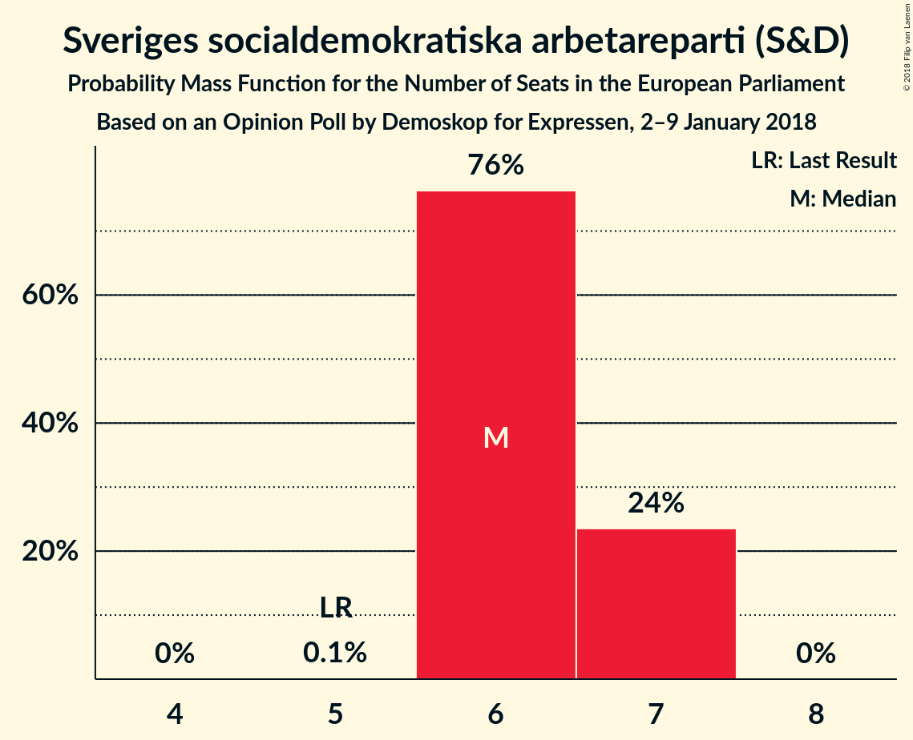
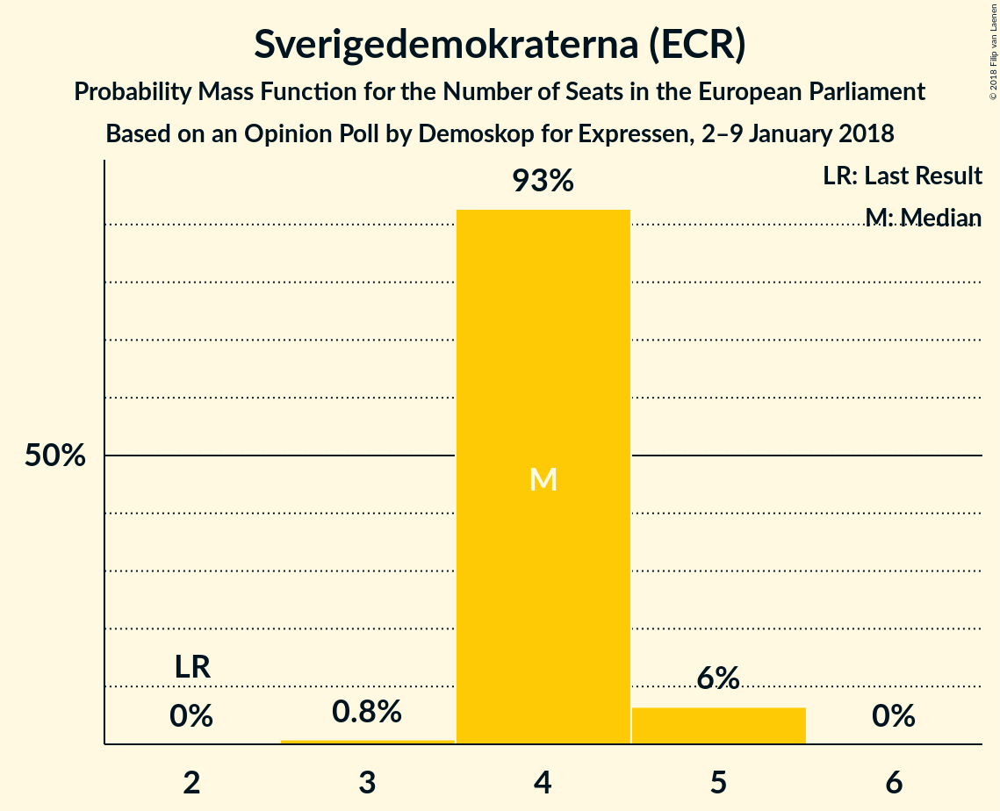
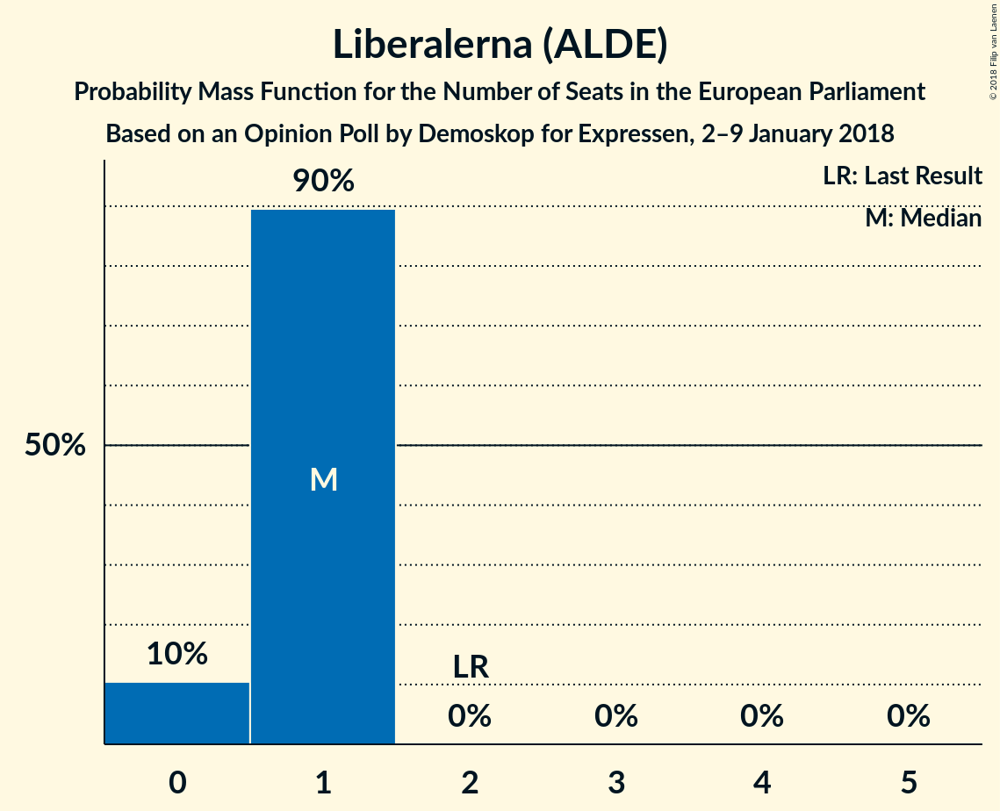
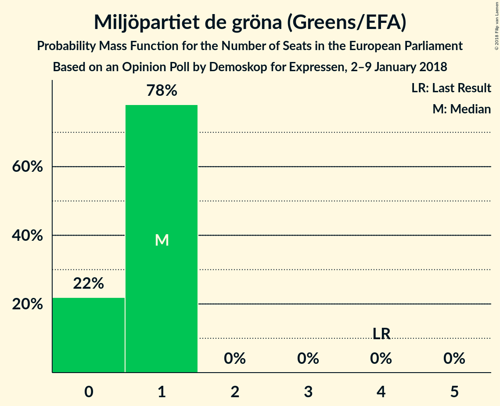
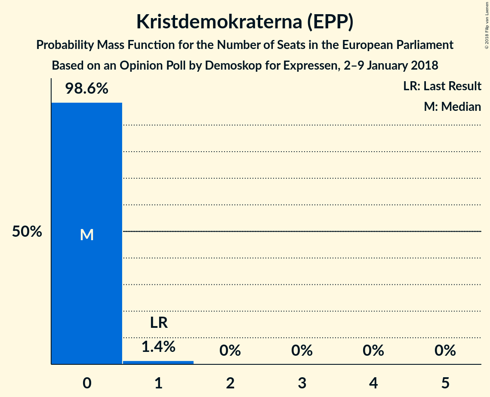
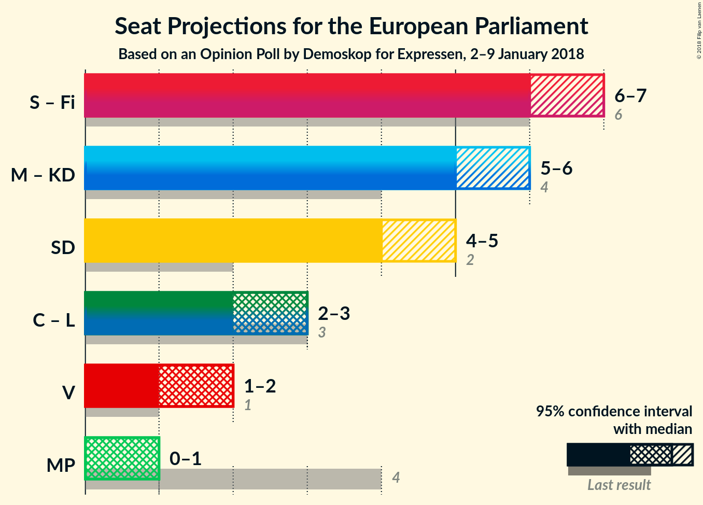

# Opinion Poll by Demoskop for Expressen, 2–9 January 2018

<a href="#voting-intentions">Voting Intentions</a> | <a href="#seats">Seats</a> | <a href="#coalitions">Coalitions</a> | <a href="#technical-information">Technical Information</a>

## Voting Intentions

### Confidence Intervals

| Party | Last Result | Poll Result | 80% Confidence Interval | 90% Confidence Interval | 95% Confidence Interval | 99% Confidence Interval |
|:-----:|:-----------:|:-----------:|:-----------------------:|:-----------------------:|:-----------------------:|:-----------------------:|
| Sveriges socialdemokratiska arbetareparti (S&D) | 24.2% | 27.8% | 26.4–29.3% |26.0–29.7% |25.7–30.0% |25.0–30.7% |
| Moderata samlingspartiet (EPP) | 13.6% | 22.6% | 21.3–24.0% |20.9–24.4% |20.6–24.7% |20.0–25.4% |
| Sverigedemokraterna (ECR) | 9.7% | 17.9% | 16.8–19.2% |16.4–19.6% |16.1–19.9% |15.6–20.5% |
| Centerpartiet (ALDE) | 6.5% | 9.2% | 8.3–10.2% |8.1–10.5% |7.9–10.7% |7.5–11.2% |
| Vänsterpartiet (GUE/NGL) | 6.3% | 7.2% | 6.4–8.1% |6.2–8.4% |6.0–8.6% |5.7–9.0% |
| Liberalerna (ALDE) | 9.9% | 4.5% | 3.9–5.3% |3.7–5.5% |3.6–5.7% |3.3–6.0% |
| Miljöpartiet de gröna (Greens/EFA) | 15.4% | 4.4% | 3.8–5.1% |3.6–5.3% |3.5–5.5% |3.2–5.9% |
| Kristdemokraterna (EPP) | 5.9% | 2.9% | 2.4–3.5% |2.3–3.7% |2.2–3.9% |2.0–4.2% |
| Feministiskt initiativ (S&D) | 5.5% | 1.9% | 1.5–2.4% |1.4–2.6% |1.4–2.7% |1.2–3.0% |

*Note:* The poll result column reflects the actual value used in the calculations. Published results may vary slightly, and in addition be rounded to fewer digits.

## Seats

### Confidence Intervals

| Party | Last Result | Median | 80% Confidence Interval | 90% Confidence Interval | 95% Confidence Interval | 99% Confidence Interval |
|:-----:|:-----------:|:------:|:-----------------------:|:-----------------------:|:-----------------------:|:-----------------------:|
| <a href="#sveriges-socialdemokratiska-arbetareparti-(s&d)">Sveriges socialdemokratiska arbetareparti (S&D)</a> | 5 | 6 | 6–7 |6–7 |6–7 |6–7 |
| <a href="#moderata-samlingspartiet-(epp)">Moderata samlingspartiet (EPP)</a> | 3 | 5 | 5 |5–6 |5–6 |4–6 |
| <a href="#sverigedemokraterna-(ecr)">Sverigedemokraterna (ECR)</a> | 2 | 4 | 4–5 |4–5 |4–5 |3–5 |
| <a href="#centerpartiet-(alde)">Centerpartiet (ALDE)</a> | 1 | 2 | 2 |2 |2 |2–3 |
| <a href="#vänsterpartiet-(gue/ngl)">Vänsterpartiet (GUE/NGL)</a> | 1 | 2 | 1–2 |1–2 |1–2 |1–2 |
| <a href="#liberalerna-(alde)">Liberalerna (ALDE)</a> | 2 | 1 | 0–1 |0–1 |0–1 |0–1 |
| <a href="#miljöpartiet-de-gröna-(greens/efa)">Miljöpartiet de gröna (Greens/EFA)</a> | 4 | 1 | 0–1 |0–1 |0–1 |0–1 |
| <a href="#kristdemokraterna-(epp)">Kristdemokraterna (EPP)</a> | 1 | 0 | 0 |0 |0 |0–1 |
| <a href="#feministiskt-initiativ-(s&d)">Feministiskt initiativ (S&D)</a> | 1 | 0 | 0 |0 |0 |0 |

### Sveriges socialdemokratiska arbetareparti (S&D)

*For a full overview of the results for this party, see the [Sveriges socialdemokratiska arbetareparti (S&D)](party-sverigessocialdemokratiskaarbetarepartisd.html) page.*

| Number of Seats | Probability | Accumulated | Special Marks |
|:---------------:|:-----------:|:-----------:|:-------------:|
| 5 | 0.1% | 100% | Last Result |
| 6 | 73% | 99.9% | Median |
| 7 | 27% | 27% |  |
| 8 | 0% | 0% |  |

### Moderata samlingspartiet (EPP)

*For a full overview of the results for this party, see the [Moderata samlingspartiet (EPP)](party-moderatasamlingspartietepp.html) page.*

| Number of Seats | Probability | Accumulated | Special Marks |
|:---------------:|:-----------:|:-----------:|:-------------:|
| 3 | 0% | 100% | Last Result |
| 4 | 1.3% | 100% |  |
| 5 | 89% | 98.7% | Median |
| 6 | 9% | 9% |  |
| 7 | 0% | 0% |  |

### Sverigedemokraterna (ECR)

*For a full overview of the results for this party, see the [Sverigedemokraterna (ECR)](party-sverigedemokraternaecr.html) page.*

| Number of Seats | Probability | Accumulated | Special Marks |
|:---------------:|:-----------:|:-----------:|:-------------:|
| 2 | 0% | 100% | Last Result |
| 3 | 0.6% | 100% |  |
| 4 | 89% | 99.4% | Median |
| 5 | 11% | 11% |  |
| 6 | 0% | 0% |  |

### Centerpartiet (ALDE)

*For a full overview of the results for this party, see the [Centerpartiet (ALDE)](party-centerpartietalde.html) page.*

| Number of Seats | Probability | Accumulated | Special Marks |
|:---------------:|:-----------:|:-----------:|:-------------:|
| 1 | 0% | 100% | Last Result |
| 2 | 98% | 100% | Median |
| 3 | 2% | 2% |  |
| 4 | 0% | 0% |  |

### Vänsterpartiet (GUE/NGL)

*For a full overview of the results for this party, see the [Vänsterpartiet (GUE/NGL)](party-vänsterpartietguengl.html) page.*

| Number of Seats | Probability | Accumulated | Special Marks |
|:---------------:|:-----------:|:-----------:|:-------------:|
| 1 | 14% | 100% | Last Result |
| 2 | 86% | 86% | Median |
| 3 | 0% | 0% |  |

### Liberalerna (ALDE)

*For a full overview of the results for this party, see the [Liberalerna (ALDE)](party-liberalernaalde.html) page.*

| Number of Seats | Probability | Accumulated | Special Marks |
|:---------------:|:-----------:|:-----------:|:-------------:|
| 0 | 10% | 100% |  |
| 1 | 90% | 90% | Median |
| 2 | 0% | 0% | Last Result |

### Miljöpartiet de gröna (Greens/EFA)

*For a full overview of the results for this party, see the [Miljöpartiet de gröna (Greens/EFA)](party-miljöpartietdegrönagreensefa.html) page.*

| Number of Seats | Probability | Accumulated | Special Marks |
|:---------------:|:-----------:|:-----------:|:-------------:|
| 0 | 24% | 100% |  |
| 1 | 76% | 76% | Median |
| 2 | 0% | 0% |  |
| 3 | 0% | 0% |  |
| 4 | 0% | 0% | Last Result |

### Kristdemokraterna (EPP)

*For a full overview of the results for this party, see the [Kristdemokraterna (EPP)](party-kristdemokraternaepp.html) page.*

| Number of Seats | Probability | Accumulated | Special Marks |
|:---------------:|:-----------:|:-----------:|:-------------:|
| 0 | 98.7% | 100% | Median |
| 1 | 1.3% | 1.3% | Last Result |
| 2 | 0% | 0% |  |

### Feministiskt initiativ (S&D)

*For a full overview of the results for this party, see the [Feministiskt initiativ (S&D)](party-feministisktinitiativsd.html) page.*

| Number of Seats | Probability | Accumulated | Special Marks |
|:---------------:|:-----------:|:-----------:|:-------------:|
| 0 | 100% | 100% | Median |
| 1 | 0% | 0% | Last Result |

## Coalitions

### Confidence Intervals

| Coalition | Last Result | Median | Majority? | 80% Confidence Interval | 90% Confidence Interval | 95% Confidence Interval | 99% Confidence Interval |
|:---------:|:-----------:|:------:|:---------:|:-----------------------:|:-----------------------:|:-----------------------:|:-----------------------:|
| Sveriges socialdemokratiska arbetareparti (S&D) – Feministiskt initiativ (S&D) | 6 | 6 | 0% | 6–7 | 6–7 | 6–7 | 6–7 |
| Moderata samlingspartiet (EPP) – Kristdemokraterna (EPP) | 4 | 5 | 0% | 5–6 | 5–6 | 5–6 | 4–6 |
| Sverigedemokraterna (ECR) | 2 | 4 | 0% | 4–5 | 4–5 | 4–5 | 3–5 |
| Centerpartiet (ALDE) – Liberalerna (ALDE) | 3 | 3 | 0% | 3 | 2–3 | 2–3 | 2–4 |
| Vänsterpartiet (GUE/NGL) | 1 | 2 | 0% | 1–2 | 1–2 | 1–2 | 1–2 |
| Miljöpartiet de gröna (Greens/EFA) | 4 | 1 | 0% | 0–1 | 0–1 | 0–1 | 0–1 |

### Sveriges socialdemokratiska arbetareparti (S&D) – Feministiskt initiativ (S&D)

| Number of Seats | Probability | Accumulated | Special Marks |
|:---------------:|:-----------:|:-----------:|:-------------:|
| 5 | 0.1% | 100% |  |
| 6 | 73% | 99.9% | Last Result, Median |
| 7 | 27% | 27% |  |
| 8 | 0% | 0% |  |

### Moderata samlingspartiet (EPP) – Kristdemokraterna (EPP)

| Number of Seats | Probability | Accumulated | Special Marks |
|:---------------:|:-----------:|:-----------:|:-------------:|
| 4 | 1.1% | 100% | Last Result |
| 5 | 88% | 98.9% | Median |
| 6 | 10% | 10% |  |
| 7 | 0% | 0% |  |

### Sverigedemokraterna (ECR)

| Number of Seats | Probability | Accumulated | Special Marks |
|:---------------:|:-----------:|:-----------:|:-------------:|
| 2 | 0% | 100% | Last Result |
| 3 | 0.6% | 100% |  |
| 4 | 89% | 99.4% | Median |
| 5 | 11% | 11% |  |
| 6 | 0% | 0% |  |

### Centerpartiet (ALDE) – Liberalerna (ALDE)

| Number of Seats | Probability | Accumulated | Special Marks |
|:---------------:|:-----------:|:-----------:|:-------------:|
| 2 | 9% | 100% |  |
| 3 | 90% | 91% | Last Result, Median |
| 4 | 0.7% | 0.7% |  |
| 5 | 0% | 0% |  |

### Vänsterpartiet (GUE/NGL)

| Number of Seats | Probability | Accumulated | Special Marks |
|:---------------:|:-----------:|:-----------:|:-------------:|
| 1 | 14% | 100% | Last Result |
| 2 | 86% | 86% | Median |
| 3 | 0% | 0% |  |

### Miljöpartiet de gröna (Greens/EFA)

| Number of Seats | Probability | Accumulated | Special Marks |
|:---------------:|:-----------:|:-----------:|:-------------:|
| 0 | 24% | 100% |  |
| 1 | 76% | 76% | Median |
| 2 | 0% | 0% |  |
| 3 | 0% | 0% |  |
| 4 | 0% | 0% | Last Result |

## Technical Information

### Opinion Poll

+ **Polling firm:** Demoskop
+ **Commissioner(s):** Expressen
+ **Fieldwork period:** 2–9 January 2018

### Calculations

+ **Sample size:** 1612
+ **Simulations done:** 524,288
+ **Error estimate:** 2.12%

