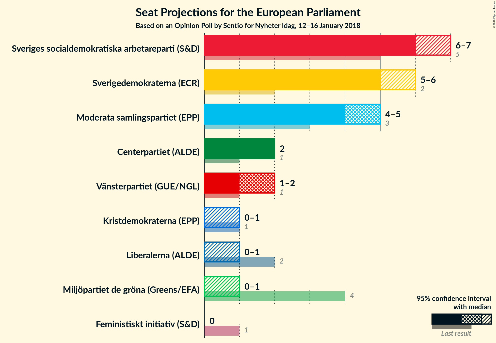
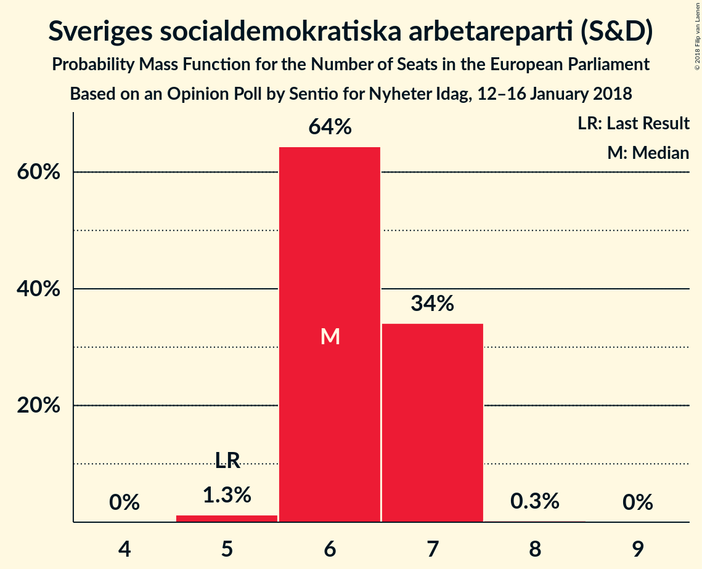
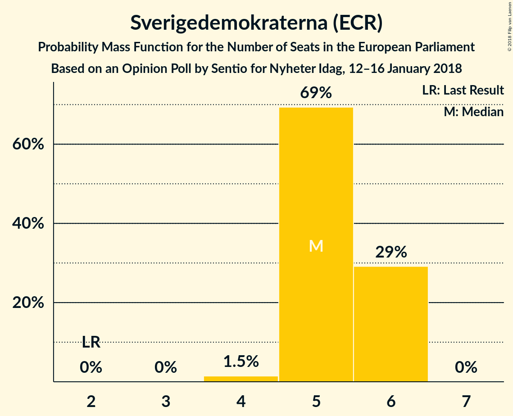
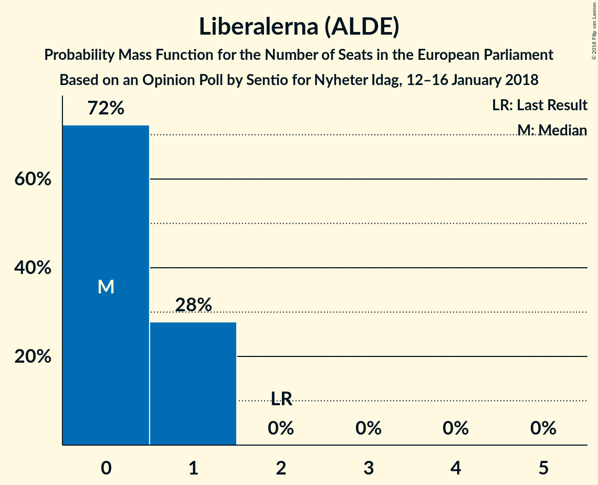

# Opinion Poll by Sentio for Nyheter Idag, 12–16 January 2018

<a href="#voting-intentions">Voting Intentions</a> | <a href="#seats">Seats</a> | <a href="#coalitions">Coalitions</a> | <a href="#technical-information">Technical Information</a>

## Voting Intentions

### Confidence Intervals

| Party | Last Result | Poll Result | 80% Confidence Interval | 90% Confidence Interval | 95% Confidence Interval | 99% Confidence Interval |
|:-----:|:-----------:|:-----------:|:-----------------------:|:-----------------------:|:-----------------------:|:-----------------------:|
| Sveriges socialdemokratiska arbetareparti (S&D) | 24.2% | 27.0% | 25.4–28.7% |25.0–29.2% |24.6–29.6% |23.8–30.5% |
| Sverigedemokraterna (ECR) | 9.7% | 22.2% | 20.7–23.8% |20.3–24.2% |19.9–24.6% |19.2–25.4% |
| Moderata samlingspartiet (EPP) | 13.6% | 19.9% | 18.5–21.4% |18.1–21.9% |17.7–22.3% |17.1–23.0% |
| Centerpartiet (ALDE) | 6.5% | 8.6% | 7.6–9.7% |7.3–10.0% |7.1–10.3% |6.7–10.9% |
| Vänsterpartiet (GUE/NGL) | 6.3% | 7.1% | 6.3–8.2% |6.0–8.5% |5.8–8.7% |5.4–9.3% |
| Miljöpartiet de gröna (Greens/EFA) | 15.4% | 3.8% | 3.2–4.6% |3.0–4.8% |2.8–5.0% |2.6–5.4% |
| Liberalerna (ALDE) | 9.9% | 3.6% | 3.0–4.4% |2.8–4.6% |2.7–4.8% |2.4–5.2% |
| Kristdemokraterna (EPP) | 5.9% | 2.9% | 2.4–3.7% |2.2–3.9% |2.1–4.1% |1.9–4.5% |
| Feministiskt initiativ (S&D) | 5.5% | 2.7% | 2.2–3.4% |2.0–3.6% |1.9–3.8% |1.7–4.1% |

*Note:* The poll result column reflects the actual value used in the calculations. Published results may vary slightly, and in addition be rounded to fewer digits.

## Seats

### Confidence Intervals

| Party | Last Result | Median | 80% Confidence Interval | 90% Confidence Interval | 95% Confidence Interval | 99% Confidence Interval |
|:-----:|:-----------:|:------:|:-----------------------:|:-----------------------:|:-----------------------:|:-----------------------:|
| <a href="#sveriges-socialdemokratiska-arbetareparti-(s&d)">Sveriges socialdemokratiska arbetareparti (S&D)</a> | 5 | 6 | 6–7 |6–7 |6–7 |5–7 |
| <a href="#sverigedemokraterna-(ecr)">Sverigedemokraterna (ECR)</a> | 2 | 5 | 5–6 |5–6 |5–6 |4–6 |
| <a href="#moderata-samlingspartiet-(epp)">Moderata samlingspartiet (EPP)</a> | 3 | 5 | 4–5 |4–5 |4–5 |4–6 |
| <a href="#centerpartiet-(alde)">Centerpartiet (ALDE)</a> | 1 | 2 | 2 |2 |2 |2–3 |
| <a href="#vänsterpartiet-(gue/ngl)">Vänsterpartiet (GUE/NGL)</a> | 1 | 2 | 2 |1–2 |1–2 |1–2 |
| <a href="#miljöpartiet-de-gröna-(greens/efa)">Miljöpartiet de gröna (Greens/EFA)</a> | 4 | 0 | 0–1 |0–1 |0–1 |0–1 |
| <a href="#liberalerna-(alde)">Liberalerna (ALDE)</a> | 2 | 0 | 0–1 |0–1 |0–1 |0–1 |
| <a href="#kristdemokraterna-(epp)">Kristdemokraterna (EPP)</a> | 1 | 0 | 0 |0 |0–1 |0–1 |
| <a href="#feministiskt-initiativ-(s&d)">Feministiskt initiativ (S&D)</a> | 1 | 0 | 0 |0 |0 |0–1 |

### Sveriges socialdemokratiska arbetareparti (S&D)

*For a full overview of the results for this party, see the [Sveriges socialdemokratiska arbetareparti (S&D)](party-sverigessocialdemokratiskaarbetarepartisd.html) page.*

| Number of Seats | Probability | Accumulated | Special Marks |
|:---------------:|:-----------:|:-----------:|:-------------:|
| 5 | 0.7% | 100% | Last Result |
| 6 | 84% | 99.3% | Median |
| 7 | 15% | 15% |  |
| 8 | 0% | 0% |  |

### Sverigedemokraterna (ECR)

*For a full overview of the results for this party, see the [Sverigedemokraterna (ECR)](party-sverigedemokraternaecr.html) page.*

| Number of Seats | Probability | Accumulated | Special Marks |
|:---------------:|:-----------:|:-----------:|:-------------:|
| 2 | 0% | 100% | Last Result |
| 3 | 0% | 100% |  |
| 4 | 2% | 100% |  |
| 5 | 75% | 98% | Median |
| 6 | 23% | 23% |  |
| 7 | 0% | 0% |  |

### Moderata samlingspartiet (EPP)

*For a full overview of the results for this party, see the [Moderata samlingspartiet (EPP)](party-moderatasamlingspartietepp.html) page.*

| Number of Seats | Probability | Accumulated | Special Marks |
|:---------------:|:-----------:|:-----------:|:-------------:|
| 3 | 0% | 100% | Last Result |
| 4 | 18% | 100% |  |
| 5 | 79% | 82% | Median |
| 6 | 2% | 2% |  |
| 7 | 0% | 0% |  |

### Centerpartiet (ALDE)

*For a full overview of the results for this party, see the [Centerpartiet (ALDE)](party-centerpartietalde.html) page.*

| Number of Seats | Probability | Accumulated | Special Marks |
|:---------------:|:-----------:|:-----------:|:-------------:|
| 1 | 0.2% | 100% | Last Result |
| 2 | 98% | 99.8% | Median |
| 3 | 2% | 2% |  |
| 4 | 0% | 0% |  |

### Vänsterpartiet (GUE/NGL)

*For a full overview of the results for this party, see the [Vänsterpartiet (GUE/NGL)](party-vänsterpartietguengl.html) page.*

| Number of Seats | Probability | Accumulated | Special Marks |
|:---------------:|:-----------:|:-----------:|:-------------:|
| 1 | 7% | 100% | Last Result |
| 2 | 93% | 93% | Median |
| 3 | 0% | 0% |  |

### Miljöpartiet de gröna (Greens/EFA)

*For a full overview of the results for this party, see the [Miljöpartiet de gröna (Greens/EFA)](party-miljöpartietdegrönagreensefa.html) page.*

| Number of Seats | Probability | Accumulated | Special Marks |
|:---------------:|:-----------:|:-----------:|:-------------:|
| 0 | 66% | 100% | Median |
| 1 | 34% | 34% |  |
| 2 | 0% | 0% |  |
| 3 | 0% | 0% |  |
| 4 | 0% | 0% | Last Result |

### Liberalerna (ALDE)

*For a full overview of the results for this party, see the [Liberalerna (ALDE)](party-liberalernaalde.html) page.*

| Number of Seats | Probability | Accumulated | Special Marks |
|:---------------:|:-----------:|:-----------:|:-------------:|
| 0 | 54% | 100% | Median |
| 1 | 46% | 46% |  |
| 2 | 0% | 0% | Last Result |

### Kristdemokraterna (EPP)

*For a full overview of the results for this party, see the [Kristdemokraterna (EPP)](party-kristdemokraternaepp.html) page.*

| Number of Seats | Probability | Accumulated | Special Marks |
|:---------------:|:-----------:|:-----------:|:-------------:|
| 0 | 95% | 100% | Median |
| 1 | 5% | 5% | Last Result |
| 2 | 0% | 0% |  |

### Feministiskt initiativ (S&D)

*For a full overview of the results for this party, see the [Feministiskt initiativ (S&D)](party-feministisktinitiativsd.html) page.*

| Number of Seats | Probability | Accumulated | Special Marks |
|:---------------:|:-----------:|:-----------:|:-------------:|
| 0 | 99.3% | 100% | Median |
| 1 | 0.7% | 0.7% | Last Result |
| 2 | 0% | 0% |  |

## Coalitions

### Confidence Intervals

| Coalition | Last Result | Median | Majority? | 80% Confidence Interval | 90% Confidence Interval | 95% Confidence Interval | 99% Confidence Interval |
|:---------:|:-----------:|:------:|:---------:|:-----------------------:|:-----------------------:|:-----------------------:|:-----------------------:|
| Sveriges socialdemokratiska arbetareparti (S&D) – Feministiskt initiativ (S&D) | 6 | 6 | 0% | 6–7 | 6–7 | 6–7 | 5–7 |
| Sverigedemokraterna (ECR) | 2 | 5 | 0% | 5–6 | 5–6 | 5–6 | 4–6 |
| Moderata samlingspartiet (EPP) – Kristdemokraterna (EPP) | 4 | 5 | 0% | 4–5 | 4–6 | 4–6 | 4–6 |
| Centerpartiet (ALDE) – Liberalerna (ALDE) | 3 | 2 | 0% | 2–3 | 2–3 | 2–3 | 2–3 |
| Vänsterpartiet (GUE/NGL) | 1 | 2 | 0% | 2 | 1–2 | 1–2 | 1–2 |
| Miljöpartiet de gröna (Greens/EFA) | 4 | 0 | 0% | 0–1 | 0–1 | 0–1 | 0–1 |

### Sveriges socialdemokratiska arbetareparti (S&D) – Feministiskt initiativ (S&D)

| Number of Seats | Probability | Accumulated | Special Marks |
|:---------------:|:-----------:|:-----------:|:-------------:|
| 5 | 0.7% | 100% |  |
| 6 | 84% | 99.3% | Last Result, Median |
| 7 | 16% | 16% |  |
| 8 | 0.1% | 0.1% |  |
| 9 | 0% | 0% |  |

### Sverigedemokraterna (ECR)

| Number of Seats | Probability | Accumulated | Special Marks |
|:---------------:|:-----------:|:-----------:|:-------------:|
| 2 | 0% | 100% | Last Result |
| 3 | 0% | 100% |  |
| 4 | 2% | 100% |  |
| 5 | 75% | 98% | Median |
| 6 | 23% | 23% |  |
| 7 | 0% | 0% |  |

### Moderata samlingspartiet (EPP) – Kristdemokraterna (EPP)

| Number of Seats | Probability | Accumulated | Special Marks |
|:---------------:|:-----------:|:-----------:|:-------------:|
| 4 | 17% | 100% | Last Result |
| 5 | 78% | 83% | Median |
| 6 | 6% | 6% |  |
| 7 | 0% | 0% |  |

### Centerpartiet (ALDE) – Liberalerna (ALDE)

| Number of Seats | Probability | Accumulated | Special Marks |
|:---------------:|:-----------:|:-----------:|:-------------:|
| 2 | 52% | 100% | Median |
| 3 | 48% | 48% | Last Result |
| 4 | 0.1% | 0.1% |  |
| 5 | 0% | 0% |  |

### Vänsterpartiet (GUE/NGL)

| Number of Seats | Probability | Accumulated | Special Marks |
|:---------------:|:-----------:|:-----------:|:-------------:|
| 1 | 7% | 100% | Last Result |
| 2 | 93% | 93% | Median |
| 3 | 0% | 0% |  |

### Miljöpartiet de gröna (Greens/EFA)

| Number of Seats | Probability | Accumulated | Special Marks |
|:---------------:|:-----------:|:-----------:|:-------------:|
| 0 | 66% | 100% | Median |
| 1 | 34% | 34% |  |
| 2 | 0% | 0% |  |
| 3 | 0% | 0% |  |
| 4 | 0% | 0% | Last Result |

## Technical Information

### Opinion Poll

+ **Polling firm:** Sentio
+ **Commissioner(s):** Nyheter Idag
+ **Fieldwork period:** 12–16 January 2018

### Calculations

+ **Sample size:** 1191
+ **Simulations done:** 131,072
+ **Error estimate:** 1.14%

