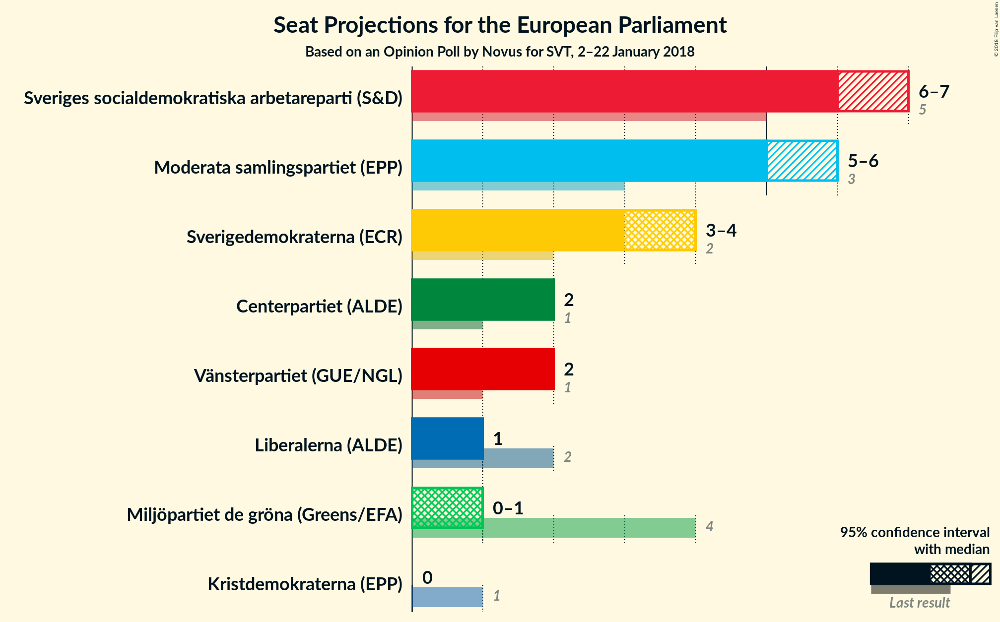
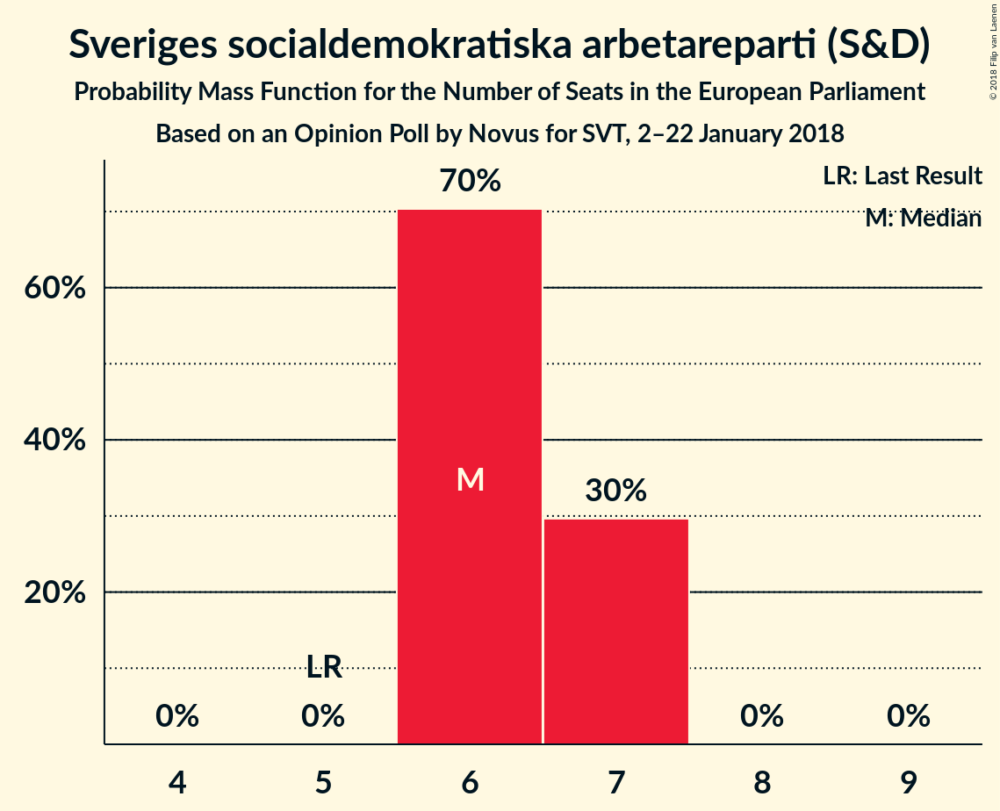
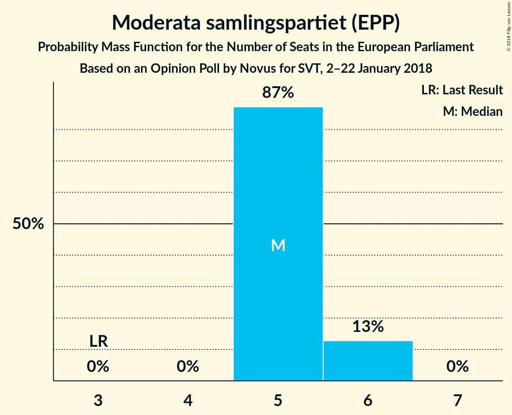
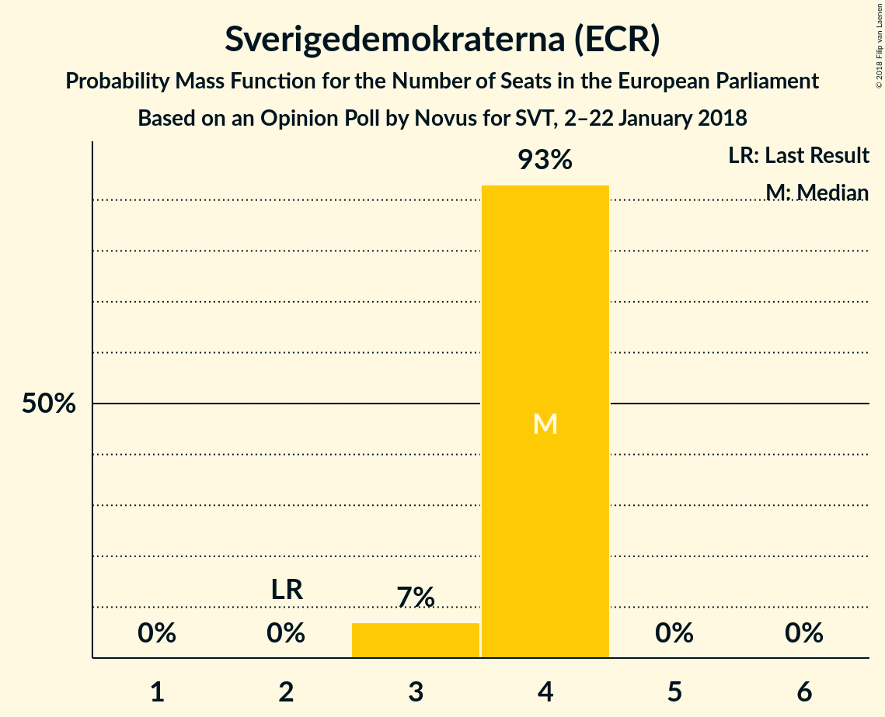
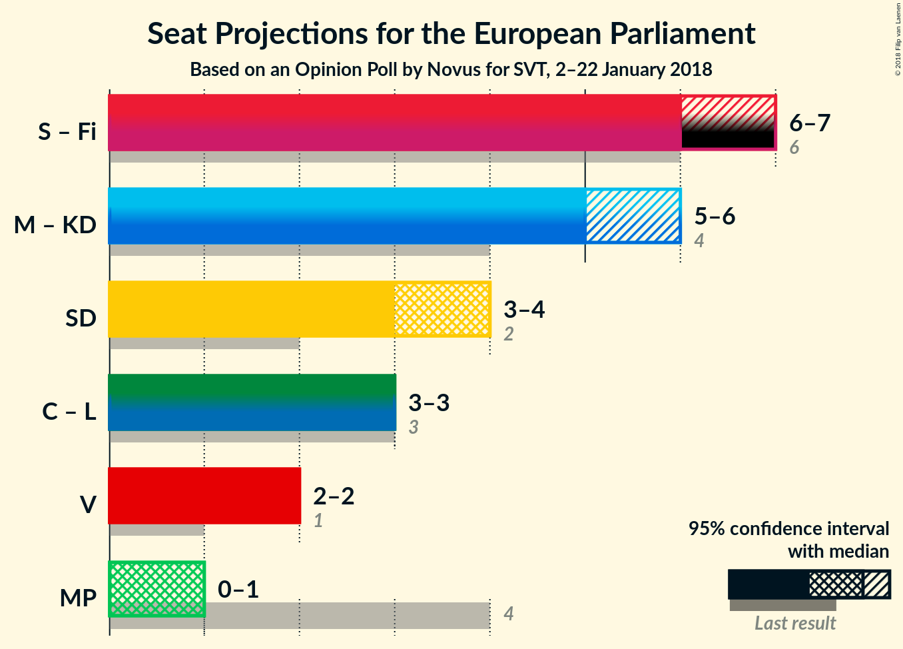

# Opinion Poll by Novus for SVT, 2–22 January 2018

<a href="#voting-intentions">Voting Intentions</a> | <a href="#seats">Seats</a> | <a href="#coalitions">Coalitions</a> | <a href="#technical-information">Technical Information</a>

## Voting Intentions

### Confidence Intervals

| Party | Last Result | Poll Result | 80% Confidence Interval | 90% Confidence Interval | 95% Confidence Interval | 99% Confidence Interval |
|:-----:|:-----------:|:-----------:|:-----------------------:|:-----------------------:|:-----------------------:|:-----------------------:|
| Sveriges socialdemokratiska arbetareparti (S&D) | 24.2% | 28.6% | 27.7–29.5% |27.5–29.8% |27.2–30.0% |26.8–30.5% |
| Moderata samlingspartiet (EPP) | 13.6% | 23.8% | 22.9–24.7% |22.7–24.9% |22.5–25.1% |22.1–25.6% |
| Sverigedemokraterna (ECR) | 9.7% | 16.5% | 15.8–17.3% |15.6–17.5% |15.4–17.7% |15.0–18.1% |
| Centerpartiet (ALDE) | 6.5% | 8.9% | 8.4–9.5% |8.2–9.7% |8.1–9.8% |7.8–10.1% |
| Vänsterpartiet (GUE/NGL) | 6.3% | 7.6% | 7.1–8.2% |6.9–8.3% |6.8–8.5% |6.6–8.7% |
| Liberalerna (ALDE) | 9.9% | 5.0% | 4.6–5.5% |4.5–5.6% |4.4–5.7% |4.2–5.9% |
| Miljöpartiet de gröna (Greens/EFA) | 15.4% | 4.1% | 3.7–4.5% |3.6–4.6% |3.5–4.8% |3.3–5.0% |
| Kristdemokraterna (EPP) | 5.9% | 2.7% | 2.4–3.1% |2.3–3.2% |2.2–3.2% |2.1–3.4% |

*Note:* The poll result column reflects the actual value used in the calculations. Published results may vary slightly, and in addition be rounded to fewer digits.

## Seats

### Confidence Intervals

| Party | Last Result | Median | 80% Confidence Interval | 90% Confidence Interval | 95% Confidence Interval | 99% Confidence Interval |
|:-----:|:-----------:|:------:|:-----------------------:|:-----------------------:|:-----------------------:|:-----------------------:|
| <a href="#sveriges-socialdemokratiska-arbetareparti-(s&d)">Sveriges socialdemokratiska arbetareparti (S&D)</a> | 5 | 6 | 6 |6 |6 |6–7 |
| <a href="#moderata-samlingspartiet-(epp)">Moderata samlingspartiet (EPP)</a> | 3 | 5 | 5–6 |5–6 |5–6 |5–6 |
| <a href="#sverigedemokraterna-(ecr)">Sverigedemokraterna (ECR)</a> | 2 | 4 | 4 |4 |4 |4 |
| <a href="#centerpartiet-(alde)">Centerpartiet (ALDE)</a> | 1 | 2 | 2 |2 |2 |2 |
| <a href="#vänsterpartiet-(gue/ngl)">Vänsterpartiet (GUE/NGL)</a> | 1 | 2 | 2 |2 |2 |2 |
| <a href="#liberalerna-(alde)">Liberalerna (ALDE)</a> | 2 | 1 | 1 |1 |1 |1 |
| <a href="#miljöpartiet-de-gröna-(greens/efa)">Miljöpartiet de gröna (Greens/EFA)</a> | 4 | 1 | 0–1 |0–1 |0–1 |0–1 |
| <a href="#kristdemokraterna-(epp)">Kristdemokraterna (EPP)</a> | 1 | 0 | 0 |0 |0 |0 |

### Sveriges socialdemokratiska arbetareparti (S&D)

*For a full overview of the results for this party, see the [Sveriges socialdemokratiska arbetareparti (S&D)](party-sverigessocialdemokratiskaarbetarepartisd.html) page.*

| Number of Seats | Probability | Accumulated | Special Marks |
|:---------------:|:-----------:|:-----------:|:-------------:|
| 5 | 0% | 100% | Last Result |
| 6 | 99.2% | 100% | Median |
| 7 | 0.8% | 0.8% |  |
| 8 | 0% | 0% |  |

### Moderata samlingspartiet (EPP)

*For a full overview of the results for this party, see the [Moderata samlingspartiet (EPP)](party-moderatasamlingspartietepp.html) page.*

| Number of Seats | Probability | Accumulated | Special Marks |
|:---------------:|:-----------:|:-----------:|:-------------:|
| 3 | 0% | 100% | Last Result |
| 4 | 0% | 100% |  |
| 5 | 87% | 100% | Median |
| 6 | 13% | 13% |  |
| 7 | 0% | 0% |  |

### Sverigedemokraterna (ECR)

*For a full overview of the results for this party, see the [Sverigedemokraterna (ECR)](party-sverigedemokraternaecr.html) page.*

| Number of Seats | Probability | Accumulated | Special Marks |
|:---------------:|:-----------:|:-----------:|:-------------:|
| 2 | 0% | 100% | Last Result |
| 3 | 0% | 100% |  |
| 4 | 100% | 100% | Median |

### Centerpartiet (ALDE)

*For a full overview of the results for this party, see the [Centerpartiet (ALDE)](party-centerpartietalde.html) page.*

| Number of Seats | Probability | Accumulated | Special Marks |
|:---------------:|:-----------:|:-----------:|:-------------:|
| 1 | 0% | 100% | Last Result |
| 2 | 100% | 100% | Median |

### Vänsterpartiet (GUE/NGL)

*For a full overview of the results for this party, see the [Vänsterpartiet (GUE/NGL)](party-vänsterpartietguengl.html) page.*

| Number of Seats | Probability | Accumulated | Special Marks |
|:---------------:|:-----------:|:-----------:|:-------------:|
| 1 | 0% | 100% | Last Result |
| 2 | 100% | 100% | Median |

### Liberalerna (ALDE)

*For a full overview of the results for this party, see the [Liberalerna (ALDE)](party-liberalernaalde.html) page.*

| Number of Seats | Probability | Accumulated | Special Marks |
|:---------------:|:-----------:|:-----------:|:-------------:|
| 1 | 100% | 100% | Median |
| 2 | 0% | 0% | Last Result |

### Miljöpartiet de gröna (Greens/EFA)

*For a full overview of the results for this party, see the [Miljöpartiet de gröna (Greens/EFA)](party-miljöpartietdegrönagreensefa.html) page.*

| Number of Seats | Probability | Accumulated | Special Marks |
|:---------------:|:-----------:|:-----------:|:-------------:|
| 0 | 13% | 100% |  |
| 1 | 87% | 87% | Median |
| 2 | 0% | 0% |  |
| 3 | 0% | 0% |  |
| 4 | 0% | 0% | Last Result |

### Kristdemokraterna (EPP)

*For a full overview of the results for this party, see the [Kristdemokraterna (EPP)](party-kristdemokraternaepp.html) page.*

| Number of Seats | Probability | Accumulated | Special Marks |
|:---------------:|:-----------:|:-----------:|:-------------:|
| 0 | 100% | 100% | Median |
| 1 | 0% | 0% | Last Result |

## Coalitions

### Confidence Intervals

| Coalition | Last Result | Median | Majority? | 80% Confidence Interval | 90% Confidence Interval | 95% Confidence Interval | 99% Confidence Interval |
|:---------:|:-----------:|:------:|:---------:|:-----------------------:|:-----------------------:|:-----------------------:|:-----------------------:|
| Moderata samlingspartiet (EPP) – Kristdemokraterna (EPP) | 4 | 5 | 0% | 5–6 | 5–6 | 5–6 | 5–6 |
| Sverigedemokraterna (ECR) | 2 | 4 | 0% | 4 | 4 | 4 | 4 |
| Centerpartiet (ALDE) – Liberalerna (ALDE) | 3 | 3 | 0% | 3 | 3 | 3 | 3 |
| Vänsterpartiet (GUE/NGL) | 1 | 2 | 0% | 2 | 2 | 2 | 2 |
| Miljöpartiet de gröna (Greens/EFA) | 4 | 1 | 0% | 0–1 | 0–1 | 0–1 | 0–1 |

### Moderata samlingspartiet (EPP) – Kristdemokraterna (EPP)

| Number of Seats | Probability | Accumulated | Special Marks |
|:---------------:|:-----------:|:-----------:|:-------------:|
| 4 | 0% | 100% | Last Result |
| 5 | 87% | 100% | Median |
| 6 | 13% | 13% |  |
| 7 | 0% | 0% |  |

### Sverigedemokraterna (ECR)

| Number of Seats | Probability | Accumulated | Special Marks |
|:---------------:|:-----------:|:-----------:|:-------------:|
| 2 | 0% | 100% | Last Result |
| 3 | 0% | 100% |  |
| 4 | 100% | 100% | Median |

### Centerpartiet (ALDE) – Liberalerna (ALDE)

| Number of Seats | Probability | Accumulated | Special Marks |
|:---------------:|:-----------:|:-----------:|:-------------:|
| 3 | 100% | 100% | Last Result, Median |

### Vänsterpartiet (GUE/NGL)

| Number of Seats | Probability | Accumulated | Special Marks |
|:---------------:|:-----------:|:-----------:|:-------------:|
| 1 | 0% | 100% | Last Result |
| 2 | 100% | 100% | Median |

### Miljöpartiet de gröna (Greens/EFA)

| Number of Seats | Probability | Accumulated | Special Marks |
|:---------------:|:-----------:|:-----------:|:-------------:|
| 0 | 13% | 100% |  |
| 1 | 87% | 87% | Median |
| 2 | 0% | 0% |  |
| 3 | 0% | 0% |  |
| 4 | 0% | 0% | Last Result |

## Technical Information

### Opinion Poll

+ **Polling firm:** Novus
+ **Commissioner(s):** SVT
+ **Fieldwork period:** 2–22 January 2018

### Calculations

+ **Sample size:** 4006
+ **Simulations done:** 1,024
+ **Error estimate:** 0.78%

