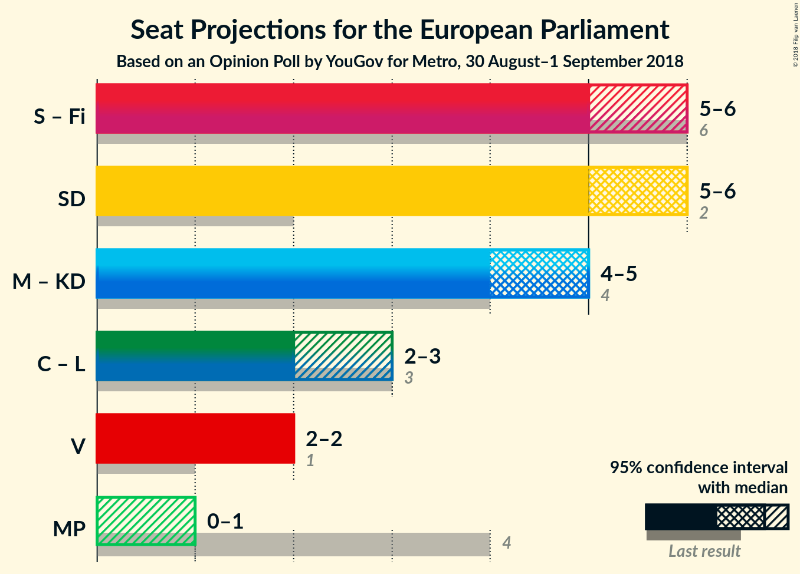

# Opinion Poll by YouGov for Metro, 30 August–1 September 2018

<a href="#voting-intentions">Voting Intentions</a> | <a href="#seats">Seats</a> | <a href="#coalitions">Coalitions</a> | <a href="#technical-information">Technical Information</a>

## Voting Intentions

### Confidence Intervals

| Party | Last Result | Poll Result | 80% Confidence Interval | 90% Confidence Interval | 95% Confidence Interval | 99% Confidence Interval |
|:-----:|:-----------:|:-----------:|:-----------------------:|:-----------------------:|:-----------------------:|:-----------------------:|
| Sverigedemokraterna (ECR) | 9.7% | 24.8% | N/A |N/A |N/A |N/A |
| Sveriges socialdemokratiska arbetareparti (S&D) | 24.2% | 23.8% | N/A |N/A |N/A |N/A |
| Moderata samlingspartiet (EPP) | 13.6% | 16.5% | N/A |N/A |N/A |N/A |
| Vänsterpartiet (GUE/NGL) | 6.3% | 9.4% | N/A |N/A |N/A |N/A |
| Centerpartiet (ALDE) | 6.5% | 6.0% | N/A |N/A |N/A |N/A |
| Liberalerna (ALDE) | 9.9% | 5.7% | N/A |N/A |N/A |N/A |
| Kristdemokraterna (EPP) | 5.9% | 4.8% | N/A |N/A |N/A |N/A |
| Miljöpartiet de gröna (Greens/EFA) | 15.4% | 3.6% | N/A |N/A |N/A |N/A |
| Feministiskt initiativ (S&D) | 5.5% | 0.6% | N/A |N/A |N/A |N/A |

*Note:* The poll result column reflects the actual value used in the calculations. Published results may vary slightly, and in addition be rounded to fewer digits.

## Seats

### Confidence Intervals

| Party | Last Result | Median | 80% Confidence Interval | 90% Confidence Interval | 95% Confidence Interval | 99% Confidence Interval |
|:-----:|:-----------:|:------:|:-----------------------:|:-----------------------:|:-----------------------:|:-----------------------:|
| <a href="#sverigedemokraterna-(ecr)">Sverigedemokraterna (ECR)</a> | 2 | N/A | N/A |N/A |N/A |N/A |
| <a href="#sveriges-socialdemokratiska-arbetareparti-(s&d)">Sveriges socialdemokratiska arbetareparti (S&D)</a> | 5 | N/A | N/A |N/A |N/A |N/A |
| <a href="#moderata-samlingspartiet-(epp)">Moderata samlingspartiet (EPP)</a> | 3 | N/A | N/A |N/A |N/A |N/A |
| <a href="#vänsterpartiet-(gue/ngl)">Vänsterpartiet (GUE/NGL)</a> | 1 | N/A | N/A |N/A |N/A |N/A |
| <a href="#centerpartiet-(alde)">Centerpartiet (ALDE)</a> | 1 | N/A | N/A |N/A |N/A |N/A |
| <a href="#liberalerna-(alde)">Liberalerna (ALDE)</a> | 2 | N/A | N/A |N/A |N/A |N/A |
| <a href="#kristdemokraterna-(epp)">Kristdemokraterna (EPP)</a> | 1 | N/A | N/A |N/A |N/A |N/A |
| <a href="#miljöpartiet-de-gröna-(greens/efa)">Miljöpartiet de gröna (Greens/EFA)</a> | 4 | N/A | N/A |N/A |N/A |N/A |
| <a href="#feministiskt-initiativ-(s&d)">Feministiskt initiativ (S&D)</a> | 1 | N/A | N/A |N/A |N/A |N/A |

## Coalitions

## Technical Information

### Opinion Poll

+ **Polling firm:** YouGov
+ **Commissioner(s):** Metro
+ **Fieldwork period:** 30 August–1 September 2018

### Calculations

+ **Sample size:** 1376
+ **Simulations done:** 0
+ **Error estimate:** 100.00%

