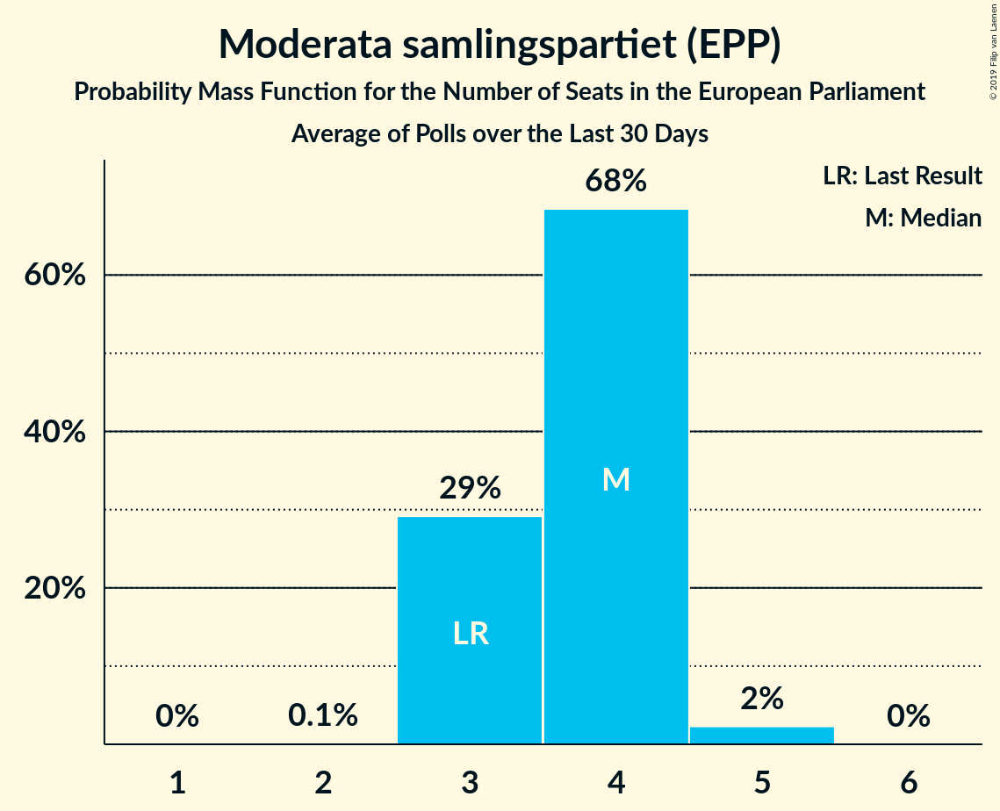
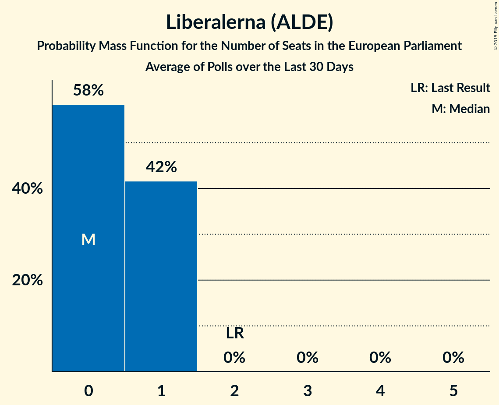
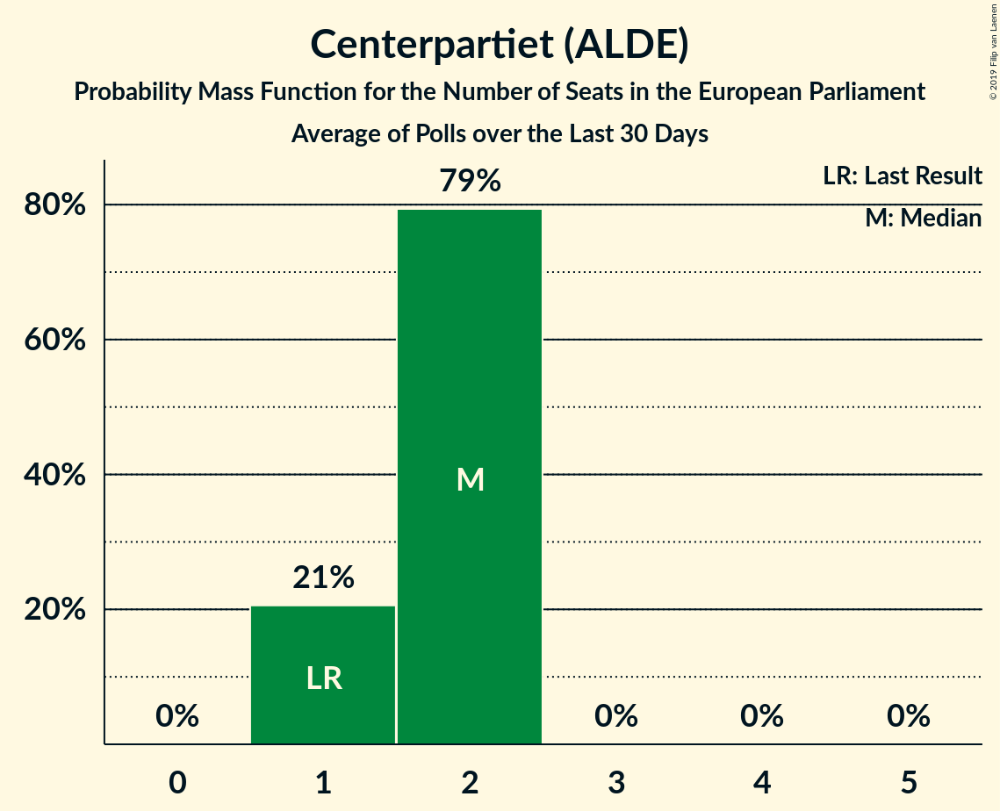

# Poll Average

<a href="#voting-intentions">Voting Intentions</a> | <a href="#seats">Seats</a> | <a href="#coalitions">Coalitions</a> | <a href="#technical-information">Technical Information</a>

## Summary

The table below lists the polls on which the average is based. They are the most recent polls (less than 30 days old) registered and analyzed so far.

| Period     | Polling firm/Commissioner(s) | S | MP | M | L | SD | C | V | KD | Fi |
|:----------:|:----------------------------:|:--:|:--:|:--:|:--:|:--:|:--:|:--:|:--:|:--:|
| 25 May 2014 | General Election | 24.2%   5 | 15.4%   4 | 13.6%   3 | 9.9%   2 | 9.7%   2 | 6.5%   1 | 6.3%   1 | 5.9%   1 | 5.5%   1 |
| N/A | Poll Average | 23–28%   5–6 | 3–10%   0–2 | 13–20%   3–4 | 2–6%   0–1 | 14–21%   3–5 | 6–10%   1–2 | 7–12%   2–3 | 8–14%   2–3 | N/A   N/A |
| [23–28 March 2019](2019-03-28-Inizio.html) | Inizio   Aftonbladet | 25–28%   5–6 | 4–5%   0–1 | 15–18%   3–4 | 3–4%   0 | 17–20%   4 | 8–10%   2 | 8–10%   2 | 11–13%   2–3 | N/A   N/A |
| [22–27 March 2019](2019-03-27-Sentio.html) | Sentio   Nyheter Idag | 22–28%   5–6 | 3–5%   0–1 | 15–20%   3–5 | 2–4%   0–1 | 17–22%   4–5 | 5–8%   1–2 | 8–12%   2–3 | 11–15%   2–3 | N/A   N/A |
| [7–27 March 2019](2019-03-27-SKOP.html) | SKOP | 24–28%   5–6 | 8–11%   2 | 16–20%   3–4 | 4–6%   0–1 | 13–17%   3–4 | 6–9%   1–2 | 6–9%   1–2 | 8–11%   2 | N/A   N/A |
| [19–25 March 2019](2019-03-25-Sifo.html) | Sifo   Svenska Dagbladet | 23–27%   5–6 | 7–9%   2 | 15–18%   3–4 | 3–5%   0–1 | 16–19%   3–4 | 6–8%   1–2 | 7–10%   2 | 9–12%   2–3 | N/A   N/A |
| [12–25 March 2019](2019-03-25-Ipsos.html) | Ipsos   Dagens Nyheter | 25–29%   5–7 | 3–5%   0–1 | 16–20%   3–5 | 3–5%   0–1 | 17–21%   4–5 | 7–9%   1–2 | 9–12%   2–3 | 8–11%   2 | N/A   N/A |
| [11–24 March 2019](2019-03-24-Novus.html) | Novus   SVT | 24–28%   5–6 | 8–11%   2 | 12–15%   3 | 4–6%   1 | 13–16%   3–4 | 8–11%   2 | 9–12%   2–3 | 8–10%   2 | N/A   N/A |
| [26 February–5 March 2019](2019-03-05-Demoskop.html) | Demoskop   Expressen | 24–28%   5–6 | 3–5%   0–1 | 17–20%   4–5 | 2–4%   0 | 18–21%   4–5 | 6–9%   1–2 | 8–11%   2 | 9–12%   2–3 | N/A   N/A |
| 25 May 2014 | General Election | 24.2%   5 | 15.4%   4 | 13.6%   3 | 9.9%   2 | 9.7%   2 | 6.5%   1 | 6.3%   1 | 5.9%   1 | 5.5%   1 |

Only polls for which at least the sample size has been published are included in the table above.

**Legend:**
+ **Top half of each row:** Voting intentions (95% confidence interval)
+ **Bottom half of each row:** Seat projections for the European Parliament (95% confidence interval)
+ **S:** Sveriges socialdemokratiska arbetareparti (S&D)
+ **MP:** Miljöpartiet de gröna (Greens/EFA)
+ **M:** Moderata samlingspartiet (EPP)
+ **L:** Liberalerna (ALDE)
+ **SD:** Sverigedemokraterna (ECR)
+ **C:** Centerpartiet (ALDE)
+ **V:** Vänsterpartiet (GUE/NGL)
+ **KD:** Kristdemokraterna (EPP)
+ **Fi:** Feministiskt initiativ (S&D)
+ **N/A (single party):** Party not included the published results
+ **N/A (entire row):** Calculation for this opinion poll not started yet

## Voting Intentions

### Confidence Intervals

| Party | Last Result | Median | 80% Confidence Interval | 90% Confidence Interval | 95% Confidence Interval | 99% Confidence Interval |
|:-----:|:-----------:|:------:|:-----------------------:|:-----------------------:|:-----------------------:|:-----------------------:|
| <a href="#sveriges-socialdemokratiska-arbetareparti-(s&d)">Sveriges socialdemokratiska arbetareparti (S&D)</a> | 24.2% | 25.8% | 24.2–27.4% |23.7–27.9% | 23.3–28.3% | 22.3–29.2% |
| <a href="#miljöpartiet-de-gröna-(greens/efa)">Miljöpartiet de gröna (Greens/EFA)</a> | 15.4% | 4.7% | 3.6–9.5% |3.4–9.9% | 3.2–10.2% | 2.9–10.8% |
| <a href="#moderata-samlingspartiet-(epp)">Moderata samlingspartiet (EPP)</a> | 13.6% | 17.1% | 14.1–18.9% |13.4–19.4% | 13.0–19.8% | 12.3–20.5% |
| <a href="#liberalerna-(alde)">Liberalerna (ALDE)</a> | 9.9% | 3.8% | 2.8–5.1% |2.6–5.4% | 2.5–5.6% | 2.2–6.0% |
| <a href="#sverigedemokraterna-(ecr)">Sverigedemokraterna (ECR)</a> | 9.7% | 18.0% | 14.3–20.1% |13.8–20.6% | 13.5–21.0% | 12.8–21.9% |
| <a href="#centerpartiet-(alde)">Centerpartiet (ALDE)</a> | 6.5% | 7.8% | 6.3–9.4% |5.8–9.7% | 5.5–10.0% | 4.9–10.5% |
| <a href="#vänsterpartiet-(gue/ngl)">Vänsterpartiet (GUE/NGL)</a> | 6.3% | 9.3% | 7.8–11.0% |7.4–11.3% | 7.0–11.7% | 6.5–12.3% |
| <a href="#kristdemokraterna-(epp)">Kristdemokraterna (EPP)</a> | 5.9% | 10.2% | 8.6–12.7% |8.3–13.3% | 8.0–13.8% | 7.6–14.8% |
| <a href="#feministiskt-initiativ-(s&d)">Feministiskt initiativ (S&D)</a> | 5.5% | N/A | N/A |N/A | N/A | N/A |

### Sveriges socialdemokratiska arbetareparti (S&D)

*For a full overview of the results for this party, see the [Sveriges socialdemokratiska arbetareparti (S&D)](party-sverigessocialdemokratiskaarbetarepartisd.html) page.*

| Voting Intentions | Probability | Accumulated | Special Marks |
|:-----------------:|:-----------:|:-----------:|:-------------:|
| 19.5–20.5% | 0% | 100% |  |
| 20.5–21.5% | 0.1% | 100% |  |
| 21.5–22.5% | 0.7% | 99.9% |  |
| 22.5–23.5% | 3% | 99.2% |  |
| 23.5–24.5% | 12% | 96% | Last Result |
| 24.5–25.5% | 25% | 84% |  |
| 25.5–26.5% | 30% | 59% | Median |
| 26.5–27.5% | 20% | 28% |  |
| 27.5–28.5% | 7% | 8% |  |
| 28.5–29.5% | 1.5% | 2% |  |
| 29.5–30.5% | 0.2% | 0.2% |  |
| 30.5–31.5% | 0% | 0% |  |

### Miljöpartiet de gröna (Greens/EFA)

*For a full overview of the results for this party, see the [Miljöpartiet de gröna (Greens/EFA)](party-miljöpartietdegrönagreensefa.html) page.*

| Voting Intentions | Probability | Accumulated | Special Marks |
|:-----------------:|:-----------:|:-----------:|:-------------:|
| 1.5–2.5% | 0.1% | 100% |  |
| 2.5–3.5% | 8% | 99.9% |  |
| 3.5–4.5% | 39% | 92% |  |
| 4.5–5.5% | 10% | 53% | Median |
| 5.5–6.5% | 0.3% | 43% |  |
| 6.5–7.5% | 2% | 43% |  |
| 7.5–8.5% | 13% | 40% |  |
| 8.5–9.5% | 18% | 27% |  |
| 9.5–10.5% | 8% | 9% |  |
| 10.5–11.5% | 1.0% | 1.1% |  |
| 11.5–12.5% | 0% | 0% |  |
| 12.5–13.5% | 0% | 0% |  |
| 13.5–14.5% | 0% | 0% |  |
| 14.5–15.5% | 0% | 0% | Last Result |

### Moderata samlingspartiet (EPP)

*For a full overview of the results for this party, see the [Moderata samlingspartiet (EPP)](party-moderatasamlingspartietepp.html) page.*

| Voting Intentions | Probability | Accumulated | Special Marks |
|:-----------------:|:-----------:|:-----------:|:-------------:|
| 10.5–11.5% | 0% | 100% |  |
| 11.5–12.5% | 0.9% | 100% |  |
| 12.5–13.5% | 5% | 99.0% |  |
| 13.5–14.5% | 6% | 94% | Last Result |
| 14.5–15.5% | 6% | 88% |  |
| 15.5–16.5% | 18% | 81% |  |
| 16.5–17.5% | 25% | 63% | Median |
| 17.5–18.5% | 22% | 38% |  |
| 18.5–19.5% | 12% | 16% |  |
| 19.5–20.5% | 3% | 4% |  |
| 20.5–21.5% | 0.4% | 0.5% |  |
| 21.5–22.5% | 0% | 0% |  |

### Liberalerna (ALDE)

*For a full overview of the results for this party, see the [Liberalerna (ALDE)](party-liberalernaalde.html) page.*

| Voting Intentions | Probability | Accumulated | Special Marks |
|:-----------------:|:-----------:|:-----------:|:-------------:|
| 0.5–1.5% | 0% | 100% |  |
| 1.5–2.5% | 3% | 100% |  |
| 2.5–3.5% | 35% | 97% |  |
| 3.5–4.5% | 38% | 61% | Median |
| 4.5–5.5% | 20% | 23% |  |
| 5.5–6.5% | 3% | 3% |  |
| 6.5–7.5% | 0% | 0% |  |
| 7.5–8.5% | 0% | 0% |  |
| 8.5–9.5% | 0% | 0% |  |
| 9.5–10.5% | 0% | 0% | Last Result |

### Sverigedemokraterna (ECR)

*For a full overview of the results for this party, see the [Sverigedemokraterna (ECR)](party-sverigedemokraternaecr.html) page.*

| Voting Intentions | Probability | Accumulated | Special Marks |
|:-----------------:|:-----------:|:-----------:|:-------------:|
| 9.5–10.5% | 0% | 100% | Last Result |
| 10.5–11.5% | 0% | 100% |  |
| 11.5–12.5% | 0.2% | 100% |  |
| 12.5–13.5% | 3% | 99.8% |  |
| 13.5–14.5% | 10% | 97% |  |
| 14.5–15.5% | 10% | 87% |  |
| 15.5–16.5% | 7% | 77% |  |
| 16.5–17.5% | 11% | 70% |  |
| 17.5–18.5% | 20% | 58% | Median |
| 18.5–19.5% | 20% | 38% |  |
| 19.5–20.5% | 12% | 18% |  |
| 20.5–21.5% | 4% | 5% |  |
| 21.5–22.5% | 0.8% | 1.0% |  |
| 22.5–23.5% | 0.1% | 0.1% |  |
| 23.5–24.5% | 0% | 0% |  |

### Centerpartiet (ALDE)

*For a full overview of the results for this party, see the [Centerpartiet (ALDE)](party-centerpartietalde.html) page.*

| Voting Intentions | Probability | Accumulated | Special Marks |
|:-----------------:|:-----------:|:-----------:|:-------------:|
| 2.5–3.5% | 0% | 100% |  |
| 3.5–4.5% | 0.2% | 100% |  |
| 4.5–5.5% | 3% | 99.8% |  |
| 5.5–6.5% | 11% | 97% | Last Result |
| 6.5–7.5% | 28% | 86% |  |
| 7.5–8.5% | 28% | 58% | Median |
| 8.5–9.5% | 23% | 30% |  |
| 9.5–10.5% | 7% | 8% |  |
| 10.5–11.5% | 0.5% | 0.5% |  |
| 11.5–12.5% | 0% | 0% |  |

### Vänsterpartiet (GUE/NGL)

*For a full overview of the results for this party, see the [Vänsterpartiet (GUE/NGL)](party-vänsterpartietguengl.html) page.*

| Voting Intentions | Probability | Accumulated | Special Marks |
|:-----------------:|:-----------:|:-----------:|:-------------:|
| 4.5–5.5% | 0% | 100% |  |
| 5.5–6.5% | 0.7% | 100% | Last Result |
| 6.5–7.5% | 6% | 99.3% |  |
| 7.5–8.5% | 21% | 93% |  |
| 8.5–9.5% | 30% | 72% | Median |
| 9.5–10.5% | 25% | 42% |  |
| 10.5–11.5% | 14% | 17% |  |
| 11.5–12.5% | 3% | 3% |  |
| 12.5–13.5% | 0.2% | 0.3% |  |
| 13.5–14.5% | 0% | 0% |  |

### Kristdemokraterna (EPP)

*For a full overview of the results for this party, see the [Kristdemokraterna (EPP)](party-kristdemokraternaepp.html) page.*

| Voting Intentions | Probability | Accumulated | Special Marks |
|:-----------------:|:-----------:|:-----------:|:-------------:|
| 5.5–6.5% | 0% | 100% | Last Result |
| 6.5–7.5% | 0.5% | 100% |  |
| 7.5–8.5% | 9% | 99.5% |  |
| 8.5–9.5% | 24% | 90% |  |
| 9.5–10.5% | 23% | 66% | Median |
| 10.5–11.5% | 16% | 44% |  |
| 11.5–12.5% | 15% | 27% |  |
| 12.5–13.5% | 9% | 12% |  |
| 13.5–14.5% | 3% | 4% |  |
| 14.5–15.5% | 0.7% | 0.8% |  |
| 15.5–16.5% | 0.1% | 0.1% |  |
| 16.5–17.5% | 0% | 0% |  |

## Seats

### Confidence Intervals

| Party | Last Result | Median | 80% Confidence Interval | 90% Confidence Interval | 95% Confidence Interval | 99% Confidence Interval |
|:-----:|:-----------:|:------:|:-----------------------:|:-----------------------:|:-----------------------:|:-----------------------:|
| <a href="#sveriges-socialdemokratiska-arbetareparti-(s&d)">Sveriges socialdemokratiska arbetareparti (S&D)</a> | 5 | 6 | 5–6 |5–6 | 5–6 | 5–7 |
| <a href="#miljöpartiet-de-gröna-(greens/efa)">Miljöpartiet de gröna (Greens/EFA)</a> | 4 | 1 | 0–2 |0–2 | 0–2 | 0–2 |
| <a href="#moderata-samlingspartiet-(epp)">Moderata samlingspartiet (EPP)</a> | 3 | 4 | 3–4 |3–4 | 3–4 | 3–5 |
| <a href="#liberalerna-(alde)">Liberalerna (ALDE)</a> | 2 | 0 | 0–1 |0–1 | 0–1 | 0–1 |
| <a href="#sverigedemokraterna-(ecr)">Sverigedemokraterna (ECR)</a> | 2 | 4 | 3–5 |3–5 | 3–5 | 3–5 |
| <a href="#centerpartiet-(alde)">Centerpartiet (ALDE)</a> | 1 | 2 | 1–2 |1–2 | 1–2 | 1–2 |
| <a href="#vänsterpartiet-(gue/ngl)">Vänsterpartiet (GUE/NGL)</a> | 1 | 2 | 2 |2 | 2–3 | 1–3 |
| <a href="#kristdemokraterna-(epp)">Kristdemokraterna (EPP)</a> | 1 | 2 | 2–3 |2–3 | 2–3 | 2–3 |
| <a href="#feministiskt-initiativ-(s&d)">Feministiskt initiativ (S&D)</a> | 1 | N/A | N/A |N/A | N/A | N/A |

### Sveriges socialdemokratiska arbetareparti (S&D)

*For a full overview of the results for this party, see the [Sveriges socialdemokratiska arbetareparti (S&D)](party-sverigessocialdemokratiskaarbetarepartisd.html) page.*

| Number of Seats | Probability | Accumulated | Special Marks |
|:---------------:|:-----------:|:-----------:|:-------------:|
| 5 | 35% | 100% | Last Result |
| 6 | 63% | 65% | Median |
| 7 | 2% | 2% |  |
| 8 | 0% | 0% |  |

### Miljöpartiet de gröna (Greens/EFA)

*For a full overview of the results for this party, see the [Miljöpartiet de gröna (Greens/EFA)](party-miljöpartietdegrönagreensefa.html) page.*

| Number of Seats | Probability | Accumulated | Special Marks |
|:---------------:|:-----------:|:-----------:|:-------------:|
| 0 | 24% | 100% |  |
| 1 | 33% | 76% | Median |
| 2 | 43% | 43% |  |
| 3 | 0.1% | 0.1% |  |
| 4 | 0% | 0% | Last Result |

### Moderata samlingspartiet (EPP)

*For a full overview of the results for this party, see the [Moderata samlingspartiet (EPP)](party-moderatasamlingspartietepp.html) page.*

| Number of Seats | Probability | Accumulated | Special Marks |
|:---------------:|:-----------:|:-----------:|:-------------:|
| 2 | 0.1% | 100% |  |
| 3 | 30% | 99.9% | Last Result |
| 4 | 68% | 70% | Median |
| 5 | 2% | 2% |  |
| 6 | 0% | 0% |  |

### Liberalerna (ALDE)

*For a full overview of the results for this party, see the [Liberalerna (ALDE)](party-liberalernaalde.html) page.*

| Number of Seats | Probability | Accumulated | Special Marks |
|:---------------:|:-----------:|:-----------:|:-------------:|
| 0 | 57% | 100% | Median |
| 1 | 43% | 43% |  |
| 2 | 0% | 0% | Last Result |

### Sverigedemokraterna (ECR)

*For a full overview of the results for this party, see the [Sverigedemokraterna (ECR)](party-sverigedemokraternaecr.html) page.*

| Number of Seats | Probability | Accumulated | Special Marks |
|:---------------:|:-----------:|:-----------:|:-------------:|
| 2 | 0% | 100% | Last Result |
| 3 | 29% | 100% |  |
| 4 | 60% | 71% | Median |
| 5 | 11% | 11% |  |
| 6 | 0% | 0% |  |

### Centerpartiet (ALDE)

*For a full overview of the results for this party, see the [Centerpartiet (ALDE)](party-centerpartietalde.html) page.*

| Number of Seats | Probability | Accumulated | Special Marks |
|:---------------:|:-----------:|:-----------:|:-------------:|
| 1 | 20% | 100% | Last Result |
| 2 | 80% | 80% | Median |
| 3 | 0% | 0% |  |

### Vänsterpartiet (GUE/NGL)

*For a full overview of the results for this party, see the [Vänsterpartiet (GUE/NGL)](party-vänsterpartietguengl.html) page.*

| Number of Seats | Probability | Accumulated | Special Marks |
|:---------------:|:-----------:|:-----------:|:-------------:|
| 1 | 2% | 100% | Last Result |
| 2 | 93% | 98% | Median |
| 3 | 5% | 5% |  |
| 4 | 0% | 0% |  |

### Kristdemokraterna (EPP)

*For a full overview of the results for this party, see the [Kristdemokraterna (EPP)](party-kristdemokraternaepp.html) page.*

| Number of Seats | Probability | Accumulated | Special Marks |
|:---------------:|:-----------:|:-----------:|:-------------:|
| 1 | 0.1% | 100% | Last Result |
| 2 | 72% | 99.9% | Median |
| 3 | 27% | 28% |  |
| 4 | 0.3% | 0.3% |  |
| 5 | 0% | 0% |  |

## Coalitions

### Confidence Intervals

| Coalition | Last Result | Median | Majority? | 80% Confidence Interval | 90% Confidence Interval | 95% Confidence Interval | 99% Confidence Interval |
|:---------:|:-----------:|:------:|:---------:|:-----------------------:|:-----------------------:|:-----------------------:|:-----------------------:|
| Moderata samlingspartiet (EPP) – Kristdemokraterna (EPP) | 4 | 6 | 0% | 5–7 | 5–7 | 5–7 | 5–8 |
| Sveriges socialdemokratiska arbetareparti (S&D) – Feministiskt initiativ (S&D) | 6 | 6 | 0% | 5–6 | 5–6 | 5–6 | 5–7 |
| Sverigedemokraterna (ECR) | 2 | 4 | 0% | 3–5 | 3–5 | 3–5 | 3–5 |
| Vänsterpartiet (GUE/NGL) | 1 | 2 | 0% | 2 | 2 | 2–3 | 1–3 |
| Liberalerna (ALDE) – Centerpartiet (ALDE) | 3 | 2 | 0% | 1–3 | 1–3 | 1–3 | 1–3 |
| Miljöpartiet de gröna (Greens/EFA) | 4 | 1 | 0% | 0–2 | 0–2 | 0–2 | 0–2 |

### Moderata samlingspartiet (EPP) – Kristdemokraterna (EPP)

| Number of Seats | Probability | Accumulated | Special Marks |
|:---------------:|:-----------:|:-----------:|:-------------:|
| 4 | 0.1% | 100% | Last Result |
| 5 | 23% | 99.9% |  |
| 6 | 55% | 77% | Median |
| 7 | 21% | 22% |  |
| 8 | 1.4% | 1.4% |  |
| 9 | 0% | 0% |  |

### Sveriges socialdemokratiska arbetareparti (S&D) – Feministiskt initiativ (S&D)

| Number of Seats | Probability | Accumulated | Special Marks |
|:---------------:|:-----------:|:-----------:|:-------------:|
| 5 | 35% | 100% |  |
| 6 | 63% | 65% | Last Result, Median |
| 7 | 2% | 2% |  |
| 8 | 0% | 0% |  |

### Sverigedemokraterna (ECR)

| Number of Seats | Probability | Accumulated | Special Marks |
|:---------------:|:-----------:|:-----------:|:-------------:|
| 2 | 0% | 100% | Last Result |
| 3 | 29% | 100% |  |
| 4 | 60% | 71% | Median |
| 5 | 11% | 11% |  |
| 6 | 0% | 0% |  |

### Vänsterpartiet (GUE/NGL)

| Number of Seats | Probability | Accumulated | Special Marks |
|:---------------:|:-----------:|:-----------:|:-------------:|
| 1 | 2% | 100% | Last Result |
| 2 | 93% | 98% | Median |
| 3 | 5% | 5% |  |
| 4 | 0% | 0% |  |

### Liberalerna (ALDE) – Centerpartiet (ALDE)

| Number of Seats | Probability | Accumulated | Special Marks |
|:---------------:|:-----------:|:-----------:|:-------------:|
| 1 | 12% | 100% |  |
| 2 | 53% | 88% | Median |
| 3 | 35% | 35% | Last Result |
| 4 | 0% | 0% |  |

### Miljöpartiet de gröna (Greens/EFA)

| Number of Seats | Probability | Accumulated | Special Marks |
|:---------------:|:-----------:|:-----------:|:-------------:|
| 0 | 24% | 100% |  |
| 1 | 33% | 76% | Median |
| 2 | 43% | 43% |  |
| 3 | 0.1% | 0.1% |  |
| 4 | 0% | 0% | Last Result |

## Technical Information

+ **Number of polls included in this average:** 7
+ **Lowest number of simulations done in a poll included in this average:** 131,072
+ **Total number of simulations done in the polls included in this average:** 3,801,088
+ **Error estimate:** 1.42%
