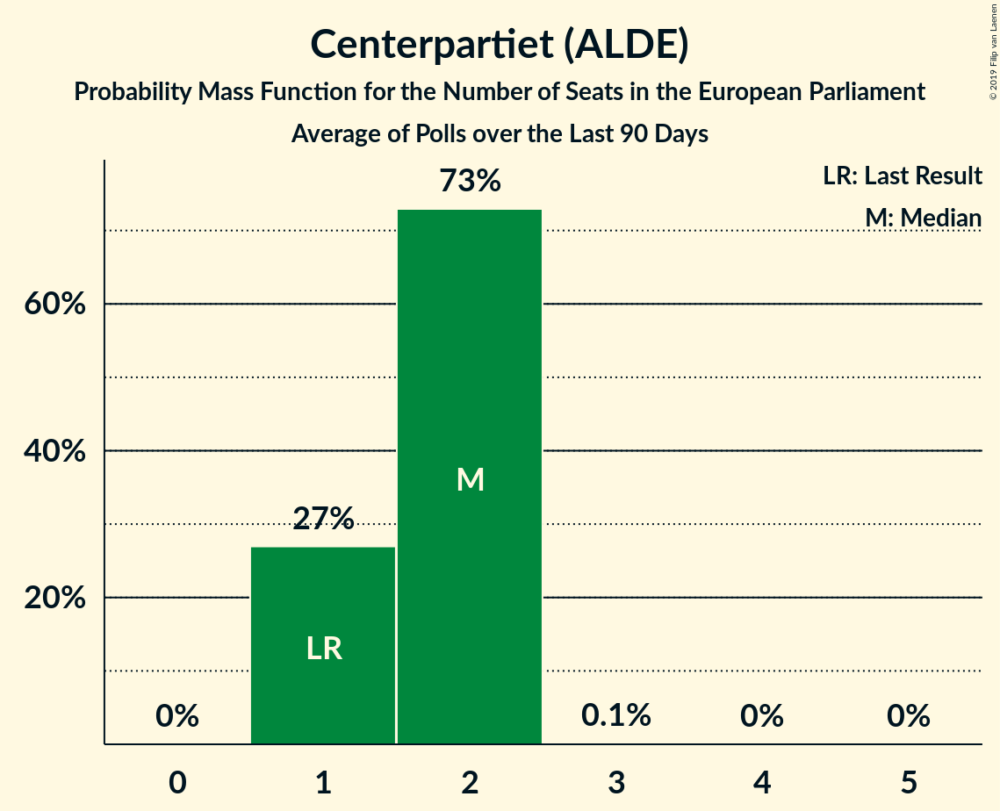

# Poll Average

<a href="#voting-intentions">Voting Intentions</a> | <a href="#seats">Seats</a> | <a href="#coalitions">Coalitions</a> | <a href="#technical-information">Technical Information</a>

## Summary

The table below lists the polls on which the average is based. They are the most recent polls (less than 90 days old) registered and analyzed so far.

| Period     | Polling firm/Commissioner(s) | S | MP | M | L | SD | C | V | KD | Fi |
|:----------:|:----------------------------:|:--:|:--:|:--:|:--:|:--:|:--:|:--:|:--:|:--:|
| 25 May 2014 | General Election | 24.2%   5 | 15.4%   4 | 13.6%   3 | 9.9%   2 | 9.7%   2 | 6.5%   1 | 6.3%   1 | 5.9%   1 | 5.5%   1 |
| N/A | Poll Average | 20–29%   4–7 | 3–6%   0–1 | 15–23%   3–5 | 4–7%   0–2 | 16–27%   4–6 | 6–11%   1–3 | 7–14%   2–3 | 2–5%   0–1 | 1–2%   0 |
| [6–9 August 2018](2018-08-09-Sifo.html) | Sifo   Svenska Dagbladet | 24–28%   5–6 | 5–7%   1 | 19–22%   4–5 | 5–7%   1–2 | 15–18%   3–4 | 9–12%   2–3 | 8–10%   2 | 3–4%   0–1 | N/A   N/A |
| [25 July–2 August 2018](2018-08-02-Inizio.html) | Inizio   Aftonbladet | 23–27%   5–6 | 4–6%   1 | 19–22%   4–5 | 4–5%   0–1 | 17–21%   4–5 | 8–11%   2 | 8–10%   2 | 4–6%   0–1 | 1–2%   0 |
| [27 July–1 August 2018](2018-08-01-Sentio.html) | Sentio   Nyheter Idag | 18–24%   4–6 | 3–6%   0–1 | 16–22%   4–5 | 3–6%   0–1 | 22–29%   5–7 | 5–9%   1–2 | 10–15%   2–4 | 2–4%   0 | 1–2%   0 |
| [25 June–22 July 2018](2018-07-22-Novus.html) | Novus   SVT | 22–25%   5–6 | 5–6%   1 | 18–21%   4–5 | 4–6%   1 | 20–23%   5 | 8–9%   2 | 9–11%   2–3 | 3–4%   0 | N/A   N/A |
| [20 June–21 July 2018](2018-07-21-SKOP.html) | SKOP | 23–28%   5–7 | 3–5%   0–1 | 17–22%   4–5 | 4–6%   0–1 | 19–23%   4–5 | 8–12%   2–3 | 9–12%   2–3 | 2–4%   0–1 | 1–2%   0 |
| [13–15 July 2018](2018-07-15-YouGov.html) | YouGov   Metro | 19–24%   4–5 | 3–5%   0–1 | 14–18%   3–4 | 4–7%   1–2 | 23–28%   5–7 | 7–10%   2 | 8–12%   2–3 | 3–5%   0–1 | 1–2%   0 |
| [25 June–3 July 2018](2018-07-03-Demoskop.html) | Demoskop   Expressen | 24–28%   5–7 | 3–5%   0–1 | 18–22%   4–5 | 3–5%   0–1 | 19–23%   4–5 | 8–11%   2–3 | 8–11%   2 | 2–3%   0 | 1–3%   0 |
| [7–18 June 2018](2018-06-18-Ipsos.html) | Ipsos   Dagens Nyheter | 22–26%   5–6 | 3–5%   0–1 | 17–21%   4–5 | 5–7%   1–2 | 18–22%   4–5 | 9–12%   2–3 | 8–10%   2 | 2–4%   0 | 1–3%   0 |
| [27 April–29 May 2018](2018-05-29-SCB.html) | SCB | 27–30%   6–7 | 4–5%   0–1 | 21–24%   5 | 4–5%   0–1 | 17–20%   4–5 | 8–10%   2 | 7–8%   2 | 2–3%   0 | N/A   N/A |
| 25 May 2014 | General Election | 24.2%   5 | 15.4%   4 | 13.6%   3 | 9.9%   2 | 9.7%   2 | 6.5%   1 | 6.3%   1 | 5.9%   1 | 5.5%   1 |

Only polls for which at least the sample size has been published are included in the table above.

**Legend:**
+ **Top half of each row:** Voting intentions (95% confidence interval)
+ **Bottom half of each row:** Seat projections for the European Parliament (95% confidence interval)
+ **S:** Sveriges socialdemokratiska arbetareparti (S&D)
+ **MP:** Miljöpartiet de gröna (Greens/EFA)
+ **M:** Moderata samlingspartiet (EPP)
+ **L:** Liberalerna (ALDE)
+ **SD:** Sverigedemokraterna (ECR)
+ **C:** Centerpartiet (ALDE)
+ **V:** Vänsterpartiet (GUE/NGL)
+ **KD:** Kristdemokraterna (EPP)
+ **Fi:** Feministiskt initiativ (S&D)
+ **N/A (single party):** Party not included the published results
+ **N/A (entire row):** Calculation for this opinion poll not started yet

## Voting Intentions

### Confidence Intervals

| Party | Last Result | Median | 80% Confidence Interval | 90% Confidence Interval | 95% Confidence Interval | 99% Confidence Interval |
|:-----:|:-----------:|:------:|:-----------------------:|:-----------------------:|:-----------------------:|:-----------------------:|
| <a href="#sveriges-socialdemokratiska-arbetareparti-(s&d)">Sveriges socialdemokratiska arbetareparti (S&D)</a> | 24.2% | 24.7% | 21.1–27.8% |20.2–28.5% | 19.6–28.8% | 18.6–29.5% |
| <a href="#miljöpartiet-de-gröna-(greens/efa)">Miljöpartiet de gröna (Greens/EFA)</a> | 15.4% | 4.4% | 3.4–5.7% |3.2–6.0% | 3.0–6.2% | 2.6–6.5% |
| <a href="#moderata-samlingspartiet-(epp)">Moderata samlingspartiet (EPP)</a> | 13.6% | 19.7% | 16.9–22.1% |15.8–22.7% | 15.1–23.1% | 14.2–23.7% |
| <a href="#liberalerna-(alde)">Liberalerna (ALDE)</a> | 9.9% | 4.9% | 4.1–6.2% |3.8–6.5% | 3.7–6.8% | 3.3–7.2% |
| <a href="#sverigedemokraterna-(ecr)">Sverigedemokraterna (ECR)</a> | 9.7% | 20.6% | 17.5–25.8% |16.7–26.7% | 16.2–27.4% | 15.5–28.6% |
| <a href="#centerpartiet-(alde)">Centerpartiet (ALDE)</a> | 6.5% | 9.2% | 7.7–10.7% |6.8–11.0% | 6.3–11.3% | 5.5–11.9% |
| <a href="#vänsterpartiet-(gue/ngl)">Vänsterpartiet (GUE/NGL)</a> | 6.3% | 9.5% | 7.8–11.7% |7.4–12.9% | 7.1–13.7% | 6.8–14.9% |
| <a href="#kristdemokraterna-(epp)">Kristdemokraterna (EPP)</a> | 5.9% | 3.2% | 2.4–4.5% |2.2–4.9% | 2.0–5.2% | 1.6–5.6% |
| <a href="#feministiskt-initiativ-(s&d)">Feministiskt initiativ (S&D)</a> | 5.5% | 1.5% | 0.8–2.2% |0.7–2.4% | 0.6–2.5% | 0.5–2.8% |

### Sveriges socialdemokratiska arbetareparti (S&D)

*For a full overview of the results for this party, see the [Sveriges socialdemokratiska arbetareparti (S&D)](party-sverigessocialdemokratiskaarbetarepartisd.html) page.*

| Voting Intentions | Probability | Accumulated | Special Marks |
|:-----------------:|:-----------:|:-----------:|:-------------:|
| 15.5–16.5% | 0% | 100% |  |
| 16.5–17.5% | 0.1% | 100% |  |
| 17.5–18.5% | 0.4% | 99.9% |  |
| 18.5–19.5% | 2% | 99.5% |  |
| 19.5–20.5% | 4% | 98% |  |
| 20.5–21.5% | 7% | 93% |  |
| 21.5–22.5% | 7% | 87% |  |
| 22.5–23.5% | 11% | 80% |  |
| 23.5–24.5% | 17% | 70% | Last Result |
| 24.5–25.5% | 17% | 53% | Median |
| 25.5–26.5% | 15% | 35% |  |
| 26.5–27.5% | 9% | 20% |  |
| 27.5–28.5% | 8% | 12% |  |
| 28.5–29.5% | 4% | 4% |  |
| 29.5–30.5% | 0.4% | 0.4% |  |
| 30.5–31.5% | 0% | 0% |  |

### Miljöpartiet de gröna (Greens/EFA)

*For a full overview of the results for this party, see the [Miljöpartiet de gröna (Greens/EFA)](party-miljöpartietdegrönagreensefa.html) page.*

| Voting Intentions | Probability | Accumulated | Special Marks |
|:-----------------:|:-----------:|:-----------:|:-------------:|
| 0.5–1.5% | 0% | 100% |  |
| 1.5–2.5% | 0.4% | 100% |  |
| 2.5–3.5% | 13% | 99.6% |  |
| 3.5–4.5% | 45% | 86% | Median |
| 4.5–5.5% | 27% | 42% |  |
| 5.5–6.5% | 14% | 15% |  |
| 6.5–7.5% | 0.4% | 0.4% |  |
| 7.5–8.5% | 0% | 0% |  |
| 8.5–9.5% | 0% | 0% |  |
| 9.5–10.5% | 0% | 0% |  |
| 10.5–11.5% | 0% | 0% |  |
| 11.5–12.5% | 0% | 0% |  |
| 12.5–13.5% | 0% | 0% |  |
| 13.5–14.5% | 0% | 0% |  |
| 14.5–15.5% | 0% | 0% | Last Result |

### Moderata samlingspartiet (EPP)

*For a full overview of the results for this party, see the [Moderata samlingspartiet (EPP)](party-moderatasamlingspartietepp.html) page.*

| Voting Intentions | Probability | Accumulated | Special Marks |
|:-----------------:|:-----------:|:-----------:|:-------------:|
| 11.5–12.5% | 0% | 100% |  |
| 12.5–13.5% | 0.1% | 100% |  |
| 13.5–14.5% | 0.9% | 99.9% | Last Result |
| 14.5–15.5% | 3% | 99.0% |  |
| 15.5–16.5% | 4% | 96% |  |
| 16.5–17.5% | 5% | 92% |  |
| 17.5–18.5% | 9% | 87% |  |
| 18.5–19.5% | 23% | 77% |  |
| 19.5–20.5% | 27% | 55% | Median |
| 20.5–21.5% | 14% | 28% |  |
| 21.5–22.5% | 8% | 14% |  |
| 22.5–23.5% | 6% | 6% |  |
| 23.5–24.5% | 0.7% | 0.8% |  |
| 24.5–25.5% | 0% | 0% |  |

### Liberalerna (ALDE)

*For a full overview of the results for this party, see the [Liberalerna (ALDE)](party-liberalernaalde.html) page.*

| Voting Intentions | Probability | Accumulated | Special Marks |
|:-----------------:|:-----------:|:-----------:|:-------------:|
| 1.5–2.5% | 0% | 100% |  |
| 2.5–3.5% | 2% | 100% |  |
| 3.5–4.5% | 30% | 98% |  |
| 4.5–5.5% | 41% | 69% | Median |
| 5.5–6.5% | 23% | 28% |  |
| 6.5–7.5% | 4% | 5% |  |
| 7.5–8.5% | 0.1% | 0.1% |  |
| 8.5–9.5% | 0% | 0% |  |
| 9.5–10.5% | 0% | 0% | Last Result |

### Sverigedemokraterna (ECR)

*For a full overview of the results for this party, see the [Sverigedemokraterna (ECR)](party-sverigedemokraternaecr.html) page.*

| Voting Intentions | Probability | Accumulated | Special Marks |
|:-----------------:|:-----------:|:-----------:|:-------------:|
| 9.5–10.5% | 0% | 100% | Last Result |
| 10.5–11.5% | 0% | 100% |  |
| 11.5–12.5% | 0% | 100% |  |
| 12.5–13.5% | 0% | 100% |  |
| 13.5–14.5% | 0% | 100% |  |
| 14.5–15.5% | 0.5% | 100% |  |
| 15.5–16.5% | 4% | 99.4% |  |
| 16.5–17.5% | 6% | 96% |  |
| 17.5–18.5% | 11% | 90% |  |
| 18.5–19.5% | 15% | 79% |  |
| 19.5–20.5% | 14% | 64% |  |
| 20.5–21.5% | 15% | 50% | Median |
| 21.5–22.5% | 11% | 35% |  |
| 22.5–23.5% | 3% | 24% |  |
| 23.5–24.5% | 4% | 21% |  |
| 24.5–25.5% | 6% | 17% |  |
| 25.5–26.5% | 6% | 12% |  |
| 26.5–27.5% | 4% | 6% |  |
| 27.5–28.5% | 1.5% | 2% |  |
| 28.5–29.5% | 0.4% | 0.5% |  |
| 29.5–30.5% | 0.1% | 0.1% |  |
| 30.5–31.5% | 0% | 0% |  |

### Centerpartiet (ALDE)

*For a full overview of the results for this party, see the [Centerpartiet (ALDE)](party-centerpartietalde.html) page.*

| Voting Intentions | Probability | Accumulated | Special Marks |
|:-----------------:|:-----------:|:-----------:|:-------------:|
| 3.5–4.5% | 0% | 100% |  |
| 4.5–5.5% | 0.6% | 100% |  |
| 5.5–6.5% | 3% | 99.4% | Last Result |
| 6.5–7.5% | 5% | 96% |  |
| 7.5–8.5% | 19% | 91% |  |
| 8.5–9.5% | 31% | 72% | Median |
| 9.5–10.5% | 28% | 41% |  |
| 10.5–11.5% | 11% | 13% |  |
| 11.5–12.5% | 1.3% | 1.3% |  |
| 12.5–13.5% | 0.1% | 0.1% |  |
| 13.5–14.5% | 0% | 0% |  |

### Vänsterpartiet (GUE/NGL)

*For a full overview of the results for this party, see the [Vänsterpartiet (GUE/NGL)](party-vänsterpartietguengl.html) page.*

| Voting Intentions | Probability | Accumulated | Special Marks |
|:-----------------:|:-----------:|:-----------:|:-------------:|
| 5.5–6.5% | 0.1% | 100% | Last Result |
| 6.5–7.5% | 7% | 99.9% |  |
| 7.5–8.5% | 15% | 93% |  |
| 8.5–9.5% | 30% | 78% | Median |
| 9.5–10.5% | 27% | 47% |  |
| 10.5–11.5% | 10% | 20% |  |
| 11.5–12.5% | 4% | 11% |  |
| 12.5–13.5% | 4% | 6% |  |
| 13.5–14.5% | 2% | 3% |  |
| 14.5–15.5% | 0.7% | 0.8% |  |
| 15.5–16.5% | 0.1% | 0.2% |  |
| 16.5–17.5% | 0% | 0% |  |

### Kristdemokraterna (EPP)

*For a full overview of the results for this party, see the [Kristdemokraterna (EPP)](party-kristdemokraternaepp.html) page.*

| Voting Intentions | Probability | Accumulated | Special Marks |
|:-----------------:|:-----------:|:-----------:|:-------------:|
| 0.0–0.5% | 0% | 100% |  |
| 0.5–1.5% | 0.3% | 100% |  |
| 1.5–2.5% | 14% | 99.7% |  |
| 2.5–3.5% | 57% | 86% | Median |
| 3.5–4.5% | 20% | 29% |  |
| 4.5–5.5% | 9% | 9% |  |
| 5.5–6.5% | 0.7% | 0.7% | Last Result |
| 6.5–7.5% | 0% | 0% |  |

### Feministiskt initiativ (S&D)

*For a full overview of the results for this party, see the [Feministiskt initiativ (S&D)](party-feministisktinitiativsd.html) page.*

| Voting Intentions | Probability | Accumulated | Special Marks |
|:-----------------:|:-----------:|:-----------:|:-------------:|
| 0.0–0.5% | 1.0% | 100% |  |
| 0.5–1.5% | 55% | 99.0% | Median |
| 1.5–2.5% | 42% | 44% |  |
| 2.5–3.5% | 2% | 2% |  |
| 3.5–4.5% | 0% | 0% |  |
| 4.5–5.5% | 0% | 0% | Last Result |

## Seats

### Confidence Intervals

| Party | Last Result | Median | 80% Confidence Interval | 90% Confidence Interval | 95% Confidence Interval | 99% Confidence Interval |
|:-----:|:-----------:|:------:|:-----------------------:|:-----------------------:|:-----------------------:|:-----------------------:|
| <a href="#sveriges-socialdemokratiska-arbetareparti-(s&d)">Sveriges socialdemokratiska arbetareparti (S&D)</a> | 5 | 6 | 5–6 |4–6 | 4–7 | 4–7 |
| <a href="#miljöpartiet-de-gröna-(greens/efa)">Miljöpartiet de gröna (Greens/EFA)</a> | 4 | 1 | 0–1 |0–1 | 0–1 | 0–1 |
| <a href="#moderata-samlingspartiet-(epp)">Moderata samlingspartiet (EPP)</a> | 3 | 5 | 4–5 |4–5 | 3–5 | 3–5 |
| <a href="#liberalerna-(alde)">Liberalerna (ALDE)</a> | 2 | 1 | 1 |0–2 | 0–2 | 0–2 |
| <a href="#sverigedemokraterna-(ecr)">Sverigedemokraterna (ECR)</a> | 2 | 5 | 4–6 |4–6 | 4–6 | 4–7 |
| <a href="#centerpartiet-(alde)">Centerpartiet (ALDE)</a> | 1 | 2 | 2 |2–3 | 1–3 | 1–3 |
| <a href="#vänsterpartiet-(gue/ngl)">Vänsterpartiet (GUE/NGL)</a> | 1 | 2 | 2–3 |2–3 | 2–3 | 2–4 |
| <a href="#kristdemokraterna-(epp)">Kristdemokraterna (EPP)</a> | 1 | 0 | 0–1 |0–1 | 0–1 | 0–1 |
| <a href="#feministiskt-initiativ-(s&d)">Feministiskt initiativ (S&D)</a> | 1 | 0 | 0 |0 | 0 | 0 |

### Sveriges socialdemokratiska arbetareparti (S&D)

*For a full overview of the results for this party, see the [Sveriges socialdemokratiska arbetareparti (S&D)](party-sverigessocialdemokratiskaarbetarepartisd.html) page.*

| Number of Seats | Probability | Accumulated | Special Marks |
|:---------------:|:-----------:|:-----------:|:-------------:|
| 4 | 6% | 100% |  |
| 5 | 34% | 94% | Last Result |
| 6 | 55% | 60% | Median |
| 7 | 4% | 4% |  |
| 8 | 0% | 0% |  |

### Miljöpartiet de gröna (Greens/EFA)

*For a full overview of the results for this party, see the [Miljöpartiet de gröna (Greens/EFA)](party-miljöpartietdegrönagreensefa.html) page.*

| Number of Seats | Probability | Accumulated | Special Marks |
|:---------------:|:-----------:|:-----------:|:-------------:|
| 0 | 32% | 100% |  |
| 1 | 68% | 68% | Median |
| 2 | 0.3% | 0.3% |  |
| 3 | 0% | 0% |  |
| 4 | 0% | 0% | Last Result |

### Moderata samlingspartiet (EPP)

*For a full overview of the results for this party, see the [Moderata samlingspartiet (EPP)](party-moderatasamlingspartietepp.html) page.*

| Number of Seats | Probability | Accumulated | Special Marks |
|:---------------:|:-----------:|:-----------:|:-------------:|
| 3 | 5% | 100% | Last Result |
| 4 | 38% | 95% |  |
| 5 | 57% | 57% | Median |
| 6 | 0.2% | 0.2% |  |
| 7 | 0% | 0% |  |

### Liberalerna (ALDE)

*For a full overview of the results for this party, see the [Liberalerna (ALDE)](party-liberalernaalde.html) page.*

| Number of Seats | Probability | Accumulated | Special Marks |
|:---------------:|:-----------:|:-----------:|:-------------:|
| 0 | 9% | 100% |  |
| 1 | 86% | 91% | Median |
| 2 | 5% | 5% | Last Result |
| 3 | 0% | 0% |  |

### Sverigedemokraterna (ECR)

*For a full overview of the results for this party, see the [Sverigedemokraterna (ECR)](party-sverigedemokraternaecr.html) page.*

| Number of Seats | Probability | Accumulated | Special Marks |
|:---------------:|:-----------:|:-----------:|:-------------:|
| 2 | 0% | 100% | Last Result |
| 3 | 0.4% | 100% |  |
| 4 | 37% | 99.6% |  |
| 5 | 45% | 62% | Median |
| 6 | 16% | 17% |  |
| 7 | 0.9% | 0.9% |  |
| 8 | 0% | 0% |  |

### Centerpartiet (ALDE)

*For a full overview of the results for this party, see the [Centerpartiet (ALDE)](party-centerpartietalde.html) page.*

| Number of Seats | Probability | Accumulated | Special Marks |
|:---------------:|:-----------:|:-----------:|:-------------:|
| 1 | 3% | 100% | Last Result |
| 2 | 90% | 97% | Median |
| 3 | 6% | 6% |  |
| 4 | 0% | 0% |  |

### Vänsterpartiet (GUE/NGL)

*For a full overview of the results for this party, see the [Vänsterpartiet (GUE/NGL)](party-vänsterpartietguengl.html) page.*

| Number of Seats | Probability | Accumulated | Special Marks |
|:---------------:|:-----------:|:-----------:|:-------------:|
| 1 | 0.2% | 100% | Last Result |
| 2 | 85% | 99.8% | Median |
| 3 | 14% | 15% |  |
| 4 | 0.5% | 0.5% |  |
| 5 | 0% | 0% |  |

### Kristdemokraterna (EPP)

*For a full overview of the results for this party, see the [Kristdemokraterna (EPP)](party-kristdemokraternaepp.html) page.*

| Number of Seats | Probability | Accumulated | Special Marks |
|:---------------:|:-----------:|:-----------:|:-------------:|
| 0 | 83% | 100% | Median |
| 1 | 17% | 17% | Last Result |
| 2 | 0% | 0% |  |

### Feministiskt initiativ (S&D)

*For a full overview of the results for this party, see the [Feministiskt initiativ (S&D)](party-feministisktinitiativsd.html) page.*

| Number of Seats | Probability | Accumulated | Special Marks |
|:---------------:|:-----------:|:-----------:|:-------------:|
| 0 | 100% | 100% | Median |
| 1 | 0% | 0% | Last Result |

## Coalitions

### Confidence Intervals

| Coalition | Last Result | Median | Majority? | 80% Confidence Interval | 90% Confidence Interval | 95% Confidence Interval | 99% Confidence Interval |
|:---------:|:-----------:|:------:|:---------:|:-----------------------:|:-----------------------:|:-----------------------:|:-----------------------:|
| Sveriges socialdemokratiska arbetareparti (S&D) – Feministiskt initiativ (S&D) | 6 | 6 | 0% | 5–6 | 4–6 | 4–7 | 4–7 |
| Sverigedemokraterna (ECR) | 2 | 5 | 0% | 4–6 | 4–6 | 4–6 | 4–7 |
| Moderata samlingspartiet (EPP) – Kristdemokraterna (EPP) | 4 | 5 | 0% | 4–5 | 4–6 | 3–6 | 3–6 |
| Liberalerna (ALDE) – Centerpartiet (ALDE) | 3 | 3 | 0% | 2–4 | 2–4 | 2–4 | 2–4 |
| Vänsterpartiet (GUE/NGL) | 1 | 2 | 0% | 2–3 | 2–3 | 2–3 | 2–4 |
| Miljöpartiet de gröna (Greens/EFA) | 4 | 1 | 0% | 0–1 | 0–1 | 0–1 | 0–1 |

### Sveriges socialdemokratiska arbetareparti (S&D) – Feministiskt initiativ (S&D)

| Number of Seats | Probability | Accumulated | Special Marks |
|:---------------:|:-----------:|:-----------:|:-------------:|
| 4 | 6% | 100% |  |
| 5 | 34% | 94% |  |
| 6 | 55% | 60% | Last Result, Median |
| 7 | 4% | 4% |  |
| 8 | 0% | 0% |  |

### Sverigedemokraterna (ECR)

| Number of Seats | Probability | Accumulated | Special Marks |
|:---------------:|:-----------:|:-----------:|:-------------:|
| 2 | 0% | 100% | Last Result |
| 3 | 0.4% | 100% |  |
| 4 | 37% | 99.6% |  |
| 5 | 45% | 62% | Median |
| 6 | 16% | 17% |  |
| 7 | 0.9% | 0.9% |  |
| 8 | 0% | 0% |  |

### Moderata samlingspartiet (EPP) – Kristdemokraterna (EPP)

| Number of Seats | Probability | Accumulated | Special Marks |
|:---------------:|:-----------:|:-----------:|:-------------:|
| 3 | 3% | 100% |  |
| 4 | 32% | 97% | Last Result |
| 5 | 57% | 65% | Median |
| 6 | 8% | 8% |  |
| 7 | 0% | 0% |  |

### Liberalerna (ALDE) – Centerpartiet (ALDE)

| Number of Seats | Probability | Accumulated | Special Marks |
|:---------------:|:-----------:|:-----------:|:-------------:|
| 1 | 0.4% | 100% |  |
| 2 | 11% | 99.6% |  |
| 3 | 79% | 89% | Last Result, Median |
| 4 | 10% | 10% |  |
| 5 | 0.4% | 0.4% |  |
| 6 | 0% | 0% |  |

### Vänsterpartiet (GUE/NGL)

| Number of Seats | Probability | Accumulated | Special Marks |
|:---------------:|:-----------:|:-----------:|:-------------:|
| 1 | 0.2% | 100% | Last Result |
| 2 | 85% | 99.8% | Median |
| 3 | 14% | 15% |  |
| 4 | 0.5% | 0.5% |  |
| 5 | 0% | 0% |  |

### Miljöpartiet de gröna (Greens/EFA)

| Number of Seats | Probability | Accumulated | Special Marks |
|:---------------:|:-----------:|:-----------:|:-------------:|
| 0 | 32% | 100% |  |
| 1 | 68% | 68% | Median |
| 2 | 0.3% | 0.3% |  |
| 3 | 0% | 0% |  |
| 4 | 0% | 0% | Last Result |

## Technical Information

