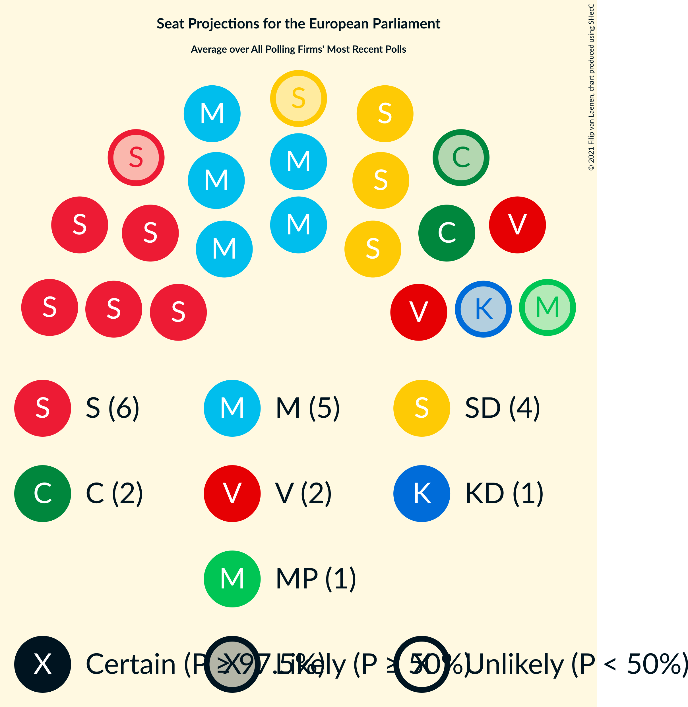

# Overview

The table below lists the most recent polls (less than 90 days old) registered and analyzed so far.

| Period     | Polling firm/Commissioner(s) | S | MP | M | L | SD | C | V | KD | Fi |
|:----------:|:----------------------------:|:--:|:--:|:--:|:--:|:--:|:--:|:--:|:--:|:--:|
| 26 May 2019 | General Election | 24.2%   5 | 15.4%   4 | 13.6%   3 | 9.9%   2 | 9.7%   2 | 6.5%   1 | 6.3%   1 | 5.9%   1 | 5.5%   1 |
| N/A | [Poll Average](average.html) | 26–34%   6–8 | 2–4%   0–1 | 20–23%   5–6 | 3–4%   0–1 | 16–22%   4–5 | 4–7%   1–2 | 7–10%   2 | 4–7%   1–2 | N/A   N/A |
| [9 May–5 June 2022](2022-06-05-Novus.html) | Novus   SVT | 29–32%   7–8 | 3–4%   0 | 20–23%   5–6 | 3–4%   0–1 | 17–19%   4–5 | 5–7%   1–2 | 9–10%   2 | 6–7%   1–2 | N/A   N/A |
| [28 April–25 May 2022](2022-05-25-SCB.html) | SCB | 32–34%   7–8 | 3–4%   0 | 20–22%   5 | 3–4%   0 | 16–18%   4 | 6–7%   1–2 | 7–8%   2 | 5–6%   1 | N/A   N/A |
| [10–22 May 2022](2022-05-22-Ipsos.html) | Ipsos   Dagens Nyheter | 30–34%   7–8 | 2–4%   0 | 20–24%   5–6 | 2–4%   0 | 16–20%   4–5 | 4–6%   1 | 8–11%   2–3 | 4–6%   0–1 | N/A   N/A |
| [2–12 May 2022](2022-05-12-Sifo.html) | Sifo   Svenska Dagbladet | 31–34%   7–8 | 2–3%   0 | 20–22%   5 | 3–4%   0–1 | 17–19%   4 | 6–7%   1–2 | 8–9%   2 | 5–6%   1 | N/A   N/A |
| [4–10 May 2022](2022-05-10-Infostat.html) | Infostat | 26–30%   6–7 | 3–5%   0–1 | 19–23%   4–6 | 3–4%   0–1 | 19–23%   4–5 | 5–7%   1–2 | 7–10%   2 | 5–7%   1–2 | N/A   N/A |
| 26 May 2019 | General Election | 24.2%   5 | 15.4%   4 | 13.6%   3 | 9.9%   2 | 9.7%   2 | 6.5%   1 | 6.3%   1 | 5.9%   1 | 5.5%   1 |

Only polls for which at least the sample size has been published are included in the table above.

**Legend:**
+ **Top half of each row:** Voting intentions (95% confidence interval)
+ **Bottom half of each row:** Seat projections for the European Parliament (95% confidence interval)
+ **S:** Sveriges socialdemokratiska arbetareparti (S&D)
+ **MP:** Miljöpartiet de gröna (Greens/EFA)
+ **M:** Moderata samlingspartiet (EPP)
+ **L:** Liberalerna (RE)
+ **SD:** Sverigedemokraterna (ECR)
+ **C:** Centerpartiet (RE)
+ **V:** Vänsterpartiet (GUE/NGL)
+ **KD:** Kristdemokraterna (EPP)
+ **Fi:** Feministiskt initiativ (S&D)
+ **N/A (single party):** Party not included the published results
+ **N/A (entire row):** Calculation for this opinion poll not started yet

