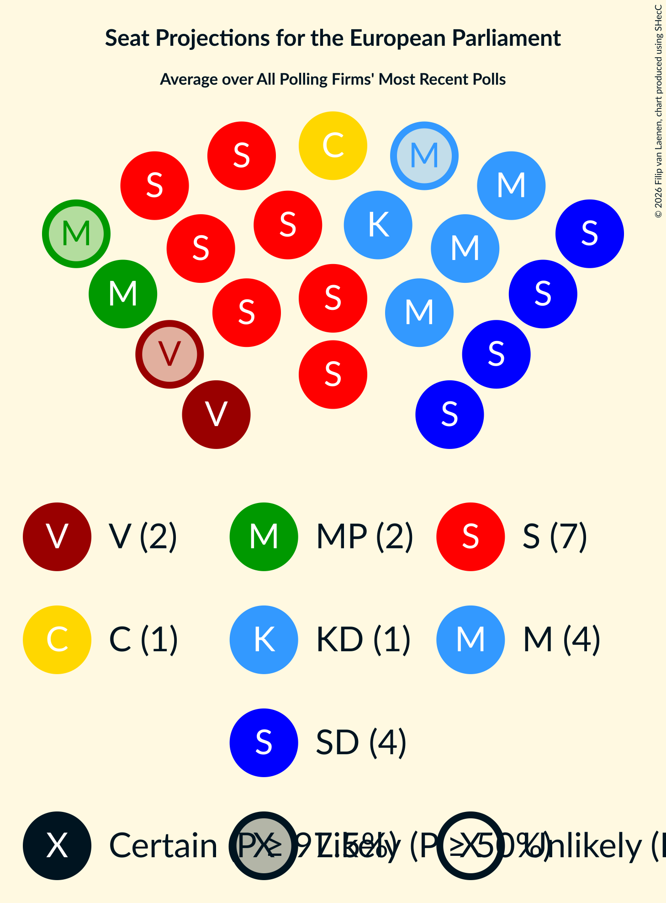
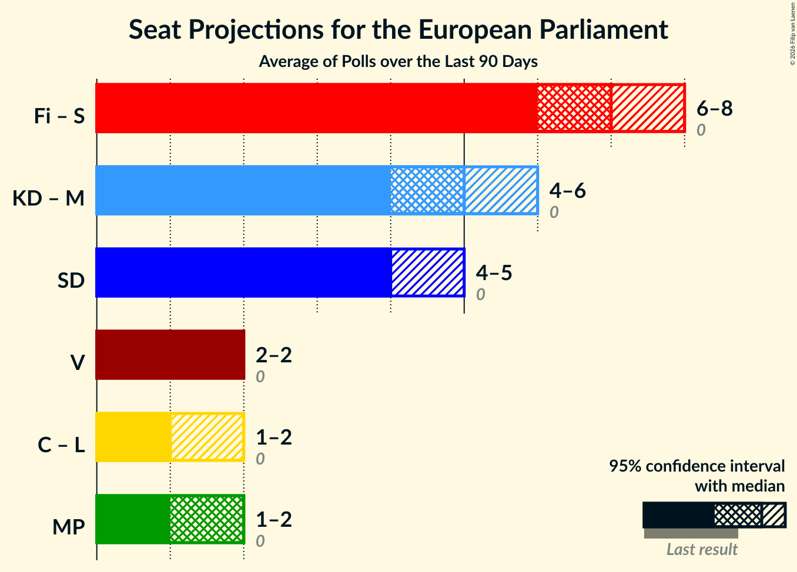

# Overview

The table below lists the most recent polls (less than 90 days old) registered and analyzed so far.

| Period     | Polling firm/Commissioner(s) | V | MP | S | Fi | L | C | M | KD | SD |
|:----------:|:----------------------------:|:--:|:--:|:--:|:--:|:--:|:--:|:--:|:--:|:--:|
| 9 June 2024 | General Election | 0.0%   0 | 0.0%   0 | 0.0%   0 | 0.0%   0 | 0.0%   0 | 0.0%   0 | 0.0%   0 | 0.0%   0 | 0.0%   0 |
| N/A | [Poll Average](average.html) | 7–11%   2 | 6–9%   1–2 | 29–34%   6–8 | N/A   N/A | 1–3%   0 | 5–8%   1–2 | 15–19%   3–4 | 4–7%   1–2 | 17–21%   4–5 |
| [1–26 June 2026](2026-06-26-Indikator.html) | Indikator   Sveriges Radio | 7–9%   1–2 | 5–8%   1–2 | 30–35%   7–8 | N/A   N/A | 1–2%   0 | 6–8%   1–2 | 16–20%   3–4 | 5–7%   1–2 | 17–21%   4–5 |
| [5–17 June 2026](2026-06-17-Demoskop.html) | Demoskop   Aftonbladet and Svenska Dagbladet | 7–9%   1–2 | 7–9%   1–2 | 29–33%   6–7 | N/A   N/A | 2–4%   0 | 5–7%   1–2 | 15–18%   3–4 | 6–8%   1–2 | 18–21%   4–5 |
| [1–14 June 2026](2026-06-14-Novus.html) | Novus   Göteborgs-Posten and TV4 | 8–10%   2 | 6–7%   1–2 | 31–34%   7–8 | N/A   N/A | 2–3%   0 | 6–7%   1–2 | 16–18%   4 | 5–6%   1 | 19–21%   4–5 |
| [2–14 June 2026](2026-06-14-Ipsos.html) | Ipsos   Dagens Nyheter | 8–12%   2–3 | 6–9%   1–2 | 28–34%   6–8 | N/A   N/A | 1–2%   0 | 5–8%   1–2 | 15–20%   3–4 | 5–8%   1–2 | 17–22%   4–5 |
| [27 May–7 June 2026](2026-06-07-Verian.html) | Verian   SVT | 8–10%   2 | 7–9%   2 | 30–33%   7 | N/A   N/A | 2–3%   0 | 5–6%   1 | 16–18%   4 | 5–7%   1 | 17–20%   4 |
| [28 April–28 May 2026](2026-05-28-SCB.html) | SCB | 8–9%   2 | 6–7%   1–2 | 33–35%   7–8 | N/A   N/A | 2–3%   0 | 6–7%   1 | 17–18%   4 | 4–5%   1 | 18–19%   4 |
| 9 June 2024 | General Election | 0.0%   0 | 0.0%   0 | 0.0%   0 | 0.0%   0 | 0.0%   0 | 0.0%   0 | 0.0%   0 | 0.0%   0 | 0.0%   0 |

Only polls for which at least the sample size has been published are included in the table above.

**Legend:**
+ **Top half of each row:** Voting intentions (95% confidence interval)
+ **Bottom half of each row:** Seat projections for the European Parliament (95% confidence interval)
+ **V:** Vänsterpartiet (GUE/NGL)
+ **MP:** Miljöpartiet de gröna (Greens/EFA)
+ **S:** Sveriges socialdemokratiska arbetareparti (S&D)
+ **Fi:** Feministiskt initiativ (S&D)
+ **L:** Liberalerna (RE)
+ **C:** Centerpartiet (RE)
+ **M:** Moderata samlingspartiet (EPP)
+ **KD:** Kristdemokraterna (EPP)
+ **SD:** Sverigedemokraterna (ECR)
+ **N/A (single party):** Party not included the published results
+ **N/A (entire row):** Calculation for this opinion poll not started yet

