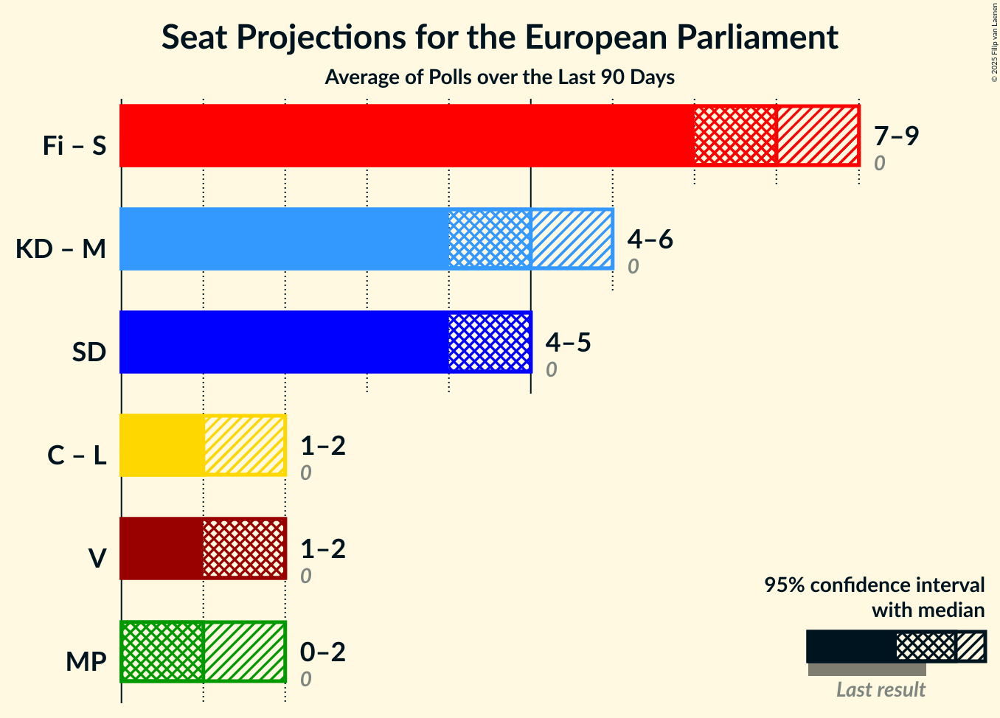

# Overview

The table below lists the most recent polls (less than 90 days old) registered and analyzed so far.

| Period     | Polling firm/Commissioner(s) | S | MP | M | L | SD | C | V | KD | Fi |
|:----------:|:----------------------------:|:--:|:--:|:--:|:--:|:--:|:--:|:--:|:--:|:--:|
| 25 May 2014 | General Election | 24.2%   5 | 15.4%   4 | 13.6%   3 | 9.9%   2 | 9.7%   2 | 6.5%   1 | 6.3%   1 | 5.9%   1 | 5.5%   1 |
| N/A | [Poll Average](average.html) | 26–33%   6–7 | 3–5%   0–1 | 16–20%   3–5 | 3–6%   0–1 | 16–22%   3–5 | 6–9%   1–2 | 7–11%   2 | 5–10%   1–2 | N/A   N/A |
| [29 January–5 February 2019](2019-02-05-Demoskop.html) | Demoskop   Expressen | 26–30%   6–7 | 2–4%   0–1 | 18–22%   4–5 | 3–4%   0–1 | 18–21%   4–5 | 7–10%   2 | 8–11%   2 | 6–8%   1–2 | N/A   N/A |
| [14 January–3 February 2019](2019-02-03-Novus.html) | Novus   SVT | 27–31%   6–7 | 3–4%   0–1 | 17–20%   4 | 2–3%   0 | 20–23%   4–5 | 7–8%   1–2 | 8–10%   2 | 7–8%   1–2 | N/A   N/A |
| [24–30 January 2019](2019-01-30-Sentio.html) | Sentio   Nyheter Idag | 25–31%   5–7 | 3–5%   0–1 | 15–20%   3–5 | 3–5%   0–1 | 18–23%   4–5 | 6–9%   1–2 | 8–11%   2–3 | 6–9%   1–2 | N/A   N/A |
| [16–23 January 2019](2019-01-23-Inizio.html) | Inizio   Aftonbladet | 26–30%   6–7 | 3–5%   0–1 | 17–21%   4–5 | 3–4%   0–1 | 17–20%   4–5 | 7–10%   2 | 8–11%   2–3 | 7–10%   2 | N/A   N/A |
| [10–20 January 2019](2019-01-20-Ipsos.html) | Ipsos   Dagens Nyheter | 28–32%   6–7 | 3–5%   0–1 | 16–20%   3–4 | 4–6%   0–1 | 16–20%   3–4 | 7–9%   1–2 | 7–9%   1–2 | 6–8%   1–2 | N/A   N/A |
| [14–17 January 2019](2019-01-17-Sifo.html) | Sifo   Svenska Dagbladet | 28–31%   6–7 | 3–5%   0–1 | 18–21%   4–5 | 3–4%   0–1 | 19–21%   4–5 | 6–8%   1–2 | 8–9%   2 | 7–8%   1–2 | N/A   N/A |
| [3–17 January 2019](2019-01-17-SKOP.html) | SKOP | 28–33%   6–7 | 2–4%   0–1 | 16–20%   3–4 | 3–5%   0–1 | 15–19%   3–4 | 7–10%   1–2 | 7–11%   2 | 8–11%   2–3 | N/A   N/A |
| [29 October–27 November 2018](2018-11-27-SCB.html) | SCB | 29–32%   6–7 | 3–5%   0–1 | 18–20%   4–5 | 4–5%   0–1 | 17–19%   4 | 8–9%   2 | 8–9%   2 | 5–6%   1 | N/A   N/A |
| 25 May 2014 | General Election | 24.2%   5 | 15.4%   4 | 13.6%   3 | 9.9%   2 | 9.7%   2 | 6.5%   1 | 6.3%   1 | 5.9%   1 | 5.5%   1 |

Only polls for which at least the sample size has been published are included in the table above.

**Legend:**
+ **Top half of each row:** Voting intentions (95% confidence interval)
+ **Bottom half of each row:** Seat projections for the European Parliament (95% confidence interval)
+ **S:** Sveriges socialdemokratiska arbetareparti (S&D)
+ **MP:** Miljöpartiet de gröna (Greens/EFA)
+ **M:** Moderata samlingspartiet (EPP)
+ **L:** Liberalerna (ALDE)
+ **SD:** Sverigedemokraterna (ECR)
+ **C:** Centerpartiet (ALDE)
+ **V:** Vänsterpartiet (GUE/NGL)
+ **KD:** Kristdemokraterna (EPP)
+ **Fi:** Feministiskt initiativ (S&D)
+ **N/A (single party):** Party not included the published results
+ **N/A (entire row):** Calculation for this opinion poll not started yet

