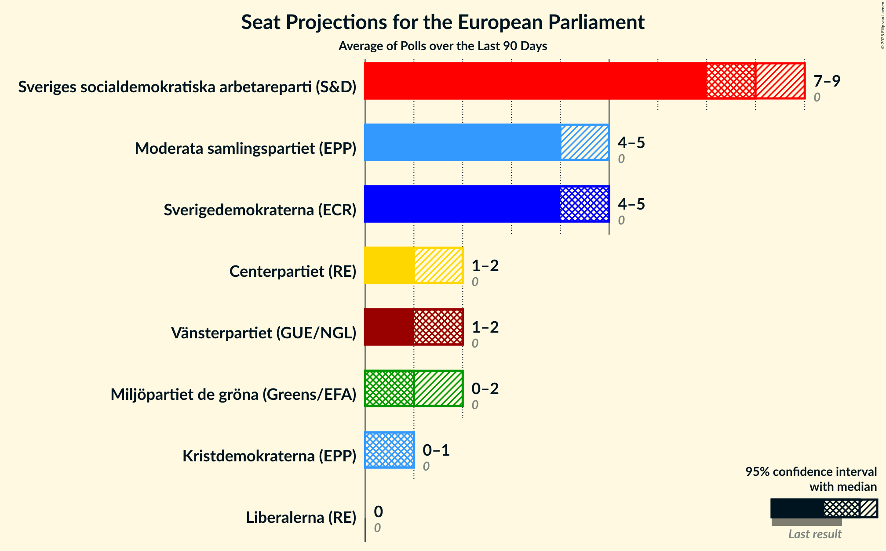

# Overview

The table below lists the most recent polls (less than 90 days old) registered and analyzed so far.

| Period     | Polling firm/Commissioner(s) | S | MP | M | L | SD | C | V | KD | Fi |
|:----------:|:----------------------------:|:--:|:--:|:--:|:--:|:--:|:--:|:--:|:--:|:--:|
| 25 May 2014 | General Election | 24.2%   5 | 15.4%   4 | 13.6%   3 | 9.9%   2 | 9.7%   2 | 6.5%   1 | 6.3%   1 | 5.9%   1 | 5.5%   1 |
| N/A | [Poll Average](average.html) | 20–29%   4–7 | 3–6%   0–1 | 15–23%   3–5 | 4–7%   0–2 | 18–27%   4–6 | 6–12%   1–3 | 7–12%   2–3 | 2–5%   0–1 | 1–2%   0 |
| [25 July–2 August 2018](2018-08-02-Inizio.html) | Inizio   Aftonbladet | 23–27%   5–6 | 4–6%   1 | 19–22%   4–5 | 4–5%   0–1 | 17–21%   4–5 | 8–11%   2 | 8–10%   2 | 4–6%   0–1 | N/A   N/A |
| [27 July–1 August 2018](2018-08-01-Sentio.html) | Sentio   Nyheter Idag | 18–24%   4–6 | 3–6%   0–1 | 16–22%   4–5 | 3–6%   0–1 | 22–29%   5–7 | 5–9%   1–2 | 10–15%   2–4 | 2–4%   0 | 1–2%   0 |
| [25 June–22 July 2018](2018-07-22-Novus.html) | Novus   SVT | 22–25%   5–6 | 5–6%   1 | 18–21%   4–5 | 4–6%   1 | 20–23%   5 | 8–9%   2 | 9–11%   2–3 | 3–4%   0 | N/A   N/A |
| [20 June–21 July 2018](2018-07-21-SKOP.html) | SKOP | 23–28%   5–7 | 3–5%   0–1 | 17–22%   4–5 | 4–6%   0–1 | 19–23%   4–5 | 8–12%   2–3 | 9–12%   2–3 | 2–4%   0–1 | 1–2%   0 |
| [13–15 July 2018](2018-07-15-YouGov.html) | YouGov   Metro | 19–24%   4–5 | 3–5%   0–1 | 14–18%   3–4 | 4–7%   1–2 | 23–28%   5–7 | 7–10%   2 | 8–12%   2–3 | 3–5%   0–1 | 1–2%   0 |
| [25 June–3 July 2018](2018-07-03-Demoskop.html) | Demoskop   Expressen | 24–28%   5–7 | 3–5%   0–1 | 18–22%   4–5 | 3–5%   0–1 | 19–23%   4–5 | 8–11%   2–3 | 8–11%   2 | 2–3%   0 | 1–3%   0 |
| [7–18 June 2018](2018-06-18-Ipsos.html) | Ipsos   Dagens Nyheter | 22–26%   5–6 | 3–5%   0–1 | 17–21%   4–5 | 5–7%   1–2 | 18–22%   4–5 | 9–12%   2–3 | 8–10%   2 | 2–4%   0 | 1–3%   0 |
| [4–14 June 2018](2018-06-14-Sifo.html) | Sifo   Svenska Dagbladet | 24–28%   5–7 | 3–5%   0–1 | 19–22%   4–5 | 4–6%   1 | 17–20%   4–5 | 10–12%   2–3 | 9–11%   2–3 | 2–3%   0 | 1–2%   0 |
| [27 April–29 May 2018](2018-05-29-SCB.html) | SCB | 27–30%   6–7 | 4–5%   0–1 | 21–24%   5 | 4–5%   0–1 | 17–20%   4–5 | 8–10%   2 | 7–8%   2 | 2–3%   0 | N/A   N/A |
| 25 May 2014 | General Election | 24.2%   5 | 15.4%   4 | 13.6%   3 | 9.9%   2 | 9.7%   2 | 6.5%   1 | 6.3%   1 | 5.9%   1 | 5.5%   1 |

Only polls for which at least the sample size has been published are included in the table above.

**Legend:**
+ **Top half of each row:** Voting intentions (95% confidence interval)
+ **Bottom half of each row:** Seat projections for the European Parliament (95% confidence interval)
+ **S:** Sveriges socialdemokratiska arbetareparti (S&D)
+ **MP:** Miljöpartiet de gröna (Greens/EFA)
+ **M:** Moderata samlingspartiet (EPP)
+ **L:** Liberalerna (ALDE)
+ **SD:** Sverigedemokraterna (ECR)
+ **C:** Centerpartiet (ALDE)
+ **V:** Vänsterpartiet (GUE/NGL)
+ **KD:** Kristdemokraterna (EPP)
+ **Fi:** Feministiskt initiativ (S&D)
+ **N/A (single party):** Party not included the published results
+ **N/A (entire row):** Calculation for this opinion poll not started yet

