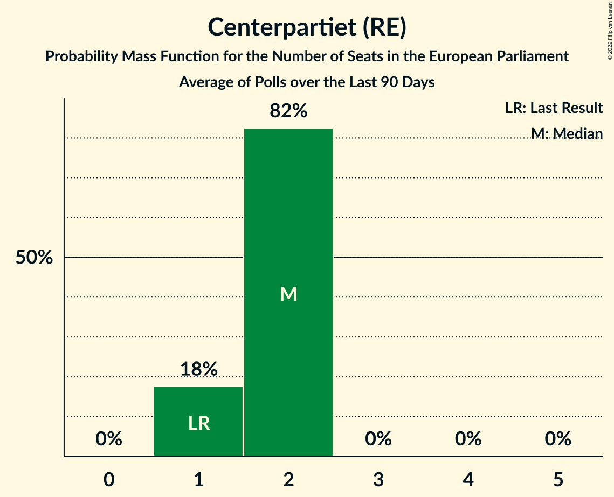

# Centerpartiet (RE)

<a href="#voting-intentions">Voting Intentions</a> | <a href="#seats">Seats</a>

## Voting Intentions

Last result: **6.5%** (General Election of 26 May 2019)

### Confidence Intervals

| Period     | Polling firm/Commissioner(s) | Median | 80% Confidence Interval | 90% Confidence Interval | 95% Confidence Interval | 99% Confidence Interval |
|:----------:|:----------------:|:-----------:|:-----------------------:|:-----------------------:|:-----------------------:|:-----------------------:|
| N/A | [Poll Average](average.html) | 4.4% | 3.7–5.1% | 3.6–5.3% | 3.5–5.5% | 3.2–5.8% |
| [3–25 October 2023](2023-10-25-Indikator.html) | Indikator   Ekot | 4.1% | 3.6–4.7% | 3.5–4.8% | 3.4–5.0% | 3.1–5.3% |
| [18 September–15 October 2023](2023-10-15-Novus.html) | Novus   Svenska Dagbladet | 4.8% | 4.3–5.4% | 4.1–5.6% | 4.0–5.8% | 3.7–6.1% |
| [23 September–7 October 2023](2023-10-07-Demoskop.html) | Demoskop   Aftonbladet | 4.5% | 4.0–5.1% | 3.8–5.3% | 3.7–5.5% | 3.5–5.8% |
| [18 September–1 October 2023](2023-10-01-Sifo.html) | Sifo   SVT | 4.0% | 3.6–4.5% | 3.5–4.6% | 3.4–4.8% | 3.2–5.0% |
| [12–24 September 2023](2023-09-24-Ipsos.html) | Ipsos   Dagens Nyheter | 5.0% | 4.3–5.9% | 4.1–6.1% | 3.9–6.3% | 3.6–6.8% |
| [1–22 September 2023](2023-09-22-Indikator.html) | Indikator   Ekot | 4.0% | 3.5–4.6% | 3.4–4.8% | 3.3–4.9% | 3.1–5.2% |
| [21 August–17 September 2023](2023-09-17-Novus.html) | Novus   Svenska Dagbladet | 3.9% | 3.5–4.4% | 3.3–4.5% | 3.2–4.7% | 3.0–4.9% |
| [21 August–5 September 2023](2023-09-05-Demoskop.html) | Demoskop   Aftonbladet | 4.3% | 3.8–4.9% | 3.7–5.0% | 3.6–5.2% | 3.4–5.5% |
| [22 August–4 September 2023](2023-09-04-Sifo.html) | Sifo   SVT | 3.9% | 3.5–4.4% | 3.4–4.5% | 3.3–4.6% | 3.1–4.9% |
| [15–27 August 2023](2023-08-27-Ipsos.html) | Ipsos   Dagens Nyheter | 6.0% | 5.2–7.0% | 5.0–7.2% | 4.8–7.5% | 4.5–7.9% |
| [1–20 August 2023](2023-08-20-Novus.html) | Novus   Svenska Dagbladet | 4.6% | 4.2–5.1% | 4.0–5.2% | 3.9–5.4% | 3.7–5.6% |
| [15 July–2 August 2023](2023-08-02-Demoskop.html) | Demoskop   Aftonbladet | 5.0% | 4.5–5.6% | 4.3–5.8% | 4.2–6.0% | 4.0–6.3% |
| [17–30 July 2023](2023-07-30-Sifo.html) | Sifo   SVT | 4.3% | 3.9–4.8% | 3.7–4.9% | 3.6–5.1% | 3.4–5.3% |
| [26 June–16 July 2023](2023-07-16-Novus.html) | Novus   Svenska Dagbladet | 4.5% | 4.0–5.1% | 3.9–5.3% | 3.7–5.4% | 3.5–5.7% |
| [13–25 June 2023](2023-06-25-Demoskop.html) | Demoskop   Aftonbladet | 4.7% | 4.2–5.3% | 4.0–5.5% | 3.9–5.6% | 3.7–5.9% |
| [29 May–21 June 2023](2023-06-21-Novus.html) | Novus   Svenska Dagbladet | 4.7% | 4.3–5.2% | 4.1–5.4% | 4.0–5.5% | 3.8–5.8% |
| [8–18 June 2023](2023-06-18-Ipsos.html) | Ipsos   Dagens Nyheter | 5.0% | 4.3–5.8% | 4.2–6.0% | 4.0–6.2% | 3.7–6.6% |
| [25 May–7 June 2023](2023-06-07-Demoskop.html) | Demoskop   Aftonbladet | 4.9% | 4.4–5.5% | 4.2–5.7% | 4.1–5.8% | 3.9–6.1% |
| [22 May–4 June 2023](2023-06-04-Sifo.html) | Sifo   SVT | 4.4% | 3.9–4.9% | 3.8–5.0% | 3.7–5.2% | 3.5–5.4% |
| [27 April–25 May 2023](2023-05-25-SCB.html) | SCB | 4.2% | 3.9–4.5% | 3.9–4.6% | 3.8–4.6% | 3.7–4.8% |
| [9–21 May 2023](2023-05-21-Ipsos.html) | Ipsos   Dagens Nyheter | 4.9% | 4.3–5.6% | 4.1–5.9% | 3.9–6.0% | 3.7–6.4% |
| [1–10 May 2023](2023-05-10-Sifo.html) | Sifo   Svenska Dagbladet | 4.3% | 4.0–4.7% | 3.9–4.8% | 3.8–4.9% | 3.6–5.1% |
| [13–30 April 2023](2023-04-30-Novus.html) | Novus   SVT | 4.4% | 4.0–4.9% | 3.9–5.1% | 3.7–5.2% | 3.6–5.4% |
| [14–24 April 2023](2023-04-24-Demoskop.html) | Demoskop   Aftonbladet | 4.9% | 4.4–5.5% | 4.2–5.7% | 4.1–5.9% | 3.8–6.2% |
| [11–23 April 2023](2023-04-23-Ipsos.html) | Ipsos   Dagens Nyheter | 5.0% | 4.3–5.7% | 4.2–6.0% | 4.0–6.2% | 3.7–6.6% |
| [3–13 April 2023](2023-04-13-Sifo.html) | Sifo   Svenska Dagbladet | 4.3% | 3.9–4.8% | 3.8–4.9% | 3.7–5.0% | 3.5–5.2% |
| [24 March–3 April 2023](2023-04-03-Demoskop.html) | Demoskop   Aftonbladet | 4.4% | 3.9–5.0% | 3.7–5.2% | 3.6–5.4% | 3.3–5.7% |
| [27 February–2 April 2023](2023-04-02-Novus.html) | Novus   SVT | 4.6% | 4.2–5.1% | 4.1–5.2% | 4.0–5.4% | 3.8–5.6% |
| [14–26 March 2023](2023-03-26-Ipsos.html) | Ipsos   Dagens Nyheter | 5.0% | 4.4–5.8% | 4.2–6.0% | 4.1–6.2% | 3.8–6.6% |
| [6–16 March 2023](2023-03-16-Sifo.html) | Sifo   Svenska Dagbladet | 3.8% | 3.5–4.2% | 3.4–4.3% | 3.3–4.4% | 3.2–4.5% |
| [24 February–6 March 2023](2023-03-06-Demoskop.html) | Demoskop   Aftonbladet | 4.4% | 3.9–5.0% | 3.7–5.2% | 3.6–5.4% | 3.4–5.7% |
| [30 January–26 February 2023](2023-02-26-Novus.html) | Novus   SVT | 4.9% | 4.5–5.4% | 4.3–5.6% | 4.2–5.7% | 4.0–5.9% |
| [14–26 February 2023](2023-02-26-Ipsos.html) | Ipsos   Dagens Nyheter | 5.0% | 4.4–5.8% | 4.2–6.0% | 4.1–6.2% | 3.8–6.6% |
| [6–16 February 2023](2023-02-16-Sifo.html) | Sifo   Svenska Dagbladet | 4.3% | 4.0–4.7% | 3.9–4.8% | 3.8–4.8% | 3.7–5.0% |
| [27 January–6 February 2023](2023-02-06-Demoskop.html) | Demoskop   Aftonbladet | 5.5% | 4.9–6.2% | 4.8–6.4% | 4.6–6.6% | 4.3–6.9% |
| [2–29 January 2023](2023-01-29-Novus.html) | Novus   SVT | 5.0% | 4.6–5.5% | 4.4–5.7% | 4.3–5.8% | 4.1–6.0% |
| [17–29 January 2023](2023-01-29-Ipsos.html) | Ipsos   Dagens Nyheter | 5.0% | 4.4–5.8% | 4.2–6.0% | 4.1–6.2% | 3.8–6.6% |
| [9–19 January 2023](2023-01-19-Sifo.html) | Sifo   Svenska Dagbladet | 5.2% | 4.8–5.7% | 4.6–5.8% | 4.5–5.9% | 4.3–6.2% |
| [31 December 2022–9 January 2023](2023-01-09-Demoskop.html) | Demoskop   Aftonbladet | 6.0% | 5.4–6.7% | 5.2–6.9% | 5.1–7.1% | 4.8–7.4% |
| [28 November 2022–1 January 2023](2023-01-01-Novus.html) | Novus   SVT | 5.4% | 4.9–6.0% | 4.8–6.1% | 4.6–6.3% | 4.4–6.6% |
| [6–18 December 2022](2022-12-18-Ipsos.html) | Ipsos   Dagens Nyheter | 6.0% | 5.3–6.8% | 5.1–7.1% | 4.9–7.3% | 4.6–7.7% |
| [5–12 December 2022](2022-12-12-Sifo.html) | Sifo   Svenska Dagbladet | 5.9% | 5.5–6.3% | 5.4–6.5% | 5.3–6.6% | 5.1–6.8% |
| [28 November–6 December 2022](2022-12-06-Demoskop.html) | Demoskop   Aftonbladet | 6.1% | 5.5–6.8% | 5.3–7.0% | 5.2–7.2% | 4.9–7.6% |
| [15–28 November 2022](2022-11-28-Ipsos.html) | Ipsos   Dagens Nyheter | 6.0% | 5.3–6.8% | 5.1–7.1% | 5.0–7.3% | 4.6–7.7% |
| [31 October–27 November 2022](2022-11-27-Novus.html) | Novus   SVT | 6.1% | 5.6–6.7% | 5.5–6.8% | 5.4–6.9% | 5.2–7.2% |
| [27 October–24 November 2022](2022-11-24-SCB.html) | SCB | 5.4% | 5.1–5.7% | 5.0–5.8% | 5.0–5.9% | 4.8–6.1% |
| [7–17 November 2022](2022-11-17-Sifo.html) | Sifo   Svenska Dagbladet | 5.5% | 5.1–5.9% | 5.0–6.1% | 4.9–6.2% | 4.7–6.4% |
| [23 October–1 November 2022](2022-11-01-Demoskop.html) | Demoskop   Aftonbladet | 6.0% | 5.4–6.7% | 5.2–6.9% | 5.1–7.0% | 4.8–7.4% |
| [3–30 October 2022](2022-10-30-Novus.html) | Novus   SVT | 5.9% | 5.4–6.4% | 5.3–6.6% | 5.2–6.7% | 4.9–7.0% |
| [11–23 October 2022](2022-10-23-Ipsos.html) | Ipsos   Dagens Nyheter | 7.0% | 6.2–7.8% | 6.0–8.1% | 5.8–8.3% | 5.5–8.8% |
| [3–13 October 2022](2022-10-13-Sifo.html) | Sifo   Svenska Dagbladet | 5.8% | 5.4–6.2% | 5.3–6.3% | 5.2–6.4% | 5.1–6.6% |
| [26 September–4 October 2022](2022-10-04-Demoskop.html) | Demoskop   Aftonbladet | 5.8% | 5.2–6.5% | 5.0–6.7% | 4.9–6.9% | 4.6–7.2% |
| [12 September–2 October 2022](2022-10-02-Novus.html) | Novus   SVT | 5.7% | 5.2–6.3% | 5.0–6.4% | 4.9–6.6% | 4.7–6.9% |
| [13–25 September 2022](2022-09-25-Ipsos.html) | Ipsos   Dagens Nyheter | 7.0% | 6.3–7.9% | 6.1–8.1% | 5.9–8.4% | 5.5–8.8% |
| [6–9 September 2022](2022-09-09-SKOP.html) | SKOP | 7.6% | 6.9–8.4% | 6.7–8.7% | 6.5–8.9% | 6.2–9.3% |
| [6–9 September 2022](2022-09-09-Ipsos.html) | Ipsos   Dagens Nyheter | 8.0% | 7.2–8.8% | 7.0–9.1% | 6.9–9.3% | 6.5–9.7% |
| [1–9 September 2022](2022-09-09-Demoskop.html) | Demoskop   Aftonbladet | 7.9% | 7.2–8.7% | 7.1–8.9% | 6.9–9.1% | 6.6–9.5% |
| [6–8 September 2022](2022-09-08-Sifo.html) | Sifo   Svenska Dagbladet | 6.6% | 6.0–7.3% | 5.8–7.5% | 5.7–7.7% | 5.4–8.0% |
| [5–8 September 2022](2022-09-08-SKOP.html) | SKOP | 7.2% | 6.4–8.1% | 6.2–8.4% | 6.1–8.6% | 5.7–9.0% |
| [6–8 September 2022](2022-09-08-Novus.html) | Novus   SVT | 7.1% | 6.3–8.0% | 6.1–8.3% | 5.9–8.5% | 5.5–8.9% |
| [5–7 September 2022](2022-09-07-Sifo.html) | Sifo   Svenska Dagbladet | 7.0% | N/A | N/A | N/A | N/A |
| [4–7 September 2022](2022-09-07-SKOP.html) | SKOP | 6.5% | N/A | N/A | N/A | N/A |
| [5–7 September 2022](2022-09-07-Novus.html) | Novus   SVT | 7.5% | N/A | N/A | N/A | N/A |
| [4–6 September 2022](2022-09-06-Sifo.html) | Sifo   Svenska Dagbladet | 7.1% | 6.4–7.8% | 6.2–8.0% | 6.1–8.2% | 5.8–8.6% |
| [3–6 September 2022](2022-09-06-SKOP.html) | SKOP | 7.0% | 6.2–7.9% | 5.9–8.2% | 5.7–8.4% | 5.4–8.9% |
| [4–6 September 2022](2022-09-06-Novus.html) | Novus   SVT | 8.6% | 7.7–9.6% | 7.5–9.9% | 7.3–10.1% | 6.9–10.6% |
| [1–6 September 2022](2022-09-06-Ipsos.html) | Ipsos   Dagens Nyheter | 7.6% | 6.8–8.5% | 6.6–8.7% | 6.4–8.9% | 6.1–9.4% |
| [3–5 September 2022](2022-09-05-Sifo.html) | Sifo   Svenska Dagbladet | 7.7% | 7.0–8.5% | 6.8–8.8% | 6.6–9.0% | 6.3–9.4% |
| [2–5 September 2022](2022-09-05-SKOP.html) | SKOP | 7.4% | 6.5–8.5% | 6.2–8.8% | 6.0–9.1% | 5.6–9.6% |
| [3–5 September 2022](2022-09-05-Novus.html) | Novus   SVT | 8.8% | 7.9–9.8% | 7.7–10.1% | 7.5–10.3% | 7.1–10.9% |
| [2–4 September 2022](2022-09-04-Sifo.html) | Sifo   Svenska Dagbladet | 8.2% | 7.4–9.0% | 7.2–9.3% | 7.0–9.5% | 6.7–9.9% |
| [1 August–4 September 2022](2022-09-04-SKOP.html) | SKOP | 7.5% | 6.5–8.5% | 6.3–8.9% | 6.1–9.1% | 5.7–9.7% |
| [2–4 September 2022](2022-09-04-Novus.html) | Novus   SVT | 8.8% | 7.9–9.8% | 7.7–10.1% | 7.5–10.3% | 7.1–10.9% |
| [31 August–4 September 2022](2022-09-04-Demoskop.html) | Demoskop   Aftonbladet | 8.1% | 7.4–8.9% | 7.2–9.1% | 7.0–9.3% | 6.7–9.7% |
| [1–3 September 2022](2022-09-03-Sifo.html) | Sifo   Svenska Dagbladet | 7.6% | N/A | N/A | N/A | N/A |
| [31 August–3 September 2022](2022-09-03-SKOP.html) | SKOP | 8.3% | N/A | N/A | N/A | N/A |
| [1–3 September 2022](2022-09-03-Novus.html) | Novus   SVT | 7.5% | N/A | N/A | N/A | N/A |
| [31 August–2 September 2022](2022-09-02-Sifo.html) | Sifo   Svenska Dagbladet | 7.8% | 7.0–8.6% | 6.8–8.9% | 6.6–9.1% | 6.3–9.5% |
| [30 August–2 September 2022](2022-09-02-SKOP.html) | SKOP | 8.1% | N/A | N/A | N/A | N/A |
| [31 August–2 September 2022](2022-09-02-Novus.html) | Novus   SVT | 6.9% | N/A | N/A | N/A | N/A |
| [30 August–1 September 2022](2022-09-01-Sifo.html) | Sifo   Svenska Dagbladet | 7.5% | N/A | N/A | N/A | N/A |
| [29 August–1 September 2022](2022-09-01-SKOP.html) | SKOP | 8.0% | N/A | N/A | N/A | N/A |
| [30 August–1 September 2022](2022-09-01-Novus.html) | Novus   SVT | 6.7% | N/A | N/A | N/A | N/A |
| [29–31 August 2022](2022-08-31-Sifo.html) | Sifo   Svenska Dagbladet | 7.3% | 6.6–8.1% | 6.4–8.3% | 6.2–8.5% | 5.9–8.9% |
| [28–31 August 2022](2022-08-31-SKOP.html) | SKOP | 8.3% | 7.3–9.4% | 7.1–9.7% | 6.9–10.0% | 6.4–10.6% |
| [29–31 August 2022](2022-08-31-Novus.html) | Novus   SVT | 6.8% | 6.0–7.7% | 5.8–8.0% | 5.6–8.2% | 5.3–8.7% |
| [28–30 August 2022](2022-08-30-Sifo.html) | Sifo   Svenska Dagbladet | 6.4% | N/A | N/A | N/A | N/A |
| [27–30 August 2022](2022-08-30-SKOP.html) | SKOP | 6.7% | N/A | N/A | N/A | N/A |
| [28–30 August 2022](2022-08-30-Novus.html) | Novus   SVT | 7.4% | N/A | N/A | N/A | N/A |
| [26–30 August 2022](2022-08-30-Ipsos.html) | Ipsos   Dagens Nyheter | 6.1% | 5.3–7.0% | 5.1–7.3% | 4.9–7.6% | 4.6–8.0% |
| [27–29 August 2022](2022-08-29-Sifo.html) | Sifo   Svenska Dagbladet | 6.6% | N/A | N/A | N/A | N/A |
| [26–29 August 2022](2022-08-29-SKOP.html) | SKOP | 7.2% | N/A | N/A | N/A | N/A |
| [27–29 August 2022](2022-08-29-Novus.html) | Novus   SVT | 7.7% | N/A | N/A | N/A | N/A |
| [21–29 August 2022](2022-08-29-Demoskop.html) | Demoskop   Aftonbladet | 7.5% | 6.8–8.3% | 6.6–8.5% | 6.5–8.7% | 6.2–9.1% |
| [26–28 August 2022](2022-08-28-Sifo.html) | Sifo   Svenska Dagbladet | 6.4% | N/A | N/A | N/A | N/A |
| [24–28 August 2022](2022-08-28-SKOP.html) | SKOP | 8.2% | N/A | N/A | N/A | N/A |
| [26–28 August 2022](2022-08-28-Novus.html) | Novus   SVT | 8.0% | N/A | N/A | N/A | N/A |
| [25–27 August 2022](2022-08-27-Sifo.html) | Sifo   Svenska Dagbladet | 6.1% | N/A | N/A | N/A | N/A |
| [23–27 August 2022](2022-08-27-SKOP.html) | SKOP | 7.7% | N/A | N/A | N/A | N/A |
| [25–27 August 2022](2022-08-27-Novus.html) | Novus   SVT | 7.4% | N/A | N/A | N/A | N/A |
| [24–26 August 2022](2022-08-26-Sifo.html) | Sifo   Svenska Dagbladet | 5.7% | N/A | N/A | N/A | N/A |
| [22–26 August 2022](2022-08-26-SKOP.html) | SKOP | 7.9% | N/A | N/A | N/A | N/A |
| [24–26 August 2022](2022-08-26-Novus.html) | Novus   SVT | 5.4% | N/A | N/A | N/A | N/A |
| [23–25 August 2022](2022-08-25-Sifo.html) | Sifo   Svenska Dagbladet | 5.8% | 5.2–6.5% | 5.0–6.7% | 4.9–6.8% | 4.6–7.2% |
| [21–25 August 2022](2022-08-25-SKOP.html) | SKOP | 7.0% | 6.1–7.9% | 5.9–8.2% | 5.7–8.5% | 5.3–8.9% |
| [23–25 August 2022](2022-08-25-Novus.html) | Novus   SVT | 5.6% | 4.9–6.4% | 4.7–6.7% | 4.5–6.9% | 4.2–7.3% |
| [22–24 August 2022](2022-08-24-Sifo.html) | Sifo   Svenska Dagbladet | 5.7% | 5.1–6.3% | 5.0–6.5% | 4.8–6.7% | 4.6–7.0% |
| [20–24 August 2022](2022-08-24-SKOP.html) | SKOP | 6.1% | 5.3–7.1% | 5.0–7.4% | 4.8–7.7% | 4.5–8.2% |
| [22–24 August 2022](2022-08-24-Novus.html) | Novus   SVT | 6.5% | 5.8–7.4% | 5.6–7.7% | 5.4–7.9% | 5.0–8.4% |
| [16–24 August 2022](2022-08-24-Ipsos.html) | Ipsos   Dagens Nyheter | 6.9% | 6.1–7.7% | 5.9–8.0% | 5.7–8.2% | 5.4–8.6% |
| [21–23 August 2022](2022-08-23-Sifo.html) | Sifo   Svenska Dagbladet | 6.0% | 5.4–6.7% | 5.2–6.9% | 5.1–7.1% | 4.8–7.5% |
| [19–23 August 2022](2022-08-23-SKOP.html) | SKOP | 6.6% | 5.7–7.7% | 5.5–8.0% | 5.3–8.2% | 4.9–8.8% |
| [21–23 August 2022](2022-08-23-Novus.html) | Novus   SVT | 6.9% | 6.2–7.8% | 5.9–8.1% | 5.7–8.3% | 5.4–8.8% |
| [20–22 August 2022](2022-08-22-Sifo.html) | Sifo   Svenska Dagbladet | 6.1% | 5.5–6.8% | 5.3–7.0% | 5.2–7.2% | 4.9–7.5% |
| [20–22 August 2022](2022-08-22-Novus.html) | Novus   SVT | 7.2% | 6.4–8.1% | 6.2–8.4% | 6.0–8.6% | 5.6–9.1% |
| [19–21 August 2022](2022-08-21-Sifo.html) | Sifo   Svenska Dagbladet | 5.8% | N/A | N/A | N/A | N/A |
| [18–21 August 2022](2022-08-21-SKOP.html) | SKOP | 8.6% | 7.6–9.8% | 7.3–10.1% | 7.1–10.4% | 6.6–11.0% |
| [19–21 August 2022](2022-08-21-Novus.html) | Novus   SVT | 6.7% | N/A | N/A | N/A | N/A |
| [16–21 August 2022](2022-08-21-Demoskop.html) | Demoskop   Aftonbladet | 6.8% | 6.2–7.5% | 6.0–7.7% | 5.8–7.9% | 5.5–8.3% |
| [18–20 August 2022](2022-08-20-Sifo.html) | Sifo   Svenska Dagbladet | 6.1% | 5.4–6.9% | 5.2–7.2% | 5.0–7.4% | 4.7–7.8% |
| [17–19 August 2022](2022-08-19-Sifo.html) | Sifo   Svenska Dagbladet | 6.0% | 5.3–6.8% | 5.1–7.0% | 5.0–7.2% | 4.6–7.6% |
| [16–18 August 2022](2022-08-18-Sifo.html) | Sifo   Svenska Dagbladet | 6.1% | 5.4–7.0% | 5.2–7.2% | 5.1–7.4% | 4.8–7.8% |
| [15–17 August 2022](2022-08-17-Sifo.html) | Sifo   Svenska Dagbladet | 6.0% | 5.4–6.8% | 5.2–7.0% | 5.1–7.1% | 4.8–7.5% |
| [14–16 August 2022](2022-08-16-Sifo.html) | Sifo   Svenska Dagbladet | 6.3% | 5.6–7.0% | 5.4–7.2% | 5.3–7.4% | 5.0–7.8% |
| [6–16 August 2022](2022-08-16-Demoskop.html) | Demoskop   Aftonbladet | 7.5% | 6.8–8.3% | 6.6–8.5% | 6.5–8.7% | 6.2–9.1% |
| [13–15 August 2022](2022-08-15-Sifo.html) | Sifo   Svenska Dagbladet | 5.9% | 5.2–6.6% | 5.1–6.8% | 4.9–7.0% | 4.6–7.4% |
| [12–14 August 2022](2022-08-14-Sifo.html) | Sifo   Svenska Dagbladet | 5.7% | 5.1–6.4% | 4.9–6.6% | 4.7–6.8% | 4.5–7.2% |
| [8–14 August 2022](2022-08-14-Novus.html) | Novus   SVT | 6.0% | 5.4–6.7% | 5.2–6.9% | 5.0–7.1% | 4.8–7.5% |
| [11–13 August 2022](2022-08-13-Sifo.html) | Sifo   Svenska Dagbladet | 5.3% | 4.7–6.0% | 4.5–6.2% | 4.4–6.4% | 4.1–6.7% |
| [10–12 August 2022](2022-08-12-Sifo.html) | Sifo   Svenska Dagbladet | 5.3% | 4.7–6.0% | 4.5–6.2% | 4.4–6.4% | 4.1–6.8% |
| [9–11 August 2022](2022-08-11-Sifo.html) | Sifo   Svenska Dagbladet | 5.3% | 4.7–6.0% | 4.5–6.2% | 4.3–6.4% | 4.1–6.8% |
| [1–7 August 2022](2022-08-07-Novus.html) | Novus   SVT | 6.8% | 6.1–7.6% | 5.9–7.8% | 5.8–8.0% | 5.4–8.4% |
| [24 July–2 August 2022](2022-08-02-Demoskop.html) | Demoskop   Aftonbladet | 7.2% | 6.6–8.0% | 6.4–8.2% | 6.2–8.4% | 5.9–8.7% |
| [8–11 July 2022](2022-07-11-SKOP.html) | SKOP | 6.2% | 5.4–7.3% | 5.1–7.7% | 4.9–7.9% | 4.5–8.5% |
| [22–30 June 2022](2022-06-30-Demoskop.html) | Demoskop   Aftonbladet | 7.1% | 6.4–7.9% | 6.2–8.1% | 6.1–8.3% | 5.8–8.7% |
| [6–26 June 2022](2022-06-26-Novus.html) | Novus   SVT | 5.4% | 4.9–6.0% | 4.7–6.1% | 4.6–6.3% | 4.4–6.6% |
| [7–19 June 2022](2022-06-19-Ipsos.html) | Ipsos   Dagens Nyheter | 5.0% | 4.4–5.8% | 4.2–6.0% | 4.1–6.2% | 3.8–6.6% |
| [6–16 June 2022](2022-06-16-Sifo.html) | Sifo   Svenska Dagbladet | 6.0% | 5.7–6.3% | 5.6–6.4% | 5.5–6.5% | 5.4–6.7% |
| [31 May–9 June 2022](2022-06-09-Demoskop.html) | Demoskop   Aftonbladet | 7.7% | 7.0–8.5% | 6.8–8.7% | 6.6–8.9% | 6.3–9.3% |
| [9 May–5 June 2022](2022-06-05-Novus.html) | Novus   SVT | 5.9% | 5.4–6.4% | 5.3–6.6% | 5.2–6.7% | 5.0–7.0% |
| [28 April–25 May 2022](2022-05-25-SCB.html) | SCB | 6.7% | 6.4–7.1% | 6.3–7.2% | 6.2–7.2% | 6.1–7.4% |
| [10–22 May 2022](2022-05-22-Ipsos.html) | Ipsos   Dagens Nyheter | 5.0% | 4.3–5.8% | 4.1–6.0% | 4.0–6.2% | 3.7–6.6% |
| [2–12 May 2022](2022-05-12-Sifo.html) | Sifo   Svenska Dagbladet | 6.3% | 5.9–6.7% | 5.8–6.8% | 5.7–6.9% | 5.6–7.1% |
| [4–10 May 2022](2022-05-10-Infostat.html) | Infostat | 5.9% | 5.2–6.7% | 5.0–7.0% | 4.9–7.1% | 4.6–7.6% |
| [26 April–4 May 2022](2022-05-04-Demoskop.html) | Demoskop   Aftonbladet | 7.8% | 7.1–8.6% | 7.0–8.9% | 6.8–9.1% | 6.5–9.5% |
| [4 April–1 May 2022](2022-05-01-Novus.html) | Novus   SVT | 6.9% | 6.4–7.5% | 6.2–7.6% | 6.1–7.8% | 5.9–8.1% |
| [12–26 April 2022](2022-04-26-Ipsos.html) | Ipsos   Dagens Nyheter | 6.0% | 5.3–6.8% | 5.1–7.1% | 4.9–7.3% | 4.6–7.7% |
| [11–21 April 2022](2022-04-21-Sifo.html) | Sifo   Svenska Dagbladet | 7.1% | 6.7–7.5% | 6.6–7.6% | 6.5–7.7% | 6.4–7.9% |
| [6–14 April 2022](2022-04-14-SKOP.html) | SKOP | 7.4% | 6.4–8.5% | 6.1–8.9% | 5.9–9.2% | 5.5–9.7% |
| [29 March–5 April 2022](2022-04-05-Demoskop.html) | Demoskop   Aftonbladet | 8.0% | 7.3–8.8% | 7.1–9.0% | 6.9–9.2% | 6.6–9.6% |
| [7 March–3 April 2022](2022-04-03-Novus.html) | Novus   SVT | 6.8% | 6.3–7.3% | 6.2–7.5% | 6.1–7.6% | 5.8–7.9% |
| [15–27 March 2022](2022-03-27-Ipsos.html) | Ipsos   Dagens Nyheter | 7.0% | 6.2–7.8% | 6.0–8.1% | 5.8–8.3% | 5.4–8.8% |
| [7–17 March 2022](2022-03-17-Sifo.html) | Sifo   Svenska Dagbladet | 7.0% | 6.6–7.4% | 6.5–7.5% | 6.4–7.6% | 6.2–7.8% |
| [1–9 March 2022](2022-03-09-Demoskop.html) | Demoskop   Aftonbladet | 7.5% | 6.8–8.3% | 6.6–8.5% | 6.5–8.7% | 6.1–9.1% |
| [31 January–27 February 2022](2022-02-27-Novus.html) | Novus   SVT | 6.8% | 6.2–7.5% | 6.0–7.7% | 5.9–7.8% | 5.6–8.2% |
| [8–20 February 2022](2022-02-20-Ipsos.html) | Ipsos   Dagens Nyheter | 7.0% | 6.2–7.9% | 6.0–8.1% | 5.9–8.3% | 5.5–8.8% |
| [7–17 February 2022](2022-02-17-Sifo.html) | Sifo   Svenska Dagbladet | 6.9% | 6.5–7.3% | 6.4–7.4% | 6.3–7.5% | 6.1–7.8% |
| [11–14 February 2022](2022-02-14-SKOP.html) | SKOP | 7.3% | 6.4–8.5% | 6.1–8.8% | 5.9–9.1% | 5.4–9.7% |
| [1–8 February 2022](2022-02-08-Demoskop.html) | Demoskop   Aftonbladet | 7.9% | 7.2–8.6% | 7.1–8.9% | 6.9–9.0% | 6.6–9.4% |
| [3–30 January 2022](2022-01-30-Novus.html) | Novus   SVT | 7.4% | 6.9–8.0% | 6.7–8.2% | 6.6–8.3% | 6.4–8.6% |
| [11–24 January 2022](2022-01-24-Ipsos.html) | Ipsos   Dagens Nyheter | 6.0% | 5.3–6.8% | 5.1–7.1% | 5.0–7.3% | 4.7–7.7% |
| [10–20 January 2022](2022-01-20-Sifo.html) | Sifo   Svenska Dagbladet | 7.0% | 6.6–7.4% | 6.5–7.5% | 6.4–7.6% | 6.2–7.8% |
| [28 December 2021–5 January 2022](2022-01-05-Demoskop.html) | Demoskop   Aftonbladet | 8.3% | 7.6–9.1% | 7.4–9.3% | 7.3–9.5% | 7.0–9.9% |
| [6 December 2021–2 January 2022](2022-01-02-Novus.html) | Novus   SVT | 6.7% | 6.0–7.5% | 5.8–7.7% | 5.7–7.9% | 5.4–8.3% |
| [7–20 December 2021](2021-12-20-Ipsos.html) | Ipsos   Dagens Nyheter | 7.0% | 6.2–7.9% | 6.0–8.2% | 5.9–8.4% | 5.5–8.8% |
| [6–16 December 2021](2021-12-16-Sifo.html) | Sifo   Svenska Dagbladet | 7.0% | 6.6–7.4% | 6.5–7.6% | 6.4–7.7% | 6.2–7.9% |
| [30 November–8 December 2021](2021-12-08-Demoskop.html) | Demoskop   Aftonbladet | 8.5% | 7.8–9.3% | 7.6–9.5% | 7.5–9.7% | 7.1–10.1% |
| [8 November–5 December 2021](2021-12-05-Novus.html) | Novus   SVT | 7.5% | 7.0–8.0% | 6.8–8.2% | 6.7–8.3% | 6.5–8.6% |
| [28 October–25 November 2021](2021-11-25-SCB.html) | SCB | 8.4% | 8.0–8.8% | 7.9–8.9% | 7.8–9.0% | 7.7–9.2% |
| [9–22 November 2021](2021-11-22-Ipsos.html) | Ipsos   Dagens Nyheter | 8.0% | 7.3–9.0% | 7.1–9.3% | 6.9–9.5% | 6.5–10.0% |
| [8–18 November 2021](2021-11-18-Sifo.html) | Sifo   Svenska Dagbladet | 8.1% | 7.7–8.6% | 7.5–8.7% | 7.4–8.9% | 7.2–9.1% |
| [5–11 November 2021](2021-11-11-Demoskop.html) | Demoskop   Aftonbladet | 9.7% | 9.0–10.5% | 8.7–10.8% | 8.6–11.0% | 8.2–11.4% |
| [4–31 October 2021](2021-10-31-Novus.html) | Novus   SVT | 8.5% | 7.9–9.1% | 7.8–9.3% | 7.6–9.4% | 7.4–9.8% |
| [12–25 October 2021](2021-10-25-Ipsos.html) | Ipsos   Dagens Nyheter | 8.0% | 7.2–9.0% | 7.0–9.2% | 6.8–9.5% | 6.4–9.9% |
| [15–17 October 2021](2021-10-17-SKOP.html) | SKOP | 9.5% | 8.4–10.8% | 8.1–11.1% | 7.8–11.5% | 7.3–12.1% |
| [4–14 October 2021](2021-10-14-Sifo.html) | Sifo | 8.0% | N/A | N/A | N/A | N/A |
| [29 September–6 October 2021](2021-10-06-Demoskop.html) | Demoskop   Aftonbladet | 9.5% | N/A | N/A | N/A | N/A |
| [30 August–3 October 2021](2021-10-03-Novus.html) | Novus   SVT | 8.8% | N/A | N/A | N/A | N/A |
| [14–26 September 2021](2021-09-26-Ipsos.html) | Ipsos   Dagens Nyheter | 8.0% | N/A | N/A | N/A | N/A |
| [6–16 September 2021](2021-09-16-Sifo.html) | Sifo | 8.9% | N/A | N/A | N/A | N/A |
| [3–11 September 2021](2021-09-11-SKOP.html) | SKOP | 9.6% | N/A | N/A | N/A | N/A |
| [31 August–8 September 2021](2021-09-08-Demoskop.html) | Demoskop   Aftonbladet | 9.7% | N/A | N/A | N/A | N/A |
| [2–29 August 2021](2021-08-29-Novus.html) | Novus   SVT | 8.9% | N/A | N/A | N/A | N/A |
| [10–23 August 2021](2021-08-23-Ipsos.html) | Ipsos   Dagens Nyheter | 8.0% | N/A | N/A | N/A | N/A |
| [9–18 August 2021](2021-08-18-Sifo.html) | Sifo | 8.6% | N/A | N/A | N/A | N/A |
| [2–5 August 2021](2021-08-05-Demoskop.html) | Demoskop   Aftonbladet | 10.1% | 9.4–10.9% | 9.1–11.2% | 9.0–11.4% | 8.6–11.8% |
| [19–26 July 2021](2021-07-26-Novus.html) | Novus   SVT | 8.9% | 8.2–9.7% | 8.0–9.9% | 7.8–10.1% | 7.5–10.5% |
| [19–23 July 2021](2021-07-23-SKOP.html) | SKOP | 8.7% | 7.6–9.9% | 7.3–10.3% | 7.1–10.6% | 6.6–11.2% |
| [29 June–7 July 2021](2021-07-07-Demoskop.html) | Demoskop   Aftonbladet | 10.4% | 9.7–11.1% | 9.6–11.3% | 9.4–11.5% | 9.1–11.9% |
| [23–28 June 2021](2021-06-28-Demoskop.html) | Demoskop   Aftonbladet | 10.6% | 9.8–11.5% | 9.6–11.8% | 9.4–12.0% | 9.0–12.4% |
| [21–27 June 2021](2021-06-27-Novus.html) | Novus   SVT | 7.8% | 7.2–8.6% | 7.0–8.8% | 6.8–9.0% | 6.5–9.4% |
| [8–20 June 2021](2021-06-20-Ipsos.html) | Ipsos   Dagens Nyheter | 10.0% | 9.1–11.1% | 8.8–11.4% | 8.6–11.6% | 8.2–12.1% |
| [7–17 June 2021](2021-06-17-Sifo.html) | Sifo | 9.9% | 9.4–10.4% | 9.3–10.5% | 9.2–10.7% | 9.0–10.9% |
| [3 May–6 June 2021](2021-06-06-Novus.html) | Novus   SVT | 9.4% | 8.9–10.0% | 8.7–10.1% | 8.6–10.3% | 8.4–10.5% |
| [26 May–2 June 2021](2021-06-02-Demoskop.html) | Demoskop | 10.7% | 10.0–11.5% | 9.8–11.7% | 9.6–11.9% | 9.3–12.3% |
| [28 April–27 May 2021](2021-05-27-SCB.html) | SCB | 9.5% | 9.1–9.9% | 9.0–10.0% | 8.9–10.1% | 8.7–10.3% |
| [11–23 May 2021](2021-05-23-Ipsos.html) | Ipsos   Dagens Nyheter | 8.9% | 8.0–9.9% | 7.8–10.2% | 7.6–10.4% | 7.2–10.9% |
| [3–13 May 2021](2021-05-13-Sifo.html) | Sifo | 9.3% | 8.9–9.7% | 8.8–9.8% | 8.7–9.9% | 8.5–10.1% |
| [28 April–5 May 2021](2021-05-05-Demoskop.html) | Demoskop | 11.8% | 11.0–12.7% | 10.8–12.9% | 10.6–13.1% | 10.3–13.5% |
| [5 April–2 May 2021](2021-05-02-Novus.html) | Novus   SVT | 8.4% | 7.9–9.1% | 7.7–9.2% | 7.6–9.4% | 7.3–9.7% |
| [13–25 April 2021](2021-04-25-Ipsos.html) | Ipsos   Dagens Nyheter | 9.0% | 8.2–9.9% | 8.0–10.1% | 7.8–10.3% | 7.5–10.7% |
| [5–15 April 2021](2021-04-15-Sifo.html) | Sifo | 8.9% | 8.5–9.4% | 8.3–9.5% | 8.2–9.6% | 8.0–9.8% |
| [30 March–7 April 2021](2021-04-07-Demoskop.html) | Demoskop | 9.8% | 9.1–10.6% | 8.9–10.8% | 8.7–11.0% | 8.4–11.4% |
| [1 March–4 April 2021](2021-04-04-Novus.html) | Novus   SVT | 8.4% | 7.9–8.9% | 7.8–9.1% | 7.7–9.2% | 7.4–9.5% |
| [9–21 March 2021](2021-03-21-Ipsos.html) | Ipsos   Dagens Nyheter | 9.0% | 8.1–10.0% | 7.9–10.3% | 7.7–10.6% | 7.3–11.1% |
| [1–11 March 2021](2021-03-11-Sifo.html) | Sifo | 8.8% | 8.4–9.2% | 8.3–9.4% | 8.2–9.5% | 8.0–9.7% |
| [26 February–3 March 2021](2021-03-03-Demoskop.html) | Demoskop | 9.9% | 9.1–10.7% | 8.9–11.0% | 8.7–11.2% | 8.4–11.6% |
| [1–28 February 2021](2021-02-28-Novus.html) | Novus   SVT | 8.3% | 7.7–8.9% | 7.6–9.1% | 7.5–9.2% | 7.2–9.5% |
| [19–23 February 2021](2021-02-23-SKOP.html) | SKOP | 10.0% | 8.9–11.3% | 8.6–11.7% | 8.3–12.0% | 7.8–12.7% |
| [9–21 February 2021](2021-02-21-Ipsos.html) | Ipsos   Dagens Nyheter | 9.0% | 8.1–10.0% | 7.9–10.3% | 7.7–10.6% | 7.3–11.1% |
| [1–11 February 2021](2021-02-11-Sifo.html) | Sifo | 8.1% | 7.7–8.6% | 7.6–8.7% | 7.5–8.8% | 7.3–9.0% |
| [26 January–3 February 2021](2021-02-03-Demoskop.html) | Demoskop | 9.6% | 8.8–10.5% | 8.6–10.7% | 8.4–10.9% | 8.1–11.4% |
| [11–31 January 2021](2021-01-31-Novus.html) | Novus   SVT | 8.5% | 7.8–9.2% | 7.7–9.4% | 7.5–9.6% | 7.2–9.9% |
| [13–25 January 2021](2021-01-25-Ipsos.html) | Ipsos   Dagens Nyheter | 8.0% | 7.1–8.9% | 6.9–9.2% | 6.7–9.4% | 6.3–9.9% |
| [11–21 January 2021](2021-01-21-Sifo.html) | Sifo | 8.1% | 7.7–8.5% | 7.6–8.7% | 7.5–8.8% | 7.3–9.0% |
| [29 December 2020–11 January 2021](2021-01-11-Demoskop.html) | Demoskop | 9.2% | 8.4–10.1% | 8.2–10.3% | 8.0–10.5% | 7.7–11.0% |
| [7 December 2020–10 January 2021](2021-01-10-Novus.html) | Novus   SVT | 8.3% | 7.6–9.0% | 7.5–9.2% | 7.3–9.4% | 7.0–9.7% |
| [1–13 December 2020](2020-12-13-Ipsos.html) | Ipsos   Dagens Nyheter | 7.0% | 6.2–7.9% | 6.0–8.2% | 5.8–8.4% | 5.5–8.8% |
| [30 November–10 December 2020](2020-12-10-Sifo.html) | Sifo | 7.7% | 7.3–8.1% | 7.2–8.2% | 7.1–8.3% | 6.9–8.5% |
| [9 November–6 December 2020](2020-12-06-Novus.html) | Novus   SVT | 8.2% | 7.7–8.8% | 7.5–9.0% | 7.4–9.1% | 7.1–9.4% |
| [30 November–3 December 2020](2020-12-03-SKOP.html) | SKOP | 8.5% | 7.4–9.7% | 7.1–10.0% | 6.9–10.4% | 6.4–11.0% |
| [26 November–2 December 2020](2020-12-02-Demoskop.html) | Demoskop | 9.4% | 8.6–10.2% | 8.4–10.5% | 8.3–10.7% | 7.9–11.1% |
| [2–26 November 2020](2020-11-26-SCB.html) | SCB | 7.6% | 7.1–8.1% | 7.0–8.3% | 6.9–8.4% | 6.6–8.6% |
| [10–22 November 2020](2020-11-22-Ipsos.html) | Ipsos   Dagens Nyheter | 9.0% | 8.1–10.0% | 7.9–10.3% | 7.7–10.6% | 7.3–11.1% |
| [2–11 November 2020](2020-11-11-Sifo.html) | Sifo | 7.6% | 6.8–8.6% | 6.6–8.8% | 6.4–9.1% | 6.0–9.5% |
| [12 October–8 November 2020](2020-11-08-Novus.html) | Novus   SVT | 8.6% | 8.0–9.2% | 7.9–9.4% | 7.7–9.5% | 7.5–9.8% |
| [27 October–4 November 2020](2020-11-04-Demoskop.html) | Demoskop | 9.2% | 8.4–10.0% | 8.2–10.3% | 8.0–10.5% | 7.7–10.9% |
| [23–26 October 2020](2020-10-26-SKOP.html) | SKOP | 9.1% | 8.0–10.4% | 7.7–10.7% | 7.5–11.1% | 7.0–11.7% |
| [13–25 October 2020](2020-10-25-Ipsos.html) | Ipsos   Dagens Nyheter | 9.0% | 8.1–10.0% | 7.9–10.3% | 7.7–10.6% | 7.3–11.1% |
| [5–15 October 2020](2020-10-15-Sifo.html) | Sifo | 7.7% | 7.3–8.1% | 7.2–8.2% | 7.1–8.3% | 6.9–8.6% |
| [14 September–11 October 2020](2020-10-11-Novus.html) | Novus   SVT | 8.4% | 7.8–9.0% | 7.7–9.2% | 7.6–9.3% | 7.3–9.6% |
| [1–7 October 2020](2020-10-07-Demoskop.html) | Demoskop | 9.4% | 8.7–10.2% | 8.5–10.4% | 8.4–10.6% | 8.0–10.9% |
| [8–21 September 2020](2020-09-21-Ipsos.html) | Ipsos   Dagens Nyheter | 8.0% | 7.2–9.0% | 7.0–9.3% | 6.8–9.5% | 6.4–10.0% |
| [7–17 September 2020](2020-09-17-Sifo.html) | Sifo | 8.2% | 7.7–8.7% | 7.6–8.9% | 7.5–9.0% | 7.2–9.2% |
| [24 August–13 September 2020](2020-09-13-Novus.html) | Novus   SVT | 7.8% | 7.2–8.4% | 7.0–8.6% | 6.9–8.8% | 6.6–9.1% |
| [25 August–1 September 2020](2020-09-01-Demoskop.html) | Demoskop | 9.2% | 8.5–10.0% | 8.3–10.3% | 8.1–10.5% | 7.8–10.9% |
| [3–23 August 2020](2020-08-23-Novus.html) | Novus   SVT | 7.6% | 7.1–8.2% | 6.9–8.4% | 6.8–8.5% | 6.6–8.8% |
| [11–23 August 2020](2020-08-23-Ipsos.html) | Ipsos   Dagens Nyheter | 7.0% | 6.2–7.9% | 6.0–8.2% | 5.8–8.4% | 5.5–8.9% |
| [10–20 August 2020](2020-08-20-Sifo.html) | Sifo | 7.8% | 7.3–8.3% | 7.2–8.4% | 7.1–8.5% | 6.9–8.7% |
| [28 July–4 August 2020](2020-08-04-Demoskop.html) | Demoskop | 8.8% | 8.1–9.5% | 7.9–9.8% | 7.8–9.9% | 7.5–10.3% |
| [23–28 July 2020](2020-07-28-SKOP.html) | SKOP | 8.0% | 7.0–9.2% | 6.7–9.6% | 6.5–9.9% | 6.1–10.5% |
| [30 June–7 July 2020](2020-07-07-Demoskop.html) | Demoskop | 8.4% | 7.7–9.2% | 7.5–9.4% | 7.3–9.6% | 7.0–10.0% |
| [25 May–21 June 2020](2020-06-21-Novus.html) | Novus   SVT | 7.8% | 7.3–8.4% | 7.1–8.6% | 7.0–8.7% | 6.7–9.0% |
| [12–15 June 2020](2020-06-15-Ipsos.html) | Ipsos   Dagens Nyheter | 7.0% | 6.2–7.9% | 6.0–8.2% | 5.8–8.4% | 5.5–8.9% |
| [1–11 June 2020](2020-06-11-Sifo.html) | Sifo | 7.0% | 6.6–7.4% | 6.5–7.5% | 6.4–7.6% | 6.3–7.8% |
| [26 May–3 June 2020](2020-06-03-Demoskop.html) | Demoskop | 9.7% | 8.9–10.5% | 8.7–10.7% | 8.6–10.9% | 8.2–11.3% |
| [31 May–2 June 2020](2020-06-02-SKOP.html) | SKOP | 6.6% | 5.7–7.7% | 5.4–8.0% | 5.2–8.3% | 4.8–8.8% |
| [29 April–27 May 2020](2020-05-27-SCB.html) | SCB | 6.0% | 5.7–6.3% | 5.6–6.4% | 5.5–6.5% | 5.4–6.7% |
| [27 April–24 May 2020](2020-05-24-Novus.html) | Novus   SVT | 8.1% | 7.6–8.7% | 7.4–8.9% | 7.3–9.0% | 7.0–9.3% |
| [12–24 May 2020](2020-05-24-Ipsos.html) | Ipsos   Dagens Nyheter | 6.9% | 6.2–7.8% | 5.9–8.1% | 5.8–8.3% | 5.4–8.8% |
| [4–14 May 2020](2020-05-14-Sifo.html) | Sifo | 7.2% | 6.8–7.6% | 6.7–7.7% | 6.6–7.8% | 6.4–8.0% |
| [30 April–8 May 2020](2020-05-08-SKOP.html) | SKOP | 7.0% | 6.0–8.1% | 5.8–8.4% | 5.6–8.7% | 5.1–9.3% |
| [28 April–5 May 2020](2020-05-05-Demoskop.html) | Demoskop | 10.0% | 9.3–10.9% | 9.0–11.1% | 8.8–11.3% | 8.5–11.7% |
| [14–26 April 2020](2020-04-26-Ipsos.html) | Ipsos   Dagens Nyheter | 7.0% | 6.2–7.9% | 6.0–8.2% | 5.8–8.4% | 5.5–8.8% |
| [30 March–19 April 2020](2020-04-19-Novus.html) | Novus   SVT | 7.7% | 7.2–8.3% | 7.0–8.5% | 6.9–8.6% | 6.7–8.9% |
| [30 March–8 April 2020](2020-04-08-Sifo.html) | Sifo | 6.9% | 6.5–7.3% | 6.4–7.4% | 6.3–7.5% | 6.2–7.7% |
| [25 March–1 April 2020](2020-04-01-Demoskop.html) | Demoskop | 10.0% | 9.2–10.8% | 9.0–11.0% | 8.9–11.2% | 8.5–11.6% |
| [24 February–22 March 2020](2020-03-22-Novus.html) | Novus   SVT | 8.1% | 7.6–8.7% | 7.4–8.9% | 7.3–9.0% | 7.0–9.3% |
| [10–20 March 2020](2020-03-20-Ipsos.html) | Ipsos   Dagens Nyheter | 7.0% | 6.2–7.9% | 6.0–8.2% | 5.9–8.4% | 5.5–8.8% |
| [2–12 March 2020](2020-03-12-Sifo.html) | Sifo | 8.4% | 8.0–8.8% | 7.9–8.9% | 7.8–9.0% | 7.6–9.2% |
| [25 February–3 March 2020](2020-03-03-Demoskop.html) | Demoskop | 9.4% | 8.7–10.2% | 8.5–10.5% | 8.3–10.7% | 7.9–11.1% |
| [11–23 February 2020](2020-02-23-Ipsos.html) | Ipsos   Dagens Nyheter | 8.0% | 7.2–9.0% | 7.0–9.3% | 6.8–9.5% | 6.4–10.0% |
| [27 January–16 February 2020](2020-02-16-Novus.html) | Novus   SVT | 8.1% | 7.5–8.8% | 7.3–9.0% | 7.2–9.1% | 6.9–9.4% |
| [3–13 February 2020](2020-02-13-Sifo.html) | Sifo | 8.1% | 7.7–8.5% | 7.6–8.6% | 7.5–8.7% | 7.3–8.9% |
| [25 January–5 February 2020](2020-02-05-Demoskop.html) | Demoskop | 8.9% | 8.1–9.7% | 7.9–10.0% | 7.8–10.2% | 7.4–10.6% |
| [14–27 January 2020](2020-01-27-Ipsos.html) | Ipsos   Dagens Nyheter | 8.9% | 8.0–9.9% | 7.8–10.2% | 7.6–10.4% | 7.2–10.9% |
| [7–26 January 2020](2020-01-26-Novus.html) | Novus   SVT | 8.7% | 8.2–9.3% | 8.0–9.4% | 7.9–9.6% | 7.7–9.8% |
| [14–24 January 2020](2020-01-24-SKOP.html) | SKOP | 9.6% | 8.5–10.9% | 8.2–11.3% | 7.9–11.6% | 7.4–12.2% |
| [6–16 January 2020](2020-01-16-Sifo.html) | Sifo | 8.5% | 8.1–8.9% | 8.0–9.0% | 7.9–9.1% | 7.7–9.3% |
| [30 December 2019–7 January 2020](2020-01-07-Demoskop.html) | Demoskop | 9.5% | 8.7–10.4% | 8.5–10.6% | 8.3–10.9% | 8.0–11.3% |
| [18 November–15 December 2019](2019-12-15-Novus.html) | Novus   SVT | 8.3% | 7.8–8.9% | 7.6–9.1% | 7.5–9.2% | 7.2–9.5% |
| [3–15 December 2019](2019-12-15-Ipsos.html) | Ipsos   Dagens Nyheter | 8.0% | 7.2–9.0% | 7.0–9.2% | 6.8–9.5% | 6.4–9.9% |
| [2–12 December 2019](2019-12-12-Sifo.html) | Sifo | 8.0% | 7.6–8.4% | 7.5–8.5% | 7.4–8.6% | 7.3–8.8% |
| [26 November–4 December 2019](2019-12-04-Demoskop.html) | Demoskop | 9.6% | 8.8–10.5% | 8.6–10.7% | 8.4–11.0% | 8.1–11.4% |
| [28 October–26 November 2019](2019-11-26-SCB.html) | SCB | 7.3% | 6.8–7.8% | 6.7–8.0% | 6.6–8.1% | 6.4–8.3% |
| [11–24 November 2019](2019-11-24-Ipsos.html) | Ipsos   Dagens Nyheter | 7.9% | 7.1–8.9% | 6.9–9.2% | 6.7–9.4% | 6.3–9.9% |
| [21 October–17 November 2019](2019-11-17-Novus.html) | Novus   SVT | 7.8% | 7.2–8.4% | 7.1–8.6% | 7.0–8.7% | 6.7–9.0% |
| [4–14 November 2019](2019-11-14-Sifo.html) | Sifo | 8.3% | 7.9–8.7% | 7.8–8.8% | 7.7–8.9% | 7.5–9.1% |
| [4–13 November 2019](2019-11-13-Demoskop.html) | Demoskop | 7.7% | 7.0–8.5% | 6.8–8.8% | 6.6–9.0% | 6.3–9.4% |
| [8–21 October 2019](2019-10-21-Ipsos.html) | Ipsos   Dagens Nyheter | 8.0% | 7.2–9.0% | 7.0–9.3% | 6.8–9.5% | 6.4–10.0% |
| [23 September–20 October 2019](2019-10-20-Novus.html) | Novus   SVT | 8.5% | 7.9–9.1% | 7.8–9.3% | 7.6–9.4% | 7.4–9.7% |
| [7–17 October 2019](2019-10-17-Sifo.html) | Sifo | 8.6% | 8.2–9.0% | 8.1–9.1% | 8.0–9.2% | 7.8–9.4% |
| [8–14 October 2019](2019-10-14-Inizio.html) | Inizio   Aftonbladet | 10.1% | 9.3–11.0% | 9.1–11.2% | 8.9–11.4% | 8.5–11.9% |
| [24 September–1 October 2019](2019-10-01-Demoskop.html) | Demoskop | 8.3% | 7.5–9.2% | 7.2–9.5% | 7.0–9.7% | 6.7–10.2% |
| [20–25 September 2019](2019-09-25-Inizio.html) | Inizio   Aftonbladet | 9.9% | 9.1–10.8% | 8.9–11.1% | 8.7–11.3% | 8.3–11.7% |
| [10–23 September 2019](2019-09-23-Ipsos.html) | Ipsos   Dagens Nyheter | 9.0% | 8.1–10.0% | 7.8–10.3% | 7.7–10.5% | 7.2–11.0% |
| [26 August–22 September 2019](2019-09-22-Novus.html) | Novus   SVT | 8.0% | 7.4–8.6% | 7.3–8.8% | 7.2–8.9% | 6.9–9.2% |
| [2–12 September 2019](2019-09-12-Sifo.html) | Sifo | 8.6% | 8.2–9.0% | 8.1–9.1% | 8.0–9.2% | 7.8–9.4% |
| [27 August–3 September 2019](2019-09-03-Demoskop.html) | Demoskop | 8.4% | 7.6–9.4% | 7.4–9.7% | 7.2–9.9% | 6.8–10.4% |
| [22–28 August 2019](2019-08-28-Inizio.html) | Inizio   Aftonbladet | 9.4% | 8.6–10.3% | 8.4–10.5% | 8.2–10.7% | 7.8–11.2% |
| [5–25 August 2019](2019-08-25-Novus.html) | Novus   SVT | 9.4% | 8.7–10.2% | 8.5–10.4% | 8.3–10.6% | 8.0–11.0% |
| [13–25 August 2019](2019-08-25-Ipsos.html) | Ipsos   Dagens Nyheter | 8.0% | 7.1–9.0% | 6.9–9.2% | 6.7–9.5% | 6.3–10.0% |
| [6–15 August 2019](2019-08-15-Sifo.html) | Sifo | 8.8% | 8.3–9.3% | 8.2–9.4% | 8.1–9.5% | 7.9–9.8% |
| [1–8 August 2019](2019-08-08-Inizio.html) | Inizio   Aftonbladet | 10.3% | 9.5–11.2% | 9.3–11.5% | 9.1–11.7% | 8.7–12.1% |
| [25 June–16 July 2019](2019-07-16-SKOP.html) | SKOP | 9.5% | 8.5–10.8% | 8.2–11.2% | 7.9–11.5% | 7.4–12.1% |
| [24 June–1 July 2019](2019-07-01-Demoskop.html) | Demoskop | 9.3% | 8.5–10.3% | 8.2–10.6% | 8.0–10.9% | 7.6–11.4% |
| [17–24 June 2019](2019-06-24-Inizio.html) | Inizio   Aftonbladet | 9.4% | 8.6–10.3% | 8.4–10.5% | 8.2–10.7% | 7.8–11.2% |
| [3–23 June 2019](2019-06-23-Novus.html) | Novus   SVT | 10.1% | 9.4–10.9% | 9.2–11.1% | 9.0–11.3% | 8.7–11.7% |
| [4–18 June 2019](2019-06-18-Ipsos.html) | Ipsos   Dagens Nyheter | 9.0% | 8.2–10.0% | 7.9–10.3% | 7.7–10.5% | 7.3–11.0% |
| [3–13 June 2019](2019-06-13-Sifo.html) | Sifo | 8.8% | 8.4–9.2% | 8.3–9.3% | 8.2–9.4% | 8.1–9.6% |
| [27 May–3 June 2019](2019-06-03-Demoskop.html) | Demoskop   Expressen | 8.9% | 8.1–9.9% | 7.8–10.2% | 7.6–10.4% | 7.2–10.9% |
| [6 May–2 June 2019](2019-06-02-Novus.html) | Novus   SVT | 8.7% | 8.1–9.3% | 8.0–9.5% | 7.8–9.7% | 7.6–10.0% |
| [29 April–28 May 2019](2019-05-28-SCB.html) | SCB | 6.9% | 6.6–7.3% | 6.5–7.4% | 6.4–7.4% | 6.2–7.6% |
| [21–28 May 2019](2019-05-28-Inizio.html) | Inizio   Aftonbladet | 10.1% | 9.3–11.0% | 9.1–11.2% | 8.9–11.5% | 8.5–11.9% |

### Probability Mass Function

The following table shows the probability mass function per percentage block of voting intentions for the [poll average](average.html) for Centerpartiet (RE).

| Voting Intentions | Probability | Accumulated | Special Marks |
|:-----------------:|:-----------:|:-----------:|:-------------:|
| 1.5–2.5% | 0% | 100% |  |
| 2.5–3.5% | 4% | 100% |  |
| 3.5–4.5% | 60% | 96% | Median |
| 4.5–5.5% | 34% | 36% |  |
| 5.5–6.5% | 2% | 2% | Last Result |
| 6.5–7.5% | 0% | 0% |  |

## Seats

Last result: **1** seats (General Election of 26 May 2019)

### Confidence Intervals

| Period     | Polling firm/Commissioner(s) | Median | 80% Confidence Interval | 90% Confidence Interval | 95% Confidence Interval | 99% Confidence Interval |
|:----------:|:----------------:|:------:|:-----------------------:|:-----------------------:|:-----------------------:|:-----------------------:|
| N/A | [Poll Average](average.html) | 1 | 0–1 | 0–1 | 0–1 | 0–1 |
| [3–25 October 2023](2023-10-25-Indikator.html) | Indikator   Ekot | 1 | 0–1 | 0–1 | 0–1 | 0–1 |
| [18 September–15 October 2023](2023-10-15-Novus.html) | Novus   Svenska Dagbladet | 1 | 1 | 1 | 0–1 | 0–1 |
| [23 September–7 October 2023](2023-10-07-Demoskop.html) | Demoskop   Aftonbladet | 1 | 0–1 | 0–1 | 0–1 | 0–1 |
| [18 September–1 October 2023](2023-10-01-Sifo.html) | Sifo   SVT | 1 | 0–1 | 0–1 | 0–1 | 0–1 |
| [12–24 September 2023](2023-09-24-Ipsos.html) | Ipsos   Dagens Nyheter | 1 | 1 | 1 | 0–1 | 0–2 |
| [1–22 September 2023](2023-09-22-Indikator.html) | Indikator   Ekot | 1 | 0–1 | 0–1 | 0–1 | 0–1 |
| [21 August–17 September 2023](2023-09-17-Novus.html) | Novus   Svenska Dagbladet | 0 | 0–1 | 0–1 | 0–1 | 0–1 |
| [21 August–5 September 2023](2023-09-05-Demoskop.html) | Demoskop   Aftonbladet | 1 | 0–1 | 0–1 | 0–1 | 0–1 |
| [22 August–4 September 2023](2023-09-04-Sifo.html) | Sifo   SVT | 0 | 0–1 | 0–1 | 0–1 | 0–1 |
| [15–27 August 2023](2023-08-27-Ipsos.html) | Ipsos   Dagens Nyheter | 1 | 1–2 | 1–2 | 1–2 | 1–2 |
| [1–20 August 2023](2023-08-20-Novus.html) | Novus   Svenska Dagbladet | 1 | 1 | 1 | 0–1 | 0–1 |
| [15 July–2 August 2023](2023-08-02-Demoskop.html) | Demoskop   Aftonbladet | 1 | 1 | 1 | 1 | 0–1 |
| [17–30 July 2023](2023-07-30-Sifo.html) | Sifo   SVT | 1 | 0–1 | 0–1 | 0–1 | 0–1 |
| [26 June–16 July 2023](2023-07-16-Novus.html) | Novus   Svenska Dagbladet | 1 | 1 | 0–1 | 0–1 | 0–1 |
| [13–25 June 2023](2023-06-25-Demoskop.html) | Demoskop   Aftonbladet | 1 | 1 | 1 | 0–1 | 0–1 |
| [29 May–21 June 2023](2023-06-21-Novus.html) | Novus   Svenska Dagbladet | 1 | 1 | 1 | 1 | 0–1 |
| [8–18 June 2023](2023-06-18-Ipsos.html) | Ipsos   Dagens Nyheter | 1 | 1 | 1 | 0–1 | 0–1 |
| [25 May–7 June 2023](2023-06-07-Demoskop.html) | Demoskop   Aftonbladet | 1 | 1 | 1 | 1 | 0–1 |
| [22 May–4 June 2023](2023-06-04-Sifo.html) | Sifo   SVT | 1 | 0–1 | 0–1 | 0–1 | 0–1 |
| [27 April–25 May 2023](2023-05-25-SCB.html) | SCB | 1 | 0–1 | 0–1 | 0–1 | 0–1 |
| [9–21 May 2023](2023-05-21-Ipsos.html) | Ipsos   Dagens Nyheter | 1 | 1 | 1 | 0–1 | 0–2 |
| [1–10 May 2023](2023-05-10-Sifo.html) | Sifo   Svenska Dagbladet | 1 | 1 | 0–1 | 0–1 | 0–1 |
| [13–30 April 2023](2023-04-30-Novus.html) | Novus   SVT | 1 | 1 | 0–1 | 0–1 | 0–1 |
| [14–24 April 2023](2023-04-24-Demoskop.html) | Demoskop   Aftonbladet | 1 | 1 | 1 | 1 | 0–1 |
| [11–23 April 2023](2023-04-23-Ipsos.html) | Ipsos   Dagens Nyheter | 1 | 1 | 1 | 1 | 0–2 |
| [3–13 April 2023](2023-04-13-Sifo.html) | Sifo   Svenska Dagbladet | 1 | 0–1 | 0–1 | 0–1 | 0–1 |
| [24 March–3 April 2023](2023-04-03-Demoskop.html) | Demoskop   Aftonbladet | 1 | 0–1 | 0–1 | 0–1 | 0–1 |
| [27 February–2 April 2023](2023-04-02-Novus.html) | Novus   SVT | 1 | 1 | 1 | 0–1 | 0–1 |
| [14–26 March 2023](2023-03-26-Ipsos.html) | Ipsos   Dagens Nyheter | 1 | 1 | 1 | 1 | 0–1 |
| [6–16 March 2023](2023-03-16-Sifo.html) | Sifo   Svenska Dagbladet | 0 | 0–1 | 0–1 | 0–1 | 0–1 |
| [24 February–6 March 2023](2023-03-06-Demoskop.html) | Demoskop   Aftonbladet | 1 | 0–1 | 0–1 | 0–1 | 0–1 |
| [30 January–26 February 2023](2023-02-26-Novus.html) | Novus   SVT | 1 | 1 | 1 | 1 | 1 |
| [14–26 February 2023](2023-02-26-Ipsos.html) | Ipsos   Dagens Nyheter | 1 | 1 | 1 | 1 | 0–2 |
| [6–16 February 2023](2023-02-16-Sifo.html) | Sifo   Svenska Dagbladet | 1 | 1 | 0–1 | 0–1 | 0–1 |
| [27 January–6 February 2023](2023-02-06-Demoskop.html) | Demoskop   Aftonbladet | 1 | 1 | 1–2 | 1–2 | 1–2 |
| [2–29 January 2023](2023-01-29-Novus.html) | Novus   SVT | 1 | 1 | 1 | 1 | 1 |
| [17–29 January 2023](2023-01-29-Ipsos.html) | Ipsos   Dagens Nyheter | 1 | 1 | 1 | 1 | 0–2 |
| [9–19 January 2023](2023-01-19-Sifo.html) | Sifo   Svenska Dagbladet | 1 | 1 | 1 | 1 | 1 |
| [31 December 2022–9 January 2023](2023-01-09-Demoskop.html) | Demoskop   Aftonbladet | 1 | 1–2 | 1–2 | 1–2 | 1–2 |
| [28 November 2022–1 January 2023](2023-01-01-Novus.html) | Novus   SVT | 1 | 1 | 1 | 1 | 1–2 |
| [6–18 December 2022](2022-12-18-Ipsos.html) | Ipsos   Dagens Nyheter | 1 | 1–2 | 1–2 | 1–2 | 1–2 |
| [5–12 December 2022](2022-12-12-Sifo.html) | Sifo   Svenska Dagbladet | 1 | 1 | 1 | 1 | 1–2 |
| [28 November–6 December 2022](2022-12-06-Demoskop.html) | Demoskop   Aftonbladet | 1 | 1–2 | 1–2 | 1–2 | 1–2 |
| [15–28 November 2022](2022-11-28-Ipsos.html) | Ipsos   Dagens Nyheter | 1 | 1–2 | 1–2 | 1–2 | 1–2 |
| [31 October–27 November 2022](2022-11-27-Novus.html) | Novus   SVT | 1 | 1–2 | 1–2 | 1–2 | 1–2 |
| [27 October–24 November 2022](2022-11-24-SCB.html) | SCB | 1 | 1 | 1 | 1 | 1 |
| [7–17 November 2022](2022-11-17-Sifo.html) | Sifo   Svenska Dagbladet | 1 | 1 | 1 | 1 | 1 |
| [23 October–1 November 2022](2022-11-01-Demoskop.html) | Demoskop   Aftonbladet | 1 | 1 | 1–2 | 1–2 | 1–2 |
| [3–30 October 2022](2022-10-30-Novus.html) | Novus   SVT | 1 | 1 | 1 | 1 | 1–2 |
| [11–23 October 2022](2022-10-23-Ipsos.html) | Ipsos   Dagens Nyheter | 2 | 1–2 | 1–2 | 1–2 | 1–2 |
| [3–13 October 2022](2022-10-13-Sifo.html) | Sifo   Svenska Dagbladet | 1 | 1 | 1 | 1 | 1 |
| [26 September–4 October 2022](2022-10-04-Demoskop.html) | Demoskop   Aftonbladet | 1 | 1 | 1 | 1–2 | 1–2 |
| [12 September–2 October 2022](2022-10-02-Novus.html) | Novus   SVT | 1 | 1 | 1 | 1 | 1–2 |
| [13–25 September 2022](2022-09-25-Ipsos.html) | Ipsos   Dagens Nyheter | 1 | 1–2 | 1–2 | 1–2 | 1–2 |
| [6–9 September 2022](2022-09-09-SKOP.html) | SKOP | 2 | 1–2 | 1–2 | 1–2 | 1–2 |
| [6–9 September 2022](2022-09-09-Ipsos.html) | Ipsos   Dagens Nyheter | 2 | 2 | 2 | 1–2 | 1–2 |
| [1–9 September 2022](2022-09-09-Demoskop.html) | Demoskop   Aftonbladet | 2 | 2 | 2 | 1–2 | 1–2 |
| [6–8 September 2022](2022-09-08-Sifo.html) | Sifo   Svenska Dagbladet | 1 | 1–2 | 1–2 | 1–2 | 1–2 |
| [5–8 September 2022](2022-09-08-SKOP.html) | SKOP | 2 | 1–2 | 1–2 | 1–2 | 1–2 |
| [6–8 September 2022](2022-09-08-Novus.html) | Novus   SVT | 2 | 1–2 | 1–2 | 1–2 | 1–2 |
| [5–7 September 2022](2022-09-07-Sifo.html) | Sifo   Svenska Dagbladet |  |  |  |  |  |
| [4–7 September 2022](2022-09-07-SKOP.html) | SKOP |  |  |  |  |  |
| [5–7 September 2022](2022-09-07-Novus.html) | Novus   SVT |  |  |  |  |  |
| [4–6 September 2022](2022-09-06-Sifo.html) | Sifo   Svenska Dagbladet | 2 | 1–2 | 1–2 | 1–2 | 1–2 |
| [3–6 September 2022](2022-09-06-SKOP.html) | SKOP | 1 | 1–2 | 1–2 | 1–2 | 1–2 |
| [4–6 September 2022](2022-09-06-Novus.html) | Novus   SVT | 2 | 2 | 2 | 2 | 1–2 |
| [1–6 September 2022](2022-09-06-Ipsos.html) | Ipsos   Dagens Nyheter | 2 | 1–2 | 1–2 | 1–2 | 1–2 |
| [3–5 September 2022](2022-09-05-Sifo.html) | Sifo   Svenska Dagbladet | 2 | 2 | 1–2 | 1–2 | 1–2 |
| [2–5 September 2022](2022-09-05-SKOP.html) | SKOP | 2 | 1–2 | 1–2 | 1–2 | 1–2 |
| [3–5 September 2022](2022-09-05-Novus.html) | Novus   SVT | 2 | 2 | 2 | 2 | 1–2 |
| [2–4 September 2022](2022-09-04-Sifo.html) | Sifo   Svenska Dagbladet | 2 | 2 | 2 | 2 | 1–2 |
| [1 August–4 September 2022](2022-09-04-SKOP.html) | SKOP | 2 | 1–2 | 1–2 | 1–2 | 1–2 |
| [2–4 September 2022](2022-09-04-Novus.html) | Novus   SVT | 2 | 2 | 2 | 2 | 1–2 |
| [31 August–4 September 2022](2022-09-04-Demoskop.html) | Demoskop   Aftonbladet | 2 | 2 | 2 | 1–2 | 1–2 |
| [1–3 September 2022](2022-09-03-Sifo.html) | Sifo   Svenska Dagbladet |  |  |  |  |  |
| [31 August–3 September 2022](2022-09-03-SKOP.html) | SKOP |  |  |  |  |  |
| [1–3 September 2022](2022-09-03-Novus.html) | Novus   SVT |  |  |  |  |  |
| [31 August–2 September 2022](2022-09-02-Sifo.html) | Sifo   Svenska Dagbladet | 2 | 2 | 1–2 | 1–2 | 1–2 |
| [30 August–2 September 2022](2022-09-02-SKOP.html) | SKOP |  |  |  |  |  |
| [31 August–2 September 2022](2022-09-02-Novus.html) | Novus   SVT |  |  |  |  |  |
| [30 August–1 September 2022](2022-09-01-Sifo.html) | Sifo   Svenska Dagbladet |  |  |  |  |  |
| [29 August–1 September 2022](2022-09-01-SKOP.html) | SKOP |  |  |  |  |  |
| [30 August–1 September 2022](2022-09-01-Novus.html) | Novus   SVT |  |  |  |  |  |
| [29–31 August 2022](2022-08-31-Sifo.html) | Sifo   Svenska Dagbladet | 2 | 1–2 | 1–2 | 1–2 | 1–2 |
| [28–31 August 2022](2022-08-31-SKOP.html) | SKOP | 2 | 2 | 2 | 1–2 | 1–2 |
| [29–31 August 2022](2022-08-31-Novus.html) | Novus   SVT | 1 | 1–2 | 1–2 | 1–2 | 1–2 |
| [28–30 August 2022](2022-08-30-Sifo.html) | Sifo   Svenska Dagbladet |  |  |  |  |  |
| [27–30 August 2022](2022-08-30-SKOP.html) | SKOP |  |  |  |  |  |
| [28–30 August 2022](2022-08-30-Novus.html) | Novus   SVT |  |  |  |  |  |
| [26–30 August 2022](2022-08-30-Ipsos.html) | Ipsos   Dagens Nyheter | 1 | 1–2 | 1–2 | 1–2 | 1–2 |
| [27–29 August 2022](2022-08-29-Sifo.html) | Sifo   Svenska Dagbladet |  |  |  |  |  |
| [26–29 August 2022](2022-08-29-SKOP.html) | SKOP |  |  |  |  |  |
| [27–29 August 2022](2022-08-29-Novus.html) | Novus   SVT |  |  |  |  |  |
| [21–29 August 2022](2022-08-29-Demoskop.html) | Demoskop   Aftonbladet | 2 | 1–2 | 1–2 | 1–2 | 1–2 |
| [26–28 August 2022](2022-08-28-Sifo.html) | Sifo   Svenska Dagbladet |  |  |  |  |  |
| [24–28 August 2022](2022-08-28-SKOP.html) | SKOP |  |  |  |  |  |
| [26–28 August 2022](2022-08-28-Novus.html) | Novus   SVT |  |  |  |  |  |
| [25–27 August 2022](2022-08-27-Sifo.html) | Sifo   Svenska Dagbladet |  |  |  |  |  |
| [23–27 August 2022](2022-08-27-SKOP.html) | SKOP |  |  |  |  |  |
| [25–27 August 2022](2022-08-27-Novus.html) | Novus   SVT |  |  |  |  |  |
| [24–26 August 2022](2022-08-26-Sifo.html) | Sifo   Svenska Dagbladet |  |  |  |  |  |
| [22–26 August 2022](2022-08-26-SKOP.html) | SKOP |  |  |  |  |  |
| [24–26 August 2022](2022-08-26-Novus.html) | Novus   SVT |  |  |  |  |  |
| [23–25 August 2022](2022-08-25-Sifo.html) | Sifo   Svenska Dagbladet | 1 | 1 | 1 | 1–2 | 1–2 |
| [21–25 August 2022](2022-08-25-SKOP.html) | SKOP | 2 | 1–2 | 1–2 | 1–2 | 1–2 |
| [23–25 August 2022](2022-08-25-Novus.html) | Novus   SVT | 1 | 1 | 1 | 1 | 1–2 |
| [22–24 August 2022](2022-08-24-Sifo.html) | Sifo   Svenska Dagbladet | 1 | 1 | 1 | 1 | 1–2 |
| [20–24 August 2022](2022-08-24-SKOP.html) | SKOP | 1 | 1–2 | 1–2 | 1–2 | 1–2 |
| [22–24 August 2022](2022-08-24-Novus.html) | Novus   SVT | 1 | 1–2 | 1–2 | 1–2 | 1–2 |
| [16–24 August 2022](2022-08-24-Ipsos.html) | Ipsos   Dagens Nyheter | 2 | 1–2 | 1–2 | 1–2 | 1–2 |
| [21–23 August 2022](2022-08-23-Sifo.html) | Sifo   Svenska Dagbladet | 1 | 1 | 1–2 | 1–2 | 1–2 |
| [19–23 August 2022](2022-08-23-SKOP.html) | SKOP | 1 | 1–2 | 1–2 | 1–2 | 1–2 |
| [21–23 August 2022](2022-08-23-Novus.html) | Novus   SVT | 1 | 1–2 | 1–2 | 1–2 | 1–2 |
| [20–22 August 2022](2022-08-22-Sifo.html) | Sifo   Svenska Dagbladet | 1 | 1 | 1–2 | 1–2 | 1–2 |
| [20–22 August 2022](2022-08-22-Novus.html) | Novus   SVT | 1 | 1–2 | 1–2 | 1–2 | 1–2 |
| [19–21 August 2022](2022-08-21-Sifo.html) | Sifo   Svenska Dagbladet |  |  |  |  |  |
| [18–21 August 2022](2022-08-21-SKOP.html) | SKOP | 2 | 2 | 2 | 2 | 1–2 |
| [19–21 August 2022](2022-08-21-Novus.html) | Novus   SVT |  |  |  |  |  |
| [16–21 August 2022](2022-08-21-Demoskop.html) | Demoskop   Aftonbladet | 1 | 1–2 | 1–2 | 1–2 | 1–2 |
| [18–20 August 2022](2022-08-20-Sifo.html) | Sifo   Svenska Dagbladet | 1 | 1 | 1–2 | 1–2 | 1–2 |
| [17–19 August 2022](2022-08-19-Sifo.html) | Sifo   Svenska Dagbladet | 1 | 1 | 1–2 | 1–2 | 1–2 |
| [16–18 August 2022](2022-08-18-Sifo.html) | Sifo   Svenska Dagbladet | 1 | 1–2 | 1–2 | 1–2 | 1–2 |
| [15–17 August 2022](2022-08-17-Sifo.html) | Sifo   Svenska Dagbladet | 1 | 1 | 1–2 | 1–2 | 1–2 |
| [14–16 August 2022](2022-08-16-Sifo.html) | Sifo   Svenska Dagbladet | 1 | 1–2 | 1–2 | 1–2 | 1–2 |
| [6–16 August 2022](2022-08-16-Demoskop.html) | Demoskop   Aftonbladet | 2 | 1–2 | 1–2 | 1–2 | 1–2 |
| [13–15 August 2022](2022-08-15-Sifo.html) | Sifo   Svenska Dagbladet | 1 | 1 | 1–2 | 1–2 | 1–2 |
| [12–14 August 2022](2022-08-14-Sifo.html) | Sifo   Svenska Dagbladet | 1 | 1 | 1 | 1–2 | 1–2 |
| [8–14 August 2022](2022-08-14-Novus.html) | Novus   SVT | 1 | 1–2 | 1–2 | 1–2 | 1–2 |
| [11–13 August 2022](2022-08-13-Sifo.html) | Sifo   Svenska Dagbladet | 1 | 1 | 1 | 1 | 0–1 |
| [10–12 August 2022](2022-08-12-Sifo.html) | Sifo   Svenska Dagbladet | 1 | 1 | 1 | 1 | 1 |
| [9–11 August 2022](2022-08-11-Sifo.html) | Sifo   Svenska Dagbladet | 1 | 1 | 1 | 1 | 1 |
| [1–7 August 2022](2022-08-07-Novus.html) | Novus   SVT | 2 | 1–2 | 1–2 | 1–2 | 1–2 |
| [24 July–2 August 2022](2022-08-02-Demoskop.html) | Demoskop   Aftonbladet | 2 | 1–2 | 1–2 | 1–2 | 1–2 |
| [8–11 July 2022](2022-07-11-SKOP.html) | SKOP | 1 | 1–2 | 1–2 | 1–2 | 1–2 |
| [22–30 June 2022](2022-06-30-Demoskop.html) | Demoskop   Aftonbladet | 2 | 1–2 | 1–2 | 1–2 | 1–2 |
| [6–26 June 2022](2022-06-26-Novus.html) | Novus   SVT | 1 | 1 | 1 | 1 | 1 |
| [7–19 June 2022](2022-06-19-Ipsos.html) | Ipsos   Dagens Nyheter | 1 | 1 | 1 | 1 | 0–1 |
| [6–16 June 2022](2022-06-16-Sifo.html) | Sifo   Svenska Dagbladet | 1 | 1 | 1 | 1 | 1 |
| [31 May–9 June 2022](2022-06-09-Demoskop.html) | Demoskop   Aftonbladet | 2 | 1–2 | 1–2 | 1–2 | 1–2 |
| [9 May–5 June 2022](2022-06-05-Novus.html) | Novus   SVT | 1 | 1–2 | 1–2 | 1–2 | 1–2 |
| [28 April–25 May 2022](2022-05-25-SCB.html) | SCB | 2 | 1–2 | 1–2 | 1–2 | 1–2 |
| [10–22 May 2022](2022-05-22-Ipsos.html) | Ipsos   Dagens Nyheter | 1 | 1 | 1 | 1 | 0–2 |
| [2–12 May 2022](2022-05-12-Sifo.html) | Sifo   Svenska Dagbladet | 1 | 1–2 | 1–2 | 1–2 | 1–2 |
| [4–10 May 2022](2022-05-10-Infostat.html) | Infostat | 1 | 1–2 | 1–2 | 1–2 | 1–2 |
| [26 April–4 May 2022](2022-05-04-Demoskop.html) | Demoskop   Aftonbladet | 2 | 2 | 2 | 1–2 | 1–2 |
| [4 April–1 May 2022](2022-05-01-Novus.html) | Novus   SVT | 2 | 1–2 | 1–2 | 1–2 | 1–2 |
| [12–26 April 2022](2022-04-26-Ipsos.html) | Ipsos   Dagens Nyheter | 1 | 1–2 | 1–2 | 1–2 | 1–2 |
| [11–21 April 2022](2022-04-21-Sifo.html) | Sifo   Svenska Dagbladet | 2 | 2 | 1–2 | 1–2 | 1–2 |
| [6–14 April 2022](2022-04-14-SKOP.html) | SKOP | 2 | 1–2 | 1–2 | 1–2 | 1–2 |
| [29 March–5 April 2022](2022-04-05-Demoskop.html) | Demoskop   Aftonbladet | 2 | 2 | 2 | 2 | 1–2 |
| [7 March–3 April 2022](2022-04-03-Novus.html) | Novus   SVT | 2 | 1–2 | 1–2 | 1–2 | 1–2 |
| [15–27 March 2022](2022-03-27-Ipsos.html) | Ipsos   Dagens Nyheter | 2 | 1–2 | 1–2 | 1–2 | 1–2 |
| [7–17 March 2022](2022-03-17-Sifo.html) | Sifo   Svenska Dagbladet | 2 | 1–2 | 1–2 | 1–2 | 1–2 |
| [1–9 March 2022](2022-03-09-Demoskop.html) | Demoskop   Aftonbladet | 2 | 1–2 | 1–2 | 1–2 | 1–2 |
| [31 January–27 February 2022](2022-02-27-Novus.html) | Novus   SVT | 2 | 1–2 | 1–2 | 1–2 | 1–2 |
| [8–20 February 2022](2022-02-20-Ipsos.html) | Ipsos   Dagens Nyheter | 2 | 1–2 | 1–2 | 1–2 | 1–2 |
| [7–17 February 2022](2022-02-17-Sifo.html) | Sifo   Svenska Dagbladet | 2 | 1–2 | 1–2 | 1–2 | 1–2 |
| [11–14 February 2022](2022-02-14-SKOP.html) | SKOP | 2 | 1–2 | 1–2 | 1–2 | 1–2 |
| [1–8 February 2022](2022-02-08-Demoskop.html) | Demoskop   Aftonbladet | 2 | 2 | 2 | 2 | 2 |
| [3–30 January 2022](2022-01-30-Novus.html) | Novus   SVT | 2 | 2 | 2 | 1–2 | 1–2 |
| [11–24 January 2022](2022-01-24-Ipsos.html) | Ipsos   Dagens Nyheter | 1 | 1–2 | 1–2 | 1–2 | 1–2 |
| [10–20 January 2022](2022-01-20-Sifo.html) | Sifo   Svenska Dagbladet | 2 | 2 | 1–2 | 1–2 | 1–2 |
| [28 December 2021–5 January 2022](2022-01-05-Demoskop.html) | Demoskop   Aftonbladet | 2 | 2 | 2 | 2 | 2 |
| [6 December 2021–2 January 2022](2022-01-02-Novus.html) | Novus   SVT | 2 | 1–2 | 1–2 | 1–2 | 1–2 |
| [7–20 December 2021](2021-12-20-Ipsos.html) | Ipsos   Dagens Nyheter | 2 | 1–2 | 1–2 | 1–2 | 1–2 |
| [6–16 December 2021](2021-12-16-Sifo.html) | Sifo   Svenska Dagbladet | 2 | 2 | 1–2 | 1–2 | 1–2 |
| [30 November–8 December 2021](2021-12-08-Demoskop.html) | Demoskop   Aftonbladet | 2 | 2 | 2 | 2 | 2 |
| [8 November–5 December 2021](2021-12-05-Novus.html) | Novus   SVT | 2 | 2 | 2 | 2 | 1–2 |
| [28 October–25 November 2021](2021-11-25-SCB.html) | SCB | 2 | 2 | 2 | 2 | 2 |
| [9–22 November 2021](2021-11-22-Ipsos.html) | Ipsos   Dagens Nyheter | 2 | 2 | 2 | 2 | 1–2 |
| [8–18 November 2021](2021-11-18-Sifo.html) | Sifo   Svenska Dagbladet | 2 | 2 | 2 | 2 | 2 |
| [5–11 November 2021](2021-11-11-Demoskop.html) | Demoskop   Aftonbladet | 2 | 2 | 2–3 | 2–3 | 2–3 |
| [4–31 October 2021](2021-10-31-Novus.html) | Novus   SVT | 2 | 2 | 2 | 2 | 2 |
| [12–25 October 2021](2021-10-25-Ipsos.html) | Ipsos   Dagens Nyheter | 2 | 2 | 2 | 1–2 | 1–2 |
| [15–17 October 2021](2021-10-17-SKOP.html) | SKOP | 2 | 2 | 2–3 | 2–3 | 2–3 |
| [4–14 October 2021](2021-10-14-Sifo.html) | Sifo |  |  |  |  |  |
| [29 September–6 October 2021](2021-10-06-Demoskop.html) | Demoskop   Aftonbladet |  |  |  |  |  |
| [30 August–3 October 2021](2021-10-03-Novus.html) | Novus   SVT |  |  |  |  |  |
| [14–26 September 2021](2021-09-26-Ipsos.html) | Ipsos   Dagens Nyheter |  |  |  |  |  |
| [6–16 September 2021](2021-09-16-Sifo.html) | Sifo |  |  |  |  |  |
| [3–11 September 2021](2021-09-11-SKOP.html) | SKOP |  |  |  |  |  |
| [31 August–8 September 2021](2021-09-08-Demoskop.html) | Demoskop   Aftonbladet |  |  |  |  |  |
| [2–29 August 2021](2021-08-29-Novus.html) | Novus   SVT |  |  |  |  |  |
| [10–23 August 2021](2021-08-23-Ipsos.html) | Ipsos   Dagens Nyheter |  |  |  |  |  |
| [9–18 August 2021](2021-08-18-Sifo.html) | Sifo |  |  |  |  |  |
| [2–5 August 2021](2021-08-05-Demoskop.html) | Demoskop   Aftonbladet | 2 | 2–3 | 2–3 | 2–3 | 2–3 |
| [19–26 July 2021](2021-07-26-Novus.html) | Novus   SVT | 2 | 2 | 2 | 2 | 2 |
| [19–23 July 2021](2021-07-23-SKOP.html) | SKOP | 2 | 2 | 2 | 2 | 2–3 |
| [29 June–7 July 2021](2021-07-07-Demoskop.html) | Demoskop   Aftonbladet | 2 | 2–3 | 2–3 | 2–3 | 2–3 |
| [23–28 June 2021](2021-06-28-Demoskop.html) | Demoskop   Aftonbladet | 2 | 2–3 | 2–3 | 2–3 | 2–3 |
| [21–27 June 2021](2021-06-27-Novus.html) | Novus   SVT | 2 | 2 | 2 | 2 | 1–2 |
| [8–20 June 2021](2021-06-20-Ipsos.html) | Ipsos   Dagens Nyheter | 2 | 2–3 | 2–3 | 2–3 | 2–3 |
| [7–17 June 2021](2021-06-17-Sifo.html) | Sifo | 2 | 2 | 2 | 2 | 2 |
| [3 May–6 June 2021](2021-06-06-Novus.html) | Novus   SVT | 2 | 2 | 2 | 2 | 2 |
| [26 May–2 June 2021](2021-06-02-Demoskop.html) | Demoskop | 2 | 2–3 | 2–3 | 2–3 | 2–3 |
| [28 April–27 May 2021](2021-05-27-SCB.html) | SCB | 2 | 2 | 2 | 2 | 2 |
| [11–23 May 2021](2021-05-23-Ipsos.html) | Ipsos   Dagens Nyheter | 2 | 2 | 2 | 2 | 2–3 |
| [3–13 May 2021](2021-05-13-Sifo.html) | Sifo | 2 | 2 | 2 | 2 | 2 |
| [28 April–5 May 2021](2021-05-05-Demoskop.html) | Demoskop | 3 | 2–3 | 2–3 | 2–3 | 2–3 |
| [5 April–2 May 2021](2021-05-02-Novus.html) | Novus   SVT | 2 | 2 | 2 | 2 | 2 |
| [13–25 April 2021](2021-04-25-Ipsos.html) | Ipsos   Dagens Nyheter | 2 | 2 | 2 | 2 | 2–3 |
| [5–15 April 2021](2021-04-15-Sifo.html) | Sifo | 2 | 2 | 2 | 2 | 2 |
| [30 March–7 April 2021](2021-04-07-Demoskop.html) | Demoskop | 2 | 2 | 2–3 | 2–3 | 2–3 |
| [1 March–4 April 2021](2021-04-04-Novus.html) | Novus   SVT | 2 | 2 | 2 | 2 | 2 |
| [9–21 March 2021](2021-03-21-Ipsos.html) | Ipsos   Dagens Nyheter | 2 | 2 | 2 | 2 | 2–3 |
| [1–11 March 2021](2021-03-11-Sifo.html) | Sifo | 2 | 2 | 2 | 2 | 2 |
| [26 February–3 March 2021](2021-03-03-Demoskop.html) | Demoskop | 2 | 2–3 | 2–3 | 2–3 | 2–3 |
| [1–28 February 2021](2021-02-28-Novus.html) | Novus   SVT | 2 | 2 | 2 | 2 | 2 |
| [19–23 February 2021](2021-02-23-SKOP.html) | SKOP | 2 | 2–3 | 2–3 | 2–3 | 2–3 |
| [9–21 February 2021](2021-02-21-Ipsos.html) | Ipsos   Dagens Nyheter | 2 | 2 | 2 | 2 | 2–3 |
| [1–11 February 2021](2021-02-11-Sifo.html) | Sifo | 2 | 2 | 2 | 2 | 2 |
| [26 January–3 February 2021](2021-02-03-Demoskop.html) | Demoskop | 2 | 2 | 2 | 2–3 | 2–3 |
| [11–31 January 2021](2021-01-31-Novus.html) | Novus   SVT | 2 | 2 | 2 | 2 | 2 |
| [13–25 January 2021](2021-01-25-Ipsos.html) | Ipsos   Dagens Nyheter | 2 | 2 | 2 | 2 | 1–2 |
| [11–21 January 2021](2021-01-21-Sifo.html) | Sifo | 2 | 2 | 2 | 2 | 2 |
| [29 December 2020–11 January 2021](2021-01-11-Demoskop.html) | Demoskop | 2 | 2 | 2 | 2 | 2–3 |
| [7 December 2020–10 January 2021](2021-01-10-Novus.html) | Novus   SVT | 2 | 2 | 2 | 2 | 2 |
| [1–13 December 2020](2020-12-13-Ipsos.html) | Ipsos   Dagens Nyheter | 2 | 1–2 | 1–2 | 1–2 | 1–2 |
| [30 November–10 December 2020](2020-12-10-Sifo.html) | Sifo | 2 | 2 | 2 | 2 | 2 |
| [9 November–6 December 2020](2020-12-06-Novus.html) | Novus   SVT | 2 | 2 | 2 | 2 | 2 |
| [30 November–3 December 2020](2020-12-03-SKOP.html) | SKOP | 2 | 2 | 2 | 2 | 1–2 |
| [26 November–2 December 2020](2020-12-02-Demoskop.html) | Demoskop | 2 | 2 | 2 | 2 | 2–3 |
| [2–26 November 2020](2020-11-26-SCB.html) | SCB | 2 | 2 | 2 | 2 | 1–2 |
| [10–22 November 2020](2020-11-22-Ipsos.html) | Ipsos   Dagens Nyheter | 2 | 2 | 2 | 2 | 2–3 |
| [2–11 November 2020](2020-11-11-Sifo.html) | Sifo | 2 | 2 | 1–2 | 1–2 | 1–2 |
| [12 October–8 November 2020](2020-11-08-Novus.html) | Novus   SVT | 2 | 2 | 2 | 2 | 2 |
| [27 October–4 November 2020](2020-11-04-Demoskop.html) | Demoskop | 2 | 2 | 2 | 2 | 2–3 |
| [23–26 October 2020](2020-10-26-SKOP.html) | SKOP | 2 | 2 | 2 | 2 | 2–3 |
| [13–25 October 2020](2020-10-25-Ipsos.html) | Ipsos   Dagens Nyheter | 2 | 2 | 2 | 2 | 2 |
| [5–15 October 2020](2020-10-15-Sifo.html) | Sifo | 2 | 2 | 2 | 2 | 2 |
| [14 September–11 October 2020](2020-10-11-Novus.html) | Novus   SVT | 2 | 2 | 2 | 2 | 2 |
| [1–7 October 2020](2020-10-07-Demoskop.html) | Demoskop | 2 | 2 | 2 | 2 | 2–3 |
| [8–21 September 2020](2020-09-21-Ipsos.html) | Ipsos   Dagens Nyheter | 2 | 2 | 2 | 1–2 | 1–2 |
| [7–17 September 2020](2020-09-17-Sifo.html) | Sifo | 2 | 2 | 2 | 2 | 2 |
| [24 August–13 September 2020](2020-09-13-Novus.html) | Novus   SVT | 2 | 2 | 2 | 2 | 1–2 |
| [25 August–1 September 2020](2020-09-01-Demoskop.html) | Demoskop | 2 | 2 | 2 | 2 | 2 |
| [3–23 August 2020](2020-08-23-Novus.html) | Novus   SVT | 2 | 2 | 2 | 2 | 1–2 |
| [11–23 August 2020](2020-08-23-Ipsos.html) | Ipsos   Dagens Nyheter | 2 | 1–2 | 1–2 | 1–2 | 1–2 |
| [10–20 August 2020](2020-08-20-Sifo.html) | Sifo | 2 | 2 | 2 | 2 | 2 |
| [28 July–4 August 2020](2020-08-04-Demoskop.html) | Demoskop | 2 | 2 | 2 | 2 | 2 |
| [23–28 July 2020](2020-07-28-SKOP.html) | SKOP | 2 | 2 | 2 | 1–2 | 1–2 |
| [30 June–7 July 2020](2020-07-07-Demoskop.html) | Demoskop | 2 | 2 | 2 | 2 | 2 |
| [25 May–21 June 2020](2020-06-21-Novus.html) | Novus   SVT | 2 | 2 | 2 | 2 | 2 |
| [12–15 June 2020](2020-06-15-Ipsos.html) | Ipsos   Dagens Nyheter | 2 | 1–2 | 1–2 | 1–2 | 1–2 |
| [1–11 June 2020](2020-06-11-Sifo.html) | Sifo | 2 | 2 | 1–2 | 1–2 | 1–2 |
| [26 May–3 June 2020](2020-06-03-Demoskop.html) | Demoskop | 2 | 2 | 2 | 2 | 2–3 |
| [31 May–2 June 2020](2020-06-02-SKOP.html) | SKOP | 1 | 1–2 | 1–2 | 1–2 | 1–2 |
| [29 April–27 May 2020](2020-05-27-SCB.html) | SCB | 1 | 1 | 1 | 1 | 1–2 |
| [27 April–24 May 2020](2020-05-24-Novus.html) | Novus   SVT | 2 | 2 | 2 | 2 | 2 |
| [12–24 May 2020](2020-05-24-Ipsos.html) | Ipsos   Dagens Nyheter | 2 | 1–2 | 1–2 | 1–2 | 1–2 |
| [4–14 May 2020](2020-05-14-Sifo.html) | Sifo | 2 | 2 | 2 | 2 | 1–2 |
| [30 April–8 May 2020](2020-05-08-SKOP.html) | SKOP | 2 | 1–2 | 1–2 | 1–2 | 1–2 |
| [28 April–5 May 2020](2020-05-05-Demoskop.html) | Demoskop | 2 | 2 | 2 | 2–3 | 2–3 |
| [14–26 April 2020](2020-04-26-Ipsos.html) | Ipsos   Dagens Nyheter | 2 | 1–2 | 1–2 | 1–2 | 1–2 |
| [30 March–19 April 2020](2020-04-19-Novus.html) | Novus   SVT | 2 | 2 | 2 | 2 | 2 |
| [30 March–8 April 2020](2020-04-08-Sifo.html) | Sifo | 2 | 2 | 1–2 | 1–2 | 1–2 |
| [25 March–1 April 2020](2020-04-01-Demoskop.html) | Demoskop | 2 | 2 | 2 | 2–3 | 2–3 |
| [24 February–22 March 2020](2020-03-22-Novus.html) | Novus   SVT | 2 | 2 | 2 | 2 | 2 |
| [10–20 March 2020](2020-03-20-Ipsos.html) | Ipsos   Dagens Nyheter | 2 | 1–2 | 1–2 | 1–2 | 1–2 |
| [2–12 March 2020](2020-03-12-Sifo.html) | Sifo | 2 | 2 | 2 | 2 | 2 |
| [25 February–3 March 2020](2020-03-03-Demoskop.html) | Demoskop | 2 | 2 | 2 | 2 | 2–3 |
| [11–23 February 2020](2020-02-23-Ipsos.html) | Ipsos   Dagens Nyheter | 2 | 2 | 1–2 | 1–2 | 1–2 |
| [27 January–16 February 2020](2020-02-16-Novus.html) | Novus   SVT | 2 | 2 | 2 | 2 | 2 |
| [3–13 February 2020](2020-02-13-Sifo.html) | Sifo | 2 | 2 | 2 | 2 | 2 |
| [25 January–5 February 2020](2020-02-05-Demoskop.html) | Demoskop | 2 | 2 | 2 | 2 | 2 |
| [14–27 January 2020](2020-01-27-Ipsos.html) | Ipsos   Dagens Nyheter | 2 | 2 | 2 | 2 | 2 |
| [7–26 January 2020](2020-01-26-Novus.html) | Novus   SVT | 2 | 2 | 2 | 2 | 2 |
| [14–24 January 2020](2020-01-24-SKOP.html) | SKOP | 2 | 2 | 2–3 | 2–3 | 2–3 |
| [6–16 January 2020](2020-01-16-Sifo.html) | Sifo | 2 | 2 | 2 | 2 | 2 |
| [30 December 2019–7 January 2020](2020-01-07-Demoskop.html) | Demoskop | 2 | 2 | 2 | 2 | 2–3 |
| [18 November–15 December 2019](2019-12-15-Novus.html) | Novus   SVT | 2 | 2 | 2 | 2 | 2 |
| [3–15 December 2019](2019-12-15-Ipsos.html) | Ipsos   Dagens Nyheter | 2 | 2 | 1–2 | 1–2 | 1–2 |
| [2–12 December 2019](2019-12-12-Sifo.html) | Sifo | 2 | 2 | 2 | 2 | 2 |
| [26 November–4 December 2019](2019-12-04-Demoskop.html) | Demoskop | 2 | 2 | 2 | 2 | 2–3 |
| [28 October–26 November 2019](2019-11-26-SCB.html) | SCB | 2 | 1–2 | 1–2 | 1–2 | 1–2 |
| [11–24 November 2019](2019-11-24-Ipsos.html) | Ipsos   Dagens Nyheter | 2 | 2 | 1–2 | 1–2 | 1–2 |
| [21 October–17 November 2019](2019-11-17-Novus.html) | Novus   SVT | 2 | 2 | 2 | 1–2 | 1–2 |
| [4–14 November 2019](2019-11-14-Sifo.html) | Sifo | 2 | 2 | 2 | 2 | 2 |
| [4–13 November 2019](2019-11-13-Demoskop.html) | Demoskop | 2 | 1–2 | 1–2 | 1–2 | 1–2 |
| [8–21 October 2019](2019-10-21-Ipsos.html) | Ipsos   Dagens Nyheter | 2 | 2 | 2 | 1–2 | 1–2 |
| [23 September–20 October 2019](2019-10-20-Novus.html) | Novus   SVT | 2 | 2 | 2 | 2 | 2 |
| [7–17 October 2019](2019-10-17-Sifo.html) | Sifo | 2 | 2 | 2 | 2 | 2 |
| [8–14 October 2019](2019-10-14-Inizio.html) | Inizio   Aftonbladet | 2 | 2 | 2–3 | 2–3 | 2–3 |
| [24 September–1 October 2019](2019-10-01-Demoskop.html) | Demoskop | 2 | 2 | 2 | 2 | 1–2 |
| [20–25 September 2019](2019-09-25-Inizio.html) | Inizio   Aftonbladet | 2 | 2–3 | 2–3 | 2–3 | 2–3 |
| [10–23 September 2019](2019-09-23-Ipsos.html) | Ipsos   Dagens Nyheter | 2 | 2 | 2 | 2 | 2 |
| [26 August–22 September 2019](2019-09-22-Novus.html) | Novus   SVT | 2 | 2 | 2 | 2 | 2 |
| [2–12 September 2019](2019-09-12-Sifo.html) | Sifo | 2 | 2 | 2 | 2 | 2 |
| [27 August–3 September 2019](2019-09-03-Demoskop.html) | Demoskop | 2 | 2 | 2 | 2 | 1–2 |
| [22–28 August 2019](2019-08-28-Inizio.html) | Inizio   Aftonbladet | 2 | 2 | 2 | 2 | 2 |
| [5–25 August 2019](2019-08-25-Novus.html) | Novus   SVT | 2 | 2 | 2 | 2 | 2 |
| [13–25 August 2019](2019-08-25-Ipsos.html) | Ipsos   Dagens Nyheter | 2 | 2 | 1–2 | 1–2 | 1–2 |
| [6–15 August 2019](2019-08-15-Sifo.html) | Sifo | 2 | 2 | 2 | 2 | 2 |
| [1–8 August 2019](2019-08-08-Inizio.html) | Inizio   Aftonbladet | 2 | 2–3 | 2–3 | 2–3 | 2–3 |
| [25 June–16 July 2019](2019-07-16-SKOP.html) | SKOP | 2 | 2 | 2 | 2 | 2–3 |
| [24 June–1 July 2019](2019-07-01-Demoskop.html) | Demoskop | 2 | 2 | 2 | 2 | 2 |
| [17–24 June 2019](2019-06-24-Inizio.html) | Inizio   Aftonbladet | 2 | 2 | 2 | 2 | 2 |
| [3–23 June 2019](2019-06-23-Novus.html) | Novus   SVT | 2 | 2 | 2 | 2 | 2–3 |
| [4–18 June 2019](2019-06-18-Ipsos.html) | Ipsos   Dagens Nyheter | 2 | 2 | 2 | 2 | 2 |
| [3–13 June 2019](2019-06-13-Sifo.html) | Sifo | 2 | 2 | 2 | 2 | 2 |
| [27 May–3 June 2019](2019-06-03-Demoskop.html) | Demoskop   Expressen | 2 | 2 | 2 | 2 | 1–2 |
| [6 May–2 June 2019](2019-06-02-Novus.html) | Novus   SVT | 2 | 2 | 2 | 2 | 2 |
| [29 April–28 May 2019](2019-05-28-SCB.html) | SCB | 2 | 1–2 | 1–2 | 1–2 | 1–2 |
| [21–28 May 2019](2019-05-28-Inizio.html) | Inizio   Aftonbladet | 2 | 2 | 2–3 | 2–3 | 2–3 |

### Probability Mass Function

The following table shows the probability mass function per seat for the [poll average](average.html) for Centerpartiet (RE).

| Number of Seats | Probability | Accumulated | Special Marks |
|:---------------:|:-----------:|:-----------:|:-------------:|
| 0 | 25% | 100% |  |
| 1 | 75% | 75% | Last Result, Median |
| 2 | 0% | 0% |  |

