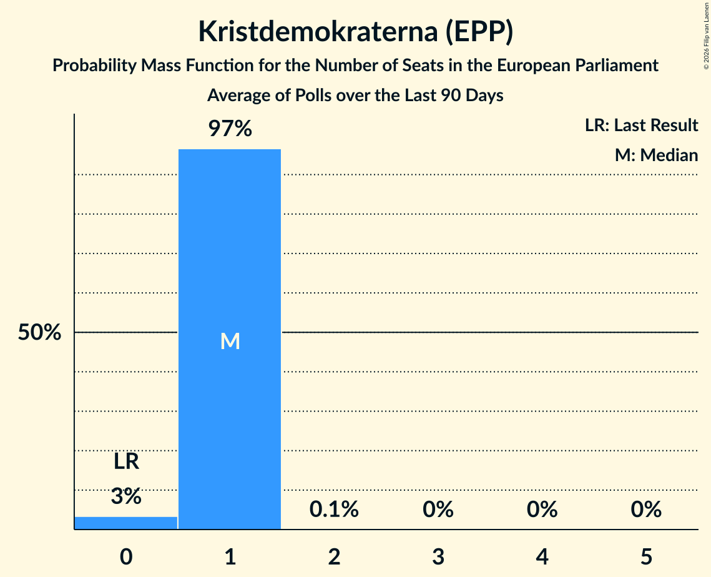

# Kristdemokraterna (EPP)

<a href="#voting-intentions">Voting Intentions</a> | <a href="#seats">Seats</a>

## Voting Intentions

Last result: **0.0%** (General Election of 9 June 2024)

### Confidence Intervals

| Period     | Polling firm/Commissioner(s) | Median | 80% Confidence Interval | 90% Confidence Interval | 95% Confidence Interval | 99% Confidence Interval |
|:----------:|:----------------:|:-----------:|:-----------------------:|:-----------------------:|:-----------------------:|:-----------------------:|
| N/A | [Poll Average](average.html) | 4.8% | 3.6–5.6% | 3.4–5.9% | 3.3–6.0% | 3.0–6.4% |
| [10–22 March 2026](2026-03-22-Ipsos.html) | Ipsos   Dagens Nyheter | 4.0% | 3.5–4.7% | 3.3–4.9% | 3.2–5.1% | 3.0–5.4% |
| [10–19 March 2026](2026-03-19-Demoskop.html) | Demoskop   Aftonbladet and Svenska Dagbladet | 5.0% | 4.4–5.8% | 4.2–6.0% | 4.0–6.2% | 3.8–6.6% |
| [14–18 March 2026](2026-03-18-Novus.html) | Novus   Göteborgs-Posten and TV4 | 5.1% | 4.6–5.8% | 4.4–6.0% | 4.3–6.1% | 4.0–6.5% |
| [23 February–8 March 2026](2026-03-08-Verian.html) | Verian   SVT | 5.3% | 4.8–5.9% | 4.7–6.0% | 4.6–6.1% | 4.4–6.4% |
| [10–24 February 2026](2026-02-24-Demoskop.html) | Demoskop   Aftonbladet and Svenska Dagbladet | 5.3% | 4.6–6.1% | 4.4–6.3% | 4.3–6.5% | 4.0–6.9% |
| [10–23 February 2026](2026-02-23-Ipsos.html) | Ipsos   Dagens Nyheter | 4.0% | 3.5–4.7% | 3.3–4.8% | 3.2–5.0% | 3.0–5.3% |
| [2–23 February 2026](2026-02-23-Indikator.html) | Indikator   Sveriges Radio | 3.8% | 3.3–4.5% | 3.1–4.6% | 3.0–4.8% | 2.8–5.2% |
| [2–15 February 2026](2026-02-15-Novus.html) | Novus   Göteborgs-Posten and TV4 | 3.8% | 3.4–4.3% | 3.2–4.5% | 3.1–4.6% | 2.9–4.9% |
| [26 January–8 February 2026](2026-02-08-Verian.html) | Verian   SVT | 5.6% | 5.1–6.2% | 5.0–6.3% | 4.9–6.5% | 4.6–6.7% |
| [20–29 January 2026](2026-01-29-Ipsos.html) | Ipsos   Dagens Nyheter | 4.0% | 3.5–4.7% | 3.3–4.8% | 3.2–5.0% | 3.0–5.3% |
| [16–26 January 2026](2026-01-26-Demoskop.html) | Demoskop   Aftonbladet and Svenska Dagbladet | 5.4% | 4.8–6.1% | 4.6–6.3% | 4.5–6.4% | 4.2–6.8% |
| [11–25 January 2026](2026-01-25-Indikator.html) | Indikator   Sveriges Radio | 3.9% | 3.6–4.3% | 3.4–4.4% | 3.4–4.5% | 3.2–4.7% |
| [7–18 January 2026](2026-01-18-Novus.html) | Novus   Göteborgs-Posten and TV4 | 4.3% | 3.8–4.9% | 3.7–5.0% | 3.6–5.2% | 3.4–5.4% |
| [29 December 2025–11 January 2026](2026-01-11-Verian.html) | Verian   SVT | 4.3% | 3.9–4.8% | 3.7–5.0% | 3.6–5.1% | 3.4–5.3% |
| [3–29 December 2025](2025-12-29-Indikator.html) | Indikator   Sveriges Radio | 3.9% | 3.4–4.4% | 3.3–4.6% | 3.2–4.7% | 3.0–4.9% |
| [7–16 December 2025](2025-12-16-Demoskop.html) | Demoskop   Aftonbladet and Svenska Dagbladet | 4.8% | 4.3–5.5% | 4.1–5.6% | 4.0–5.8% | 3.7–6.1% |
| [1–14 December 2025](2025-12-14-Novus.html) | Novus   TV4 | 3.9% | 3.5–4.5% | 3.3–4.6% | 3.2–4.8% | 3.0–5.0% |
| [2–14 December 2025](2025-12-14-Ipsos.html) | Ipsos   Dagens Nyheter | 4.0% | 3.4–4.6% | 3.3–4.8% | 3.2–5.0% | 2.9–5.3% |
| [24 November–7 December 2025](2025-12-07-Verian.html) | Verian   SVT | 5.0% | 4.5–5.5% | 4.4–5.7% | 4.3–5.9% | 4.1–6.1% |
| [5–24 November 2025](2025-11-24-Indikator.html) | Indikator   Sveriges Radio | 5.4% | 4.8–6.2% | 4.6–6.4% | 4.5–6.6% | 4.2–6.9% |
| [15–24 November 2025](2025-11-24-Demoskop.html) | Demoskop   Aftonbladet and Svenska Dagbladet | 4.7% | 4.1–5.5% | 3.9–5.7% | 3.8–5.9% | 3.5–6.2% |
| [4–17 November 2025](2025-11-17-Ipsos.html) | Ipsos   Dagens Nyheter | 4.0% | 3.4–4.7% | 3.3–4.8% | 3.2–5.0% | 2.9–5.3% |
| [3–16 November 2025](2025-11-16-Novus.html) | Novus   TV4 | 3.7% | 3.2–4.3% | 3.1–4.4% | 3.0–4.6% | 2.8–4.9% |
| [27 October–9 November 2025](2025-11-09-Verian.html) | Verian   SVT | 4.0% | 3.6–4.5% | 3.5–4.6% | 3.4–4.7% | 3.2–5.0% |
| [2–27 October 2025](2025-10-27-Indikator.html) | Indikator   Sveriges Radio | 4.3% | 3.8–5.0% | 3.6–5.1% | 3.5–5.3% | 3.3–5.6% |
| [18–27 October 2025](2025-10-27-Demoskop.html) | Demoskop   Aftonbladet and Svenska Dagbladet | 4.1% | 3.6–4.8% | 3.4–4.9% | 3.3–5.1% | 3.1–5.4% |
| [6–19 October 2025](2025-10-19-Novus.html) | Novus   TV4 | 4.0% | 3.5–4.6% | 3.4–4.7% | 3.3–4.9% | 3.1–5.2% |
| [7–19 October 2025](2025-10-19-Ipsos.html) | Ipsos   Dagens Nyheter | 4.0% | 3.5–4.7% | 3.3–4.9% | 3.2–5.0% | 3.0–5.4% |
| [22 September–5 October 2025](2025-10-05-Verian.html) | Verian   SVT | 4.2% | 3.8–4.7% | 3.7–4.8% | 3.6–5.0% | 3.4–5.2% |
| [11–22 September 2025](2025-09-22-Demoskop.html) | Demoskop   Aftonbladet and Svenska Dagbladet | 4.9% | 4.3–5.6% | 4.2–5.8% | 4.1–5.9% | 3.8–6.2% |
| [9–21 September 2025](2025-09-21-Ipsos.html) | Ipsos   Dagens Nyheter | 4.0% | 3.3–4.9% | 3.1–5.2% | 2.9–5.4% | 2.6–5.9% |
| [8–19 September 2025](2025-09-19-Novus.html) | Novus   Göteborgs-Posten | 3.1% | 2.7–3.6% | 2.5–3.8% | 2.4–3.9% | 2.3–4.2% |
| [18 August–8 September 2025](2025-09-08-Indikator.html) | Indikator   Sveriges Radio | 3.2% | 2.8–3.8% | 2.6–3.9% | 2.5–4.1% | 2.3–4.3% |
| [25 August–7 September 2025](2025-09-07-Verian.html) | Verian   SVT | 4.1% | 3.7–4.6% | 3.6–4.7% | 3.5–4.9% | 3.3–5.1% |
| [14–25 August 2025](2025-08-25-Demoskop.html) | Demoskop   Aftonbladet | 4.3% | 3.8–4.9% | 3.6–5.1% | 3.5–5.3% | 3.3–5.6% |
| [11–24 August 2025](2025-08-24-Novus.html) | Novus   Göteborgs-Posten | 3.9% | 3.4–4.5% | 3.3–4.6% | 3.2–4.8% | 2.9–5.1% |
| [12–24 August 2025](2025-08-24-Ipsos.html) | Ipsos   Dagens Nyheter | 5.0% | 4.4–5.8% | 4.2–6.0% | 4.1–6.2% | 3.8–6.6% |
| [4–17 August 2025](2025-08-17-Verian.html) | Verian   SVT | 3.5% | 3.1–3.9% | 3.0–4.1% | 2.9–4.2% | 2.7–4.4% |
| [4–24 June 2025](2025-06-24-Indikator.html) | Indikator   Sveriges Radio | 3.8% | 3.3–4.4% | 3.1–4.6% | 3.0–4.8% | 2.8–5.1% |
| [3–15 June 2025](2025-06-15-Ipsos.html) | Ipsos   Dagens Nyheter | 4.0% | 3.4–4.7% | 3.3–4.9% | 3.1–5.1% | 2.9–5.4% |
| [1–15 June 2025](2025-06-15-Demoskop.html) | Demoskop   Aftonbladet and Svenska Dagbladet | 4.4% | 3.9–5.0% | 3.7–5.2% | 3.6–5.4% | 3.4–5.7% |
| [1–13 June 2025](2025-06-13-Novus.html) | Novus   Göteborgs-Posten | 3.8% | 3.3–4.4% | 3.1–4.6% | 3.0–4.7% | 2.8–5.1% |
| [26 May–8 June 2025](2025-06-08-Verian.html) | Verian   SVT | 3.7% | 3.3–4.2% | 3.2–4.3% | 3.1–4.4% | 2.9–4.7% |
| [29 April–28 May 2025](2025-05-28-SCB.html) | SCB | 3.4% | 3.2–3.7% | 3.1–3.7% | 3.0–3.8% | 2.9–3.9% |
| [12–26 May 2025](2025-05-26-Demoskop.html) | Demoskop   Aftonbladet and Svenska Dagbladet | 4.3% | 3.8–4.9% | 3.7–5.0% | 3.6–5.2% | 3.4–5.4% |
| [2–25 May 2025](2025-05-25-Indikator.html) | Indikator   Sveriges Radio | 3.3% | 2.9–3.8% | 2.8–3.9% | 2.7–4.0% | 2.5–4.3% |
| [5–18 May 2025](2025-05-18-Novus.html) | Novus   TV4 | 2.9% | 2.5–3.4% | 2.3–3.6% | 2.2–3.7% | 2.0–4.0% |
| [21 April–4 May 2025](2025-05-04-Verian.html) | Verian   SVT | 4.4% | 3.9–4.9% | 3.8–5.0% | 3.7–5.2% | 3.5–5.4% |
| [11–28 April 2025](2025-04-28-Indikator.html) | Indikator   Sveriges Radio | 3.0% | 2.6–3.4% | 2.5–3.6% | 2.4–3.7% | 2.3–3.9% |
| [10–22 April 2025](2025-04-22-Demoskop.html) | Demoskop   Svenska Dagbladet | 3.9% | 3.4–4.5% | 3.3–4.6% | 3.2–4.7% | 3.0–5.0% |
| [7–21 April 2025](2025-04-21-Novus.html) | Novus   TV4 | 3.2% | 2.8–3.8% | 2.6–3.9% | 2.5–4.1% | 2.3–4.3% |
| [8–21 April 2025](2025-04-21-Ipsos.html) | Ipsos   Dagens Nyheter | 3.0% | 2.5–3.6% | 2.4–3.8% | 2.3–4.0% | 2.1–4.3% |
| [24 March–6 April 2025](2025-04-06-Verian.html) | Verian   SVT | 3.4% | 3.0–3.9% | 2.9–4.0% | 2.8–4.1% | 2.7–4.3% |
| [13–24 March 2025](2025-03-24-Demoskop.html) | Demoskop   Aftonbladet and Svenska Dagbladet | 4.6% | 4.1–5.2% | 3.9–5.4% | 3.8–5.5% | 3.6–5.8% |
| [7–21 March 2025](2025-03-21-Novus.html) | Novus | 3.2% | 2.8–3.7% | 2.7–3.9% | 2.6–4.0% | 2.4–4.3% |
| [4–16 March 2025](2025-03-16-Ipsos.html) | Ipsos   Dagens Nyheter | 3.0% | 2.5–3.6% | 2.4–3.8% | 2.3–3.9% | 2.1–4.2% |
| [24 February–9 March 2025](2025-03-09-Verian.html) | Verian   SVT | 4.4% | 4.0–4.9% | 3.8–5.0% | 3.7–5.2% | 3.5–5.4% |
| [3–25 February 2025](2025-02-25-Indikator.html) | Indikator   Sveriges Radio | 2.7% | 2.4–3.1% | 2.3–3.2% | 2.2–3.4% | 2.0–3.6% |
| [9–24 February 2025](2025-02-24-Demoskop.html) | Demoskop   Aftonbladet and Svenska Dagbladet | 4.0% | 3.5–4.6% | 3.4–4.7% | 3.3–4.8% | 3.1–5.1% |
| [10–21 February 2025](2025-02-21-Novus.html) | Novus   Göteborgs-Posten and TV4 | 3.0% | 2.6–3.6% | 2.5–3.7% | 2.3–3.8% | 2.2–4.1% |
| [27 January–9 February 2025](2025-02-09-Verian.html) | Verian   SVT | 4.1% | 3.7–4.6% | 3.6–4.7% | 3.5–4.9% | 3.3–5.1% |
| [13 January–2 February 2025](2025-02-02-Indikator.html) | Indikator   Sveriges Radio | 3.1% | 2.7–3.6% | 2.6–3.7% | 2.5–3.8% | 2.3–4.0% |
| [10–27 January 2025](2025-01-27-Demoskop.html) | Demoskop   Svenska Dagbladet | 3.8% | 3.4–4.3% | 3.2–4.5% | 3.1–4.6% | 2.9–4.9% |
| [14–26 January 2025](2025-01-26-Ipsos.html) | Ipsos   Dagens Nyheter | 3.0% | 2.4–3.8% | 2.2–4.0% | 2.1–4.3% | 1.8–4.7% |
| [13–24 January 2025](2025-01-24-Novus.html) | Novus   Göteborgs-Posten | 2.6% | 2.2–3.1% | 2.1–3.2% | 2.0–3.3% | 1.8–3.6% |
| [30 December 2024–12 January 2025](2025-01-12-Verian.html) | Verian   SVT | 4.0% | 3.6–4.5% | 3.5–4.6% | 3.4–4.7% | 3.2–5.0% |
| [5 December 2024–6 January 2025](2025-01-06-Indikator.html) | Indikator   Sveriges Radio | 3.2% | 2.8–3.8% | 2.6–3.9% | 2.5–4.1% | 2.3–4.4% |
| [2–16 December 2024](2024-12-16-Ipsos.html) | Ipsos   Dagens Nyheter | 3.0% | 2.5–3.6% | 2.4–3.8% | 2.3–3.9% | 2.0–4.2% |
| [23 November–9 December 2024](2024-12-09-Demoskop.html) | Demoskop   Svenska Dagbladet | 3.5% | 3.1–4.0% | 2.9–4.2% | 2.8–4.3% | 2.6–4.6% |
| [25 November–8 December 2024](2024-12-08-Verian.html) | Verian   SVT | 3.8% | 3.4–4.3% | 3.3–4.4% | 3.2–4.5% | 3.0–4.8% |
| [5–18 November 2024](2024-11-18-Ipsos.html) | Ipsos   Dagens Nyheter | 4.0% | 3.5–4.7% | 3.3–4.9% | 3.2–5.1% | 2.9–5.5% |
| [26 October–11 November 2024](2024-11-11-Demoskop.html) | Demoskop   Aftonbladet and Svenska Dagbladet | 4.0% | 3.5–4.5% | 3.4–4.7% | 3.3–4.8% | 3.1–5.1% |
| [28 October–10 November 2024](2024-11-10-Verian.html) | Verian   SVT | 4.1% | 3.7–4.6% | 3.6–4.8% | 3.4–4.9% | 3.2–5.1% |
| [7–29 October 2024](2024-10-29-Indikator.html) | Indikator   Sveriges Radio | 3.5% | 3.2–3.8% | 3.1–3.9% | 3.1–4.0% | 3.0–4.1% |
| [9–20 October 2024](2024-10-20-Novus.html) | Novus   Göteborgs-Posten | 3.7% | 3.2–4.3% | 3.1–4.4% | 3.0–4.6% | 2.7–4.9% |
| [7–20 October 2024](2024-10-20-Ipsos.html) | Ipsos   Dagens Nyheter | 4.0% | 3.3–4.9% | 3.1–5.2% | 2.9–5.4% | 2.6–5.9% |
| [22 September–8 October 2024](2024-10-08-Demoskop.html) | Demoskop   Svenska Dagbladet | 3.3% | 2.9–3.8% | 2.8–3.9% | 2.7–4.0% | 2.5–4.3% |
| [23 September–6 October 2024](2024-10-06-Verian.html) | Verian   SVT | 4.2% | 3.8–4.7% | 3.6–4.9% | 3.5–5.0% | 3.3–5.2% |
| [26 August–22 September 2024](2024-09-22-Indikator.html) | Indikator   Sveriges Radio | 3.5% | 3.1–4.0% | 2.9–4.2% | 2.9–4.3% | 2.7–4.6% |
| [26 August–8 September 2024](2024-09-08-Verian.html) | Verian   SVT | 3.2% | 2.8–3.7% | 2.7–3.8% | 2.7–3.9% | 2.5–4.1% |
| [29 July–11 August 2024](2024-08-11-Verian.html) | Verian   SVT | 3.6% | 3.2–4.1% | 3.1–4.2% | 3.0–4.3% | 2.8–4.5% |
| [5–26 June 2024](2024-06-26-Indikator.html) | Indikator   Sveriges Radio | 3.7% | 3.2–4.3% | 3.1–4.5% | 3.0–4.6% | 2.8–4.9% |
| [3–16 June 2024](2024-06-16-Verian.html) | Verian   SVT | 4.6% | 4.2–5.1% | 4.0–5.3% | 3.9–5.4% | 3.7–5.7% |
| [2–11 June 2024](2024-06-11-Demoskop.html) | Demoskop   Aftonbladet and Svenska Dagbladet | 3.4% | 3.0–3.9% | 2.9–4.1% | 2.8–4.2% | 2.6–4.4% |

### Probability Mass Function

The following table shows the probability mass function per percentage block of voting intentions for the [poll average](average.html) for Kristdemokraterna (EPP).

| Voting Intentions | Probability | Accumulated | Special Marks |
|:-----------------:|:-----------:|:-----------:|:-------------:|
| 0.0–0.5% | 0% | 100% | Last Result |
| 0.5–1.5% | 0% | 100% |  |
| 1.5–2.5% | 0% | 100% |  |
| 2.5–3.5% | 8% | 100% |  |
| 3.5–4.5% | 33% | 92% |  |
| 4.5–5.5% | 45% | 59% | Median |
| 5.5–6.5% | 13% | 14% |  |
| 6.5–7.5% | 0.2% | 0.2% |  |
| 7.5–8.5% | 0% | 0% |  |

## Seats

Last result: **0** seats (General Election of 9 June 2024)

### Confidence Intervals

| Period     | Polling firm/Commissioner(s) | Median | 80% Confidence Interval | 90% Confidence Interval | 95% Confidence Interval | 99% Confidence Interval |
|:----------:|:----------------:|:------:|:-----------------------:|:-----------------------:|:-----------------------:|:-----------------------:|
| N/A | [Poll Average](average.html) | 1 | 0–1 | 0–1 | 0–1 | 0–1 |
| [10–22 March 2026](2026-03-22-Ipsos.html) | Ipsos   Dagens Nyheter | 1 | 0–1 | 0–1 | 0–1 | 0–1 |
| [10–19 March 2026](2026-03-19-Demoskop.html) | Demoskop   Aftonbladet and Svenska Dagbladet | 1 | 1 | 1 | 1 | 0–1 |
| [14–18 March 2026](2026-03-18-Novus.html) | Novus   Göteborgs-Posten and TV4 | 1 | 1 | 1 | 1 | 1 |
| [23 February–8 March 2026](2026-03-08-Verian.html) | Verian   SVT | 1 | 1 | 1 | 1 | 1 |
| [10–24 February 2026](2026-02-24-Demoskop.html) | Demoskop   Aftonbladet and Svenska Dagbladet | 1 | 1 | 1 | 1 | 0–2 |
| [10–23 February 2026](2026-02-23-Ipsos.html) | Ipsos   Dagens Nyheter | 1 | 0–1 | 0–1 | 0–1 | 0–1 |
| [2–23 February 2026](2026-02-23-Indikator.html) | Indikator   Sveriges Radio | 0 | 0–1 | 0–1 | 0–1 | 0–1 |
| [2–15 February 2026](2026-02-15-Novus.html) | Novus   Göteborgs-Posten and TV4 | 0 | 0–1 | 0–1 | 0–1 | 0–1 |
| [26 January–8 February 2026](2026-02-08-Verian.html) | Verian   SVT | 1 | 1 | 1 | 1 | 1 |
| [20–29 January 2026](2026-01-29-Ipsos.html) | Ipsos   Dagens Nyheter | 1 | 0–1 | 0–1 | 0–1 | 0–1 |
| [16–26 January 2026](2026-01-26-Demoskop.html) | Demoskop   Aftonbladet and Svenska Dagbladet | 1 | 1 | 1 | 1 | 1–2 |
| [11–25 January 2026](2026-01-25-Indikator.html) | Indikator   Sveriges Radio | 0 | 0–1 | 0–1 | 0–1 | 0–1 |
| [7–18 January 2026](2026-01-18-Novus.html) | Novus   Göteborgs-Posten and TV4 | 1 | 0–1 | 0–1 | 0–1 | 0–1 |
| [29 December 2025–11 January 2026](2026-01-11-Verian.html) | Verian   SVT | 1 | 0–1 | 0–1 | 0–1 | 0–1 |
| [3–29 December 2025](2025-12-29-Indikator.html) | Indikator   Sveriges Radio | 0 | 0–1 | 0–1 | 0–1 | 0–1 |
| [7–16 December 2025](2025-12-16-Demoskop.html) | Demoskop   Aftonbladet and Svenska Dagbladet | 1 | 1 | 1 | 0–1 | 0–1 |
| [1–14 December 2025](2025-12-14-Novus.html) | Novus   TV4 | 0 | 0–1 | 0–1 | 0–1 | 0–1 |
| [2–14 December 2025](2025-12-14-Ipsos.html) | Ipsos   Dagens Nyheter | 0 | 0–1 | 0–1 | 0–1 | 0–1 |
| [24 November–7 December 2025](2025-12-07-Verian.html) | Verian   SVT | 1 | 1 | 1 | 1 | 1 |
| [5–24 November 2025](2025-11-24-Indikator.html) | Indikator   Sveriges Radio | 1 | 1 | 1 | 1 | 1–2 |
| [15–24 November 2025](2025-11-24-Demoskop.html) | Demoskop   Aftonbladet and Svenska Dagbladet | 1 | 1 | 0–1 | 0–1 | 0–1 |
| [4–17 November 2025](2025-11-17-Ipsos.html) | Ipsos   Dagens Nyheter | 0 | 0–1 | 0–1 | 0–1 | 0–1 |
| [3–16 November 2025](2025-11-16-Novus.html) | Novus   TV4 | 0 | 0–1 | 0–1 | 0–1 | 0–1 |
| [27 October–9 November 2025](2025-11-09-Verian.html) | Verian   SVT | 1 | 0–1 | 0–1 | 0–1 | 0–1 |
| [2–27 October 2025](2025-10-27-Indikator.html) | Indikator   Sveriges Radio | 1 | 0–1 | 0–1 | 0–1 | 0–1 |
| [18–27 October 2025](2025-10-27-Demoskop.html) | Demoskop   Aftonbladet and Svenska Dagbladet | 1 | 0–1 | 0–1 | 0–1 | 0–1 |
| [6–19 October 2025](2025-10-19-Novus.html) | Novus   TV4 | 1 | 0–1 | 0–1 | 0–1 | 0–1 |
| [7–19 October 2025](2025-10-19-Ipsos.html) | Ipsos   Dagens Nyheter | 1 | 0–1 | 0–1 | 0–1 | 0–1 |
| [22 September–5 October 2025](2025-10-05-Verian.html) | Verian   SVT | 1 | 0–1 | 0–1 | 0–1 | 0–1 |
| [11–22 September 2025](2025-09-22-Demoskop.html) | Demoskop   Aftonbladet and Svenska Dagbladet | 1 | 1 | 1 | 1 | 0–1 |
| [9–21 September 2025](2025-09-21-Ipsos.html) | Ipsos   Dagens Nyheter | 1 | 0–1 | 0–1 | 0–1 | 0–1 |
| [8–19 September 2025](2025-09-19-Novus.html) | Novus   Göteborgs-Posten | 0 | 0 | 0 | 0 | 0–1 |
| [18 August–8 September 2025](2025-09-08-Indikator.html) | Indikator   Sveriges Radio | 0 | 0 | 0 | 0–1 | 0–1 |
| [25 August–7 September 2025](2025-09-07-Verian.html) | Verian   SVT | 1 | 0–1 | 0–1 | 0–1 | 0–1 |
| [14–25 August 2025](2025-08-25-Demoskop.html) | Demoskop   Aftonbladet | 1 | 0–1 | 0–1 | 0–1 | 0–1 |
| [11–24 August 2025](2025-08-24-Novus.html) | Novus   Göteborgs-Posten | 0 | 0–1 | 0–1 | 0–1 | 0–1 |
| [12–24 August 2025](2025-08-24-Ipsos.html) | Ipsos   Dagens Nyheter | 1 | 1 | 1 | 1 | 0–1 |
| [4–17 August 2025](2025-08-17-Verian.html) | Verian   SVT | 0 | 0 | 0–1 | 0–1 | 0–1 |
| [4–24 June 2025](2025-06-24-Indikator.html) | Indikator   Sveriges Radio | 0 | 0–1 | 0–1 | 0–1 | 0–1 |
| [3–15 June 2025](2025-06-15-Ipsos.html) | Ipsos   Dagens Nyheter | 1 | 0–1 | 0–1 | 0–1 | 0–1 |
| [1–15 June 2025](2025-06-15-Demoskop.html) | Demoskop   Aftonbladet and Svenska Dagbladet | 1 | 0–1 | 0–1 | 0–1 | 0–1 |
| [1–13 June 2025](2025-06-13-Novus.html) | Novus   Göteborgs-Posten | 0 | 0–1 | 0–1 | 0–1 | 0–1 |
| [26 May–8 June 2025](2025-06-08-Verian.html) | Verian   SVT | 0 | 0–1 | 0–1 | 0–1 | 0–1 |
| [29 April–28 May 2025](2025-05-28-SCB.html) | SCB | 0 | 0 | 0 | 0 | 0 |
| [12–26 May 2025](2025-05-26-Demoskop.html) | Demoskop   Aftonbladet and Svenska Dagbladet | 1 | 0–1 | 0–1 | 0–1 | 0–1 |
| [2–25 May 2025](2025-05-25-Indikator.html) | Indikator   Sveriges Radio | 0 | 0 | 0 | 0–1 | 0–1 |
| [5–18 May 2025](2025-05-18-Novus.html) | Novus   TV4 | 0 | 0 | 0 | 0 | 0 |
| [21 April–4 May 2025](2025-05-04-Verian.html) | Verian   SVT | 1 | 0–1 | 0–1 | 0–1 | 0–1 |
| [11–28 April 2025](2025-04-28-Indikator.html) | Indikator   Sveriges Radio | 0 | 0 | 0 | 0 | 0 |
| [10–22 April 2025](2025-04-22-Demoskop.html) | Demoskop   Svenska Dagbladet | 0 | 0–1 | 0–1 | 0–1 | 0–1 |
| [7–21 April 2025](2025-04-21-Novus.html) | Novus   TV4 | 0 | 0 | 0 | 0 | 0–1 |
| [8–21 April 2025](2025-04-21-Ipsos.html) | Ipsos   Dagens Nyheter | 0 | 0 | 0 | 0 | 0–1 |
| [24 March–6 April 2025](2025-04-06-Verian.html) | Verian   SVT | 0 | 0 | 0 | 0–1 | 0–1 |
| [13–24 March 2025](2025-03-24-Demoskop.html) | Demoskop   Aftonbladet and Svenska Dagbladet | 1 | 1 | 0–1 | 0–1 | 0–1 |
| [7–21 March 2025](2025-03-21-Novus.html) | Novus | 0 | 0 | 0 | 0 | 0–1 |
| [4–16 March 2025](2025-03-16-Ipsos.html) | Ipsos   Dagens Nyheter | 0 | 0 | 0 | 0 | 0–1 |
| [24 February–9 March 2025](2025-03-09-Verian.html) | Verian   SVT | 1 | 0–1 | 0–1 | 0–1 | 0–1 |
| [3–25 February 2025](2025-02-25-Indikator.html) | Indikator   Sveriges Radio | 0 | 0 | 0 | 0 | 0 |
| [9–24 February 2025](2025-02-24-Demoskop.html) | Demoskop   Aftonbladet and Svenska Dagbladet | 0 | 0–1 | 0–1 | 0–1 | 0–1 |
| [10–21 February 2025](2025-02-21-Novus.html) | Novus   Göteborgs-Posten and TV4 | 0 | 0 | 0 | 0 | 0–1 |
| [27 January–9 February 2025](2025-02-09-Verian.html) | Verian   SVT | 1 | 0–1 | 0–1 | 0–1 | 0–1 |
| [13 January–2 February 2025](2025-02-02-Indikator.html) | Indikator   Sveriges Radio | 0 | 0 | 0 | 0 | 0–1 |
| [10–27 January 2025](2025-01-27-Demoskop.html) | Demoskop   Svenska Dagbladet | 0 | 0–1 | 0–1 | 0–1 | 0–1 |
| [14–26 January 2025](2025-01-26-Ipsos.html) | Ipsos   Dagens Nyheter | 0 | 0 | 0 | 0–1 | 0–1 |
| [13–24 January 2025](2025-01-24-Novus.html) | Novus   Göteborgs-Posten | 0 | 0 | 0 | 0 | 0 |
| [30 December 2024–12 January 2025](2025-01-12-Verian.html) | Verian   SVT | 1 | 0–1 | 0–1 | 0–1 | 0–1 |
| [5 December 2024–6 January 2025](2025-01-06-Indikator.html) | Indikator   Sveriges Radio | 0 | 0 | 0 | 0–1 | 0–1 |
| [2–16 December 2024](2024-12-16-Ipsos.html) | Ipsos   Dagens Nyheter | 0 | 0 | 0 | 0 | 0–1 |
| [23 November–9 December 2024](2024-12-09-Demoskop.html) | Demoskop   Svenska Dagbladet | 0 | 0–1 | 0–1 | 0–1 | 0–1 |
| [25 November–8 December 2024](2024-12-08-Verian.html) | Verian   SVT | 0 | 0–1 | 0–1 | 0–1 | 0–1 |
| [5–18 November 2024](2024-11-18-Ipsos.html) | Ipsos   Dagens Nyheter | 0 | 0–1 | 0–1 | 0–1 | 0–1 |
| [26 October–11 November 2024](2024-11-11-Demoskop.html) | Demoskop   Aftonbladet and Svenska Dagbladet | 1 | 0–1 | 0–1 | 0–1 | 0–1 |
| [28 October–10 November 2024](2024-11-10-Verian.html) | Verian   SVT | 1 | 0–1 | 0–1 | 0–1 | 0–1 |
| [7–29 October 2024](2024-10-29-Indikator.html) | Indikator   Sveriges Radio | 0 | 0 | 0 | 0 | 0–1 |
| [9–20 October 2024](2024-10-20-Novus.html) | Novus   Göteborgs-Posten | 0 | 0–1 | 0–1 | 0–1 | 0–1 |
| [7–20 October 2024](2024-10-20-Ipsos.html) | Ipsos   Dagens Nyheter | 1 | 0–1 | 0–1 | 0–1 | 0–1 |
| [22 September–8 October 2024](2024-10-08-Demoskop.html) | Demoskop   Svenska Dagbladet | 0 | 0 | 0 | 0–1 | 0–1 |
| [23 September–6 October 2024](2024-10-06-Verian.html) | Verian   SVT | 1 | 0–1 | 0–1 | 0–1 | 0–1 |
| [26 August–22 September 2024](2024-09-22-Indikator.html) | Indikator   Sveriges Radio | 0 | 0–1 | 0–1 | 0–1 | 0–1 |
| [26 August–8 September 2024](2024-09-08-Verian.html) | Verian   SVT | 0 | 0 | 0 | 0 | 0–1 |
| [29 July–11 August 2024](2024-08-11-Verian.html) | Verian   SVT | 0 | 0–1 | 0–1 | 0–1 | 0–1 |
| [5–26 June 2024](2024-06-26-Indikator.html) | Indikator   Sveriges Radio | 0 | 0–1 | 0–1 | 0–1 | 0–1 |
| [3–16 June 2024](2024-06-16-Verian.html) | Verian   SVT | 1 | 1 | 1 | 0–1 | 0–1 |
| [2–11 June 2024](2024-06-11-Demoskop.html) | Demoskop   Aftonbladet and Svenska Dagbladet | 0 | 0 | 0–1 | 0–1 | 0–1 |

### Probability Mass Function

The following table shows the probability mass function per seat for the [poll average](average.html) for Kristdemokraterna (EPP).

| Number of Seats | Probability | Accumulated | Special Marks |
|:---------------:|:-----------:|:-----------:|:-------------:|
| 0 | 22% | 100% | Last Result |
| 1 | 78% | 78% | Median |
| 2 | 0.1% | 0.1% |  |
| 3 | 0% | 0% |  |

