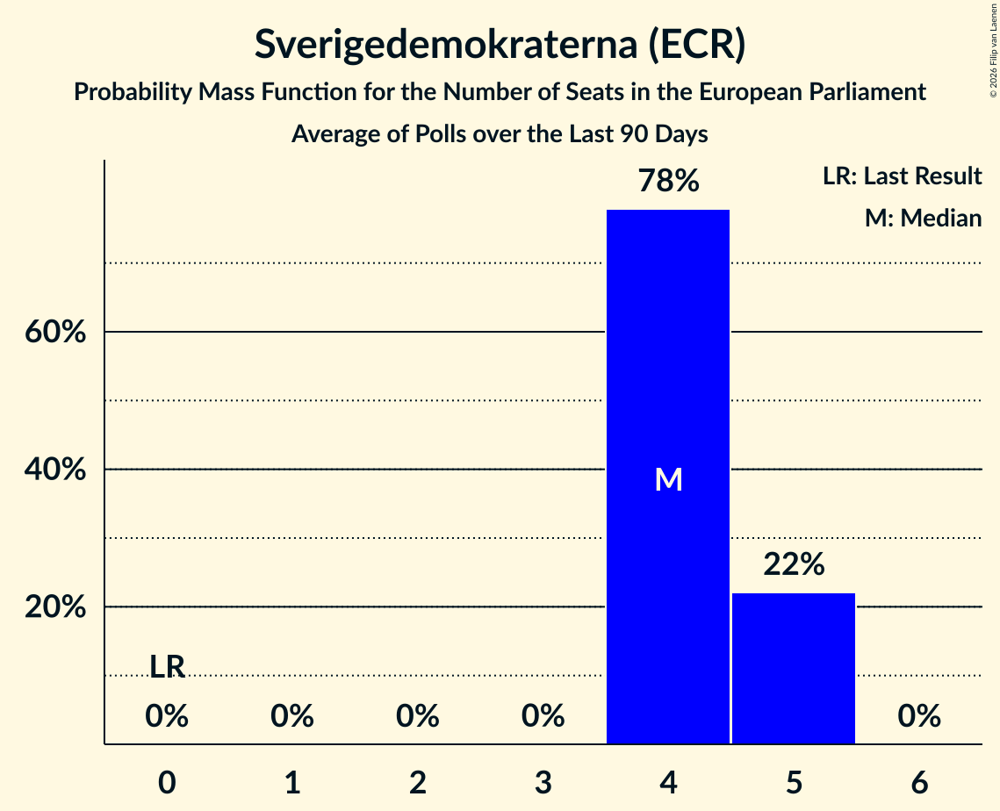

# Sverigedemokraterna (ECR)

<a href="#voting-intentions">Voting Intentions</a> | <a href="#seats">Seats</a>

## Voting Intentions

Last result: **0.0%** (General Election of 9 June 2024)

### Confidence Intervals

| Period     | Polling firm/Commissioner(s) | Median | 80% Confidence Interval | 90% Confidence Interval | 95% Confidence Interval | 99% Confidence Interval |
|:----------:|:----------------:|:-----------:|:-----------------------:|:-----------------------:|:-----------------------:|:-----------------------:|
| N/A | [Poll Average](average.html) | 21.0% | 19.4–23.1% | 19.1–23.5% | 18.8–23.9% | 18.2–24.5% |
| [10–24 February 2026](2026-02-24-Demoskop.html) | Demoskop   Aftonbladet and Svenska Dagbladet | 21.2% | 19.9–22.6% | 19.6–22.9% | 19.3–23.3% | 18.7–23.9% |
| [10–23 February 2026](2026-02-23-Ipsos.html) | Ipsos   Dagens Nyheter | 20.0% | 18.8–21.2% | 18.5–21.6% | 18.2–21.9% | 17.7–22.5% |
| [2–23 February 2026](2026-02-23-Indikator.html) | Indikator   Sveriges Radio | 21.3% | 20.1–22.6% | 19.7–23.0% | 19.4–23.3% | 18.9–23.9% |
| [2–15 February 2026](2026-02-15-Novus.html) | Novus   Göteborgs-Posten and TV4 | 22.9% | 21.9–24.0% | 21.6–24.3% | 21.3–24.5% | 20.9–25.0% |
| [26 January–8 February 2026](2026-02-08-Verian.html) | Verian   SVT | 20.1% | 19.2–21.0% | 19.0–21.3% | 18.7–21.5% | 18.3–22.0% |
| [20–29 January 2026](2026-01-29-Ipsos.html) | Ipsos   Dagens Nyheter | 21.0% | 19.8–22.2% | 19.5–22.6% | 19.2–22.9% | 18.6–23.5% |
| [16–26 January 2026](2026-01-26-Demoskop.html) | Demoskop   Aftonbladet and Svenska Dagbladet | 20.8% | 19.7–22.0% | 19.4–22.3% | 19.1–22.6% | 18.6–23.2% |
| [11–25 January 2026](2026-01-25-Indikator.html) | Indikator   Sveriges Radio | 21.4% | 20.6–22.2% | 20.4–22.5% | 20.2–22.7% | 19.8–23.1% |
| [7–18 January 2026](2026-01-18-Novus.html) | Novus   Göteborgs-Posten and TV4 | 22.5% | 21.5–23.6% | 21.2–23.9% | 20.9–24.2% | 20.5–24.7% |
| [29 December 2025–11 January 2026](2026-01-11-Verian.html) | Verian   SVT | 21.3% | 20.4–22.3% | 20.1–22.6% | 19.9–22.8% | 19.4–23.3% |
| [3–29 December 2025](2025-12-29-Indikator.html) | Indikator   Sveriges Radio | 21.4% | 20.4–22.4% | 20.1–22.7% | 19.9–23.0% | 19.4–23.5% |
| [7–16 December 2025](2025-12-16-Demoskop.html) | Demoskop   Aftonbladet and Svenska Dagbladet | 21.5% | 20.4–22.7% | 20.1–23.0% | 19.8–23.3% | 19.3–23.9% |
| [1–14 December 2025](2025-12-14-Novus.html) | Novus   TV4 | 23.7% | 22.6–24.8% | 22.3–25.1% | 22.1–25.4% | 21.6–25.9% |
| [2–14 December 2025](2025-12-14-Ipsos.html) | Ipsos   Dagens Nyheter | 22.0% | 20.8–23.3% | 20.4–23.6% | 20.1–23.9% | 19.6–24.6% |
| [24 November–7 December 2025](2025-12-07-Verian.html) | Verian   SVT | 20.4% | 19.5–21.4% | 19.2–21.6% | 19.0–21.9% | 18.5–22.4% |
| [5–24 November 2025](2025-11-24-Indikator.html) | Indikator   Sveriges Radio | 20.3% | 19.1–21.6% | 18.8–21.9% | 18.5–22.2% | 18.0–22.8% |
| [15–24 November 2025](2025-11-24-Demoskop.html) | Demoskop   Aftonbladet and Svenska Dagbladet | 21.3% | 20.0–22.7% | 19.7–23.1% | 19.4–23.4% | 18.8–24.1% |
| [4–17 November 2025](2025-11-17-Ipsos.html) | Ipsos   Dagens Nyheter | 21.0% | 19.8–22.3% | 19.5–22.7% | 19.2–23.0% | 18.6–23.6% |
| [3–16 November 2025](2025-11-16-Novus.html) | Novus   TV4 | 21.0% | 19.9–22.1% | 19.6–22.4% | 19.4–22.7% | 18.9–23.3% |
| [27 October–9 November 2025](2025-11-09-Verian.html) | Verian   SVT | 20.0% | 19.1–20.9% | 18.9–21.2% | 18.7–21.4% | 18.2–21.9% |
| [2–27 October 2025](2025-10-27-Indikator.html) | Indikator   Sveriges Radio | 22.9% | 21.7–24.1% | 21.4–24.4% | 21.1–24.8% | 20.6–25.3% |
| [18–27 October 2025](2025-10-27-Demoskop.html) | Demoskop   Aftonbladet and Svenska Dagbladet | 21.6% | 20.5–22.8% | 20.1–23.2% | 19.8–23.5% | 19.3–24.1% |
| [6–19 October 2025](2025-10-19-Novus.html) | Novus   TV4 | 22.6% | 21.6–23.7% | 21.2–24.1% | 21.0–24.3% | 20.5–24.9% |
| [7–19 October 2025](2025-10-19-Ipsos.html) | Ipsos   Dagens Nyheter | 21.0% | 19.8–22.3% | 19.5–22.7% | 19.2–23.0% | 18.6–23.6% |
| [22 September–5 October 2025](2025-10-05-Verian.html) | Verian   SVT | 20.1% | 19.2–21.0% | 19.0–21.3% | 18.8–21.5% | 18.3–22.0% |
| [11–22 September 2025](2025-09-22-Demoskop.html) | Demoskop   Aftonbladet and Svenska Dagbladet | 20.2% | 19.1–21.4% | 18.8–21.7% | 18.5–22.0% | 18.0–22.5% |
| [9–21 September 2025](2025-09-21-Ipsos.html) | Ipsos   Dagens Nyheter | 21.0% | 19.4–22.8% | 19.0–23.2% | 18.6–23.7% | 17.9–24.5% |
| [8–19 September 2025](2025-09-19-Novus.html) | Novus   Göteborgs-Posten | 23.9% | 22.8–25.1% | 22.4–25.4% | 22.1–25.7% | 21.6–26.3% |
| [18 August–8 September 2025](2025-09-08-Indikator.html) | Indikator   Sveriges Radio | 21.0% | 19.9–22.2% | 19.6–22.5% | 19.3–22.8% | 18.8–23.4% |
| [25 August–7 September 2025](2025-09-07-Verian.html) | Verian   SVT | 20.8% | 19.9–21.7% | 19.6–22.0% | 19.4–22.2% | 19.0–22.7% |
| [14–25 August 2025](2025-08-25-Demoskop.html) | Demoskop   Aftonbladet | 20.7% | 19.6–21.9% | 19.3–22.2% | 19.0–22.5% | 18.5–23.1% |
| [11–24 August 2025](2025-08-24-Novus.html) | Novus   Göteborgs-Posten | 21.0% | 19.9–22.2% | 19.6–22.5% | 19.4–22.8% | 18.9–23.3% |
| [12–24 August 2025](2025-08-24-Ipsos.html) | Ipsos   Dagens Nyheter | 20.0% | 18.8–21.3% | 18.4–21.7% | 18.1–22.0% | 17.5–22.7% |
| [4–17 August 2025](2025-08-17-Verian.html) | Verian   SVT | 20.5% | 19.6–21.4% | 19.3–21.7% | 19.1–21.9% | 18.7–22.4% |
| [4–24 June 2025](2025-06-24-Indikator.html) | Indikator   Sveriges Radio | 19.0% | 17.9–20.2% | 17.5–20.6% | 17.3–20.9% | 16.8–21.5% |
| [3–15 June 2025](2025-06-15-Ipsos.html) | Ipsos   Dagens Nyheter | 19.0% | 17.8–20.3% | 17.5–20.7% | 17.2–21.0% | 16.6–21.7% |
| [1–15 June 2025](2025-06-15-Demoskop.html) | Demoskop   Aftonbladet and Svenska Dagbladet | 20.5% | 19.4–21.7% | 19.1–22.0% | 18.9–22.3% | 18.4–22.8% |
| [1–13 June 2025](2025-06-13-Novus.html) | Novus   Göteborgs-Posten | 20.2% | 19.1–21.4% | 18.7–21.8% | 18.5–22.1% | 17.9–22.7% |
| [26 May–8 June 2025](2025-06-08-Verian.html) | Verian   SVT | 19.3% | 18.4–20.2% | 18.2–20.5% | 18.0–20.7% | 17.6–21.2% |
| [29 April–28 May 2025](2025-05-28-SCB.html) | SCB | 18.0% | 17.5–18.5% | 17.3–18.7% | 17.2–18.8% | 17.0–19.1% |
| [12–26 May 2025](2025-05-26-Demoskop.html) | Demoskop   Aftonbladet and Svenska Dagbladet | 19.6% | 18.6–20.6% | 18.4–20.9% | 18.1–21.2% | 17.6–21.7% |
| [2–25 May 2025](2025-05-25-Indikator.html) | Indikator   Sveriges Radio | 20.0% | 19.1–21.0% | 18.8–21.3% | 18.6–21.5% | 18.1–22.0% |
| [5–18 May 2025](2025-05-18-Novus.html) | Novus   TV4 | 20.4% | 19.3–21.6% | 18.9–21.9% | 18.7–22.2% | 18.2–22.8% |
| [21 April–4 May 2025](2025-05-04-Verian.html) | Verian   SVT | 18.9% | 18.0–19.8% | 17.8–20.1% | 17.6–20.3% | 17.2–20.7% |
| [11–28 April 2025](2025-04-28-Indikator.html) | Indikator   Sveriges Radio | 18.2% | 17.3–19.2% | 17.0–19.4% | 16.8–19.7% | 16.4–20.1% |
| [10–22 April 2025](2025-04-22-Demoskop.html) | Demoskop   Svenska Dagbladet | 18.3% | 17.3–19.3% | 17.1–19.6% | 16.8–19.8% | 16.4–20.3% |
| [7–21 April 2025](2025-04-21-Novus.html) | Novus   TV4 | 19.2% | 18.2–20.4% | 17.8–20.7% | 17.6–21.0% | 17.1–21.5% |
| [8–21 April 2025](2025-04-21-Ipsos.html) | Ipsos   Dagens Nyheter | 19.0% | 17.8–20.3% | 17.5–20.7% | 17.2–21.0% | 16.6–21.6% |
| [24 March–6 April 2025](2025-04-06-Verian.html) | Verian   SVT | 18.7% | 17.8–19.6% | 17.6–19.9% | 17.4–20.1% | 17.0–20.5% |
| [13–24 March 2025](2025-03-24-Demoskop.html) | Demoskop   Aftonbladet and Svenska Dagbladet | 19.7% | 18.7–20.8% | 18.4–21.1% | 18.2–21.4% | 17.7–21.9% |
| [7–21 March 2025](2025-03-21-Novus.html) | Novus | 19.4% | 18.4–20.5% | 18.1–20.8% | 17.9–21.1% | 17.4–21.6% |
| [4–16 March 2025](2025-03-16-Ipsos.html) | Ipsos   Dagens Nyheter | 20.0% | 18.8–21.3% | 18.4–21.6% | 18.2–22.0% | 17.6–22.6% |
| [24 February–9 March 2025](2025-03-09-Verian.html) | Verian   SVT | 19.2% | 18.3–20.1% | 18.1–20.4% | 17.9–20.6% | 17.5–21.0% |
| [3–25 February 2025](2025-02-25-Indikator.html) | Indikator   Sveriges Radio | 19.6% | 18.7–20.6% | 18.5–20.8% | 18.2–21.1% | 17.8–21.5% |
| [9–24 February 2025](2025-02-24-Demoskop.html) | Demoskop   Aftonbladet and Svenska Dagbladet | 19.2% | 18.2–20.3% | 17.9–20.5% | 17.7–20.8% | 17.2–21.3% |
| [10–21 February 2025](2025-02-21-Novus.html) | Novus   Göteborgs-Posten and TV4 | 20.5% | 19.4–21.7% | 19.1–22.0% | 18.8–22.3% | 18.3–22.9% |
| [27 January–9 February 2025](2025-02-09-Verian.html) | Verian   SVT | 20.9% | 20.0–21.8% | 19.7–22.1% | 19.5–22.3% | 19.1–22.8% |
| [13 January–2 February 2025](2025-02-02-Indikator.html) | Indikator   Sveriges Radio | 20.1% | 19.2–21.1% | 18.9–21.4% | 18.7–21.6% | 18.2–22.1% |
| [10–27 January 2025](2025-01-27-Demoskop.html) | Demoskop   Svenska Dagbladet | 20.0% | 19.0–21.0% | 18.7–21.3% | 18.5–21.6% | 18.0–22.1% |
| [14–26 January 2025](2025-01-26-Ipsos.html) | Ipsos   Dagens Nyheter | 20.0% | 18.5–21.7% | 18.0–22.2% | 17.7–22.6% | 16.9–23.5% |
| [13–24 January 2025](2025-01-24-Novus.html) | Novus   Göteborgs-Posten | 20.3% | 19.3–21.4% | 19.0–21.7% | 18.7–22.0% | 18.2–22.5% |
| [30 December 2024–12 January 2025](2025-01-12-Verian.html) | Verian   SVT | 20.3% | 19.4–21.2% | 19.1–21.5% | 18.9–21.7% | 18.5–22.2% |
| [5 December 2024–6 January 2025](2025-01-06-Indikator.html) | Indikator   Sveriges Radio | 21.6% | 20.5–22.8% | 20.1–23.2% | 19.9–23.5% | 19.3–24.1% |
| [2–16 December 2024](2024-12-16-Ipsos.html) | Ipsos   Dagens Nyheter | 21.0% | 19.8–22.3% | 19.4–22.7% | 19.1–23.0% | 18.5–23.7% |
| [23 November–9 December 2024](2024-12-09-Demoskop.html) | Demoskop   Svenska Dagbladet | 20.2% | 19.2–21.3% | 18.9–21.6% | 18.7–21.8% | 18.2–22.4% |
| [25 November–8 December 2024](2024-12-08-Verian.html) | Verian   SVT | 19.3% | 18.4–20.2% | 18.2–20.5% | 18.0–20.7% | 17.6–21.2% |
| [5–18 November 2024](2024-11-18-Ipsos.html) | Ipsos   Dagens Nyheter | 21.0% | 19.7–22.3% | 19.4–22.7% | 19.1–23.0% | 18.5–23.7% |
| [26 October–11 November 2024](2024-11-11-Demoskop.html) | Demoskop   Aftonbladet and Svenska Dagbladet | 19.7% | 18.7–20.7% | 18.4–21.0% | 18.2–21.3% | 17.7–21.8% |
| [28 October–10 November 2024](2024-11-10-Verian.html) | Verian   SVT | 18.9% | 18.0–19.8% | 17.8–20.1% | 17.5–20.3% | 17.1–20.8% |
| [7–29 October 2024](2024-10-29-Indikator.html) | Indikator   Sveriges Radio | 20.6% | 20.0–21.2% | 19.8–21.4% | 19.6–21.6% | 19.4–21.9% |
| [9–20 October 2024](2024-10-20-Novus.html) | Novus   Göteborgs-Posten | 20.2% | 19.1–21.4% | 18.8–21.7% | 18.5–22.0% | 18.0–22.5% |
| [7–20 October 2024](2024-10-20-Ipsos.html) | Ipsos   Dagens Nyheter | 19.0% | 17.5–20.7% | 17.1–21.2% | 16.7–21.6% | 16.0–22.4% |
| [22 September–8 October 2024](2024-10-08-Demoskop.html) | Demoskop   Svenska Dagbladet | 19.2% | 18.2–20.2% | 18.0–20.5% | 17.7–20.8% | 17.3–21.2% |
| [23 September–6 October 2024](2024-10-06-Verian.html) | Verian   SVT | 19.2% | 18.3–20.1% | 18.0–20.4% | 17.8–20.7% | 17.4–21.1% |
| [26 August–22 September 2024](2024-09-22-Indikator.html) | Indikator   Sveriges Radio | 19.2% | 18.2–20.2% | 17.9–20.5% | 17.7–20.8% | 17.2–21.3% |
| [26 August–8 September 2024](2024-09-08-Verian.html) | Verian   SVT | 18.7% | 17.8–19.6% | 17.6–19.8% | 17.3–20.1% | 16.9–20.5% |
| [29 July–11 August 2024](2024-08-11-Verian.html) | Verian   SVT | 19.9% | 19.0–20.8% | 18.7–21.1% | 18.5–21.3% | 18.1–21.8% |
| [5–26 June 2024](2024-06-26-Indikator.html) | Indikator   Sveriges Radio | 18.6% | 17.5–19.7% | 17.2–20.0% | 17.0–20.3% | 16.5–20.9% |
| [3–16 June 2024](2024-06-16-Verian.html) | Verian   SVT | 18.9% | 18.0–19.8% | 17.7–20.0% | 17.5–20.3% | 17.1–20.7% |
| [2–11 June 2024](2024-06-11-Demoskop.html) | Demoskop   Aftonbladet and Svenska Dagbladet | 21.3% | 20.3–22.3% | 20.0–22.6% | 19.7–22.9% | 19.3–23.4% |

### Probability Mass Function

The following table shows the probability mass function per percentage block of voting intentions for the [poll average](average.html) for Sverigedemokraterna (ECR).

| Voting Intentions | Probability | Accumulated | Special Marks |
|:-----------------:|:-----------:|:-----------:|:-------------:|
| 0.0–0.5% | 0% | 100% | Last Result |
| 0.5–1.5% | 0% | 100% |  |
| 1.5–2.5% | 0% | 100% |  |
| 2.5–3.5% | 0% | 100% |  |
| 3.5–4.5% | 0% | 100% |  |
| 4.5–5.5% | 0% | 100% |  |
| 5.5–6.5% | 0% | 100% |  |
| 6.5–7.5% | 0% | 100% |  |
| 7.5–8.5% | 0% | 100% |  |
| 8.5–9.5% | 0% | 100% |  |
| 9.5–10.5% | 0% | 100% |  |
| 10.5–11.5% | 0% | 100% |  |
| 11.5–12.5% | 0% | 100% |  |
| 12.5–13.5% | 0% | 100% |  |
| 13.5–14.5% | 0% | 100% |  |
| 14.5–15.5% | 0% | 100% |  |
| 15.5–16.5% | 0% | 100% |  |
| 16.5–17.5% | 0.1% | 100% |  |
| 17.5–18.5% | 1.4% | 99.9% |  |
| 18.5–19.5% | 11% | 98.5% |  |
| 19.5–20.5% | 26% | 88% |  |
| 20.5–21.5% | 25% | 62% | Median |
| 21.5–22.5% | 19% | 36% |  |
| 22.5–23.5% | 13% | 18% |  |
| 23.5–24.5% | 4% | 5% |  |
| 24.5–25.5% | 0.5% | 0.5% |  |
| 25.5–26.5% | 0% | 0% |  |

## Seats

Last result: **0** seats (General Election of 9 June 2024)

### Confidence Intervals

| Period     | Polling firm/Commissioner(s) | Median | 80% Confidence Interval | 90% Confidence Interval | 95% Confidence Interval | 99% Confidence Interval |
|:----------:|:----------------:|:------:|:-----------------------:|:-----------------------:|:-----------------------:|:-----------------------:|
| N/A | [Poll Average](average.html) | 5 | 4–5 | 4–5 | 4–5 | 4–6 |
| [10–24 February 2026](2026-02-24-Demoskop.html) | Demoskop   Aftonbladet and Svenska Dagbladet | 5 | 4–5 | 4–5 | 4–5 | 4–6 |
| [10–23 February 2026](2026-02-23-Ipsos.html) | Ipsos   Dagens Nyheter | 5 | 4–5 | 4–5 | 4–5 | 4–5 |
| [2–23 February 2026](2026-02-23-Indikator.html) | Indikator   Sveriges Radio | 5 | 4–5 | 4–5 | 4–5 | 4–5 |
| [2–15 February 2026](2026-02-15-Novus.html) | Novus   Göteborgs-Posten and TV4 | 5 | 5 | 5 | 5–6 | 5–6 |
| [26 January–8 February 2026](2026-02-08-Verian.html) | Verian   SVT | 4 | 4–5 | 4–5 | 4–5 | 4–5 |
| [20–29 January 2026](2026-01-29-Ipsos.html) | Ipsos   Dagens Nyheter | 5 | 4–5 | 4–5 | 4–5 | 4–5 |
| [16–26 January 2026](2026-01-26-Demoskop.html) | Demoskop   Aftonbladet and Svenska Dagbladet | 5 | 4–5 | 4–5 | 4–5 | 4–5 |
| [11–25 January 2026](2026-01-25-Indikator.html) | Indikator   Sveriges Radio | 5 | 4–5 | 4–5 | 4–5 | 4–5 |
| [7–18 January 2026](2026-01-18-Novus.html) | Novus   Göteborgs-Posten and TV4 | 5 | 5 | 5 | 5 | 4–6 |
| [29 December 2025–11 January 2026](2026-01-11-Verian.html) | Verian   SVT | 5 | 4–5 | 4–5 | 4–5 | 4–5 |
| [3–29 December 2025](2025-12-29-Indikator.html) | Indikator   Sveriges Radio | 5 | 5 | 4–5 | 4–5 | 4–6 |
| [7–16 December 2025](2025-12-16-Demoskop.html) | Demoskop   Aftonbladet and Svenska Dagbladet | 5 | 5 | 4–5 | 4–5 | 4–5 |
| [1–14 December 2025](2025-12-14-Novus.html) | Novus   TV4 | 5 | 5–6 | 5–6 | 5–6 | 5–6 |
| [2–14 December 2025](2025-12-14-Ipsos.html) | Ipsos   Dagens Nyheter | 5 | 5 | 5–6 | 4–6 | 4–6 |
| [24 November–7 December 2025](2025-12-07-Verian.html) | Verian   SVT | 5 | 4–5 | 4–5 | 4–5 | 4–5 |
| [5–24 November 2025](2025-11-24-Indikator.html) | Indikator   Sveriges Radio | 5 | 4–5 | 4–5 | 4–5 | 4–5 |
| [15–24 November 2025](2025-11-24-Demoskop.html) | Demoskop   Aftonbladet and Svenska Dagbladet | 5 | 4–5 | 4–5 | 4–5 | 4–6 |
| [4–17 November 2025](2025-11-17-Ipsos.html) | Ipsos   Dagens Nyheter | 5 | 4–5 | 4–5 | 4–5 | 4–5 |
| [3–16 November 2025](2025-11-16-Novus.html) | Novus   TV4 | 5 | 5 | 4–5 | 4–5 | 4–6 |
| [27 October–9 November 2025](2025-11-09-Verian.html) | Verian   SVT | 4 | 4–5 | 4–5 | 4–5 | 4–5 |
| [2–27 October 2025](2025-10-27-Indikator.html) | Indikator   Sveriges Radio | 5 | 5 | 5–6 | 5–6 | 4–6 |
| [18–27 October 2025](2025-10-27-Demoskop.html) | Demoskop   Aftonbladet and Svenska Dagbladet | 5 | 4–5 | 4–5 | 4–5 | 4–5 |
| [6–19 October 2025](2025-10-19-Novus.html) | Novus   TV4 | 5 | 5 | 5–6 | 5–6 | 4–6 |
| [7–19 October 2025](2025-10-19-Ipsos.html) | Ipsos   Dagens Nyheter | 5 | 4–5 | 4–5 | 4–5 | 4–5 |
| [22 September–5 October 2025](2025-10-05-Verian.html) | Verian   SVT | 4 | 4–5 | 4–5 | 4–5 | 4–5 |
| [11–22 September 2025](2025-09-22-Demoskop.html) | Demoskop   Aftonbladet and Svenska Dagbladet | 5 | 4–5 | 4–5 | 4–5 | 4–5 |
| [9–21 September 2025](2025-09-21-Ipsos.html) | Ipsos   Dagens Nyheter | 5 | 4–5 | 4–5 | 4–6 | 4–6 |
| [8–19 September 2025](2025-09-19-Novus.html) | Novus   Göteborgs-Posten | 6 | 5–6 | 5–6 | 5–6 | 5–6 |
| [18 August–8 September 2025](2025-09-08-Indikator.html) | Indikator   Sveriges Radio | 5 | 4–5 | 4–5 | 4–5 | 4–5 |
| [25 August–7 September 2025](2025-09-07-Verian.html) | Verian   SVT | 5 | 4–5 | 4–5 | 4–5 | 4–5 |
| [14–25 August 2025](2025-08-25-Demoskop.html) | Demoskop   Aftonbladet | 5 | 4–5 | 4–5 | 4–5 | 4–5 |
| [11–24 August 2025](2025-08-24-Novus.html) | Novus   Göteborgs-Posten | 5 | 4–5 | 4–5 | 4–5 | 4–5 |
| [12–24 August 2025](2025-08-24-Ipsos.html) | Ipsos   Dagens Nyheter | 4 | 4–5 | 4–5 | 4–5 | 4–5 |
| [4–17 August 2025](2025-08-17-Verian.html) | Verian   SVT | 5 | 4–5 | 4–5 | 4–5 | 4–5 |
| [4–24 June 2025](2025-06-24-Indikator.html) | Indikator   Sveriges Radio | 4 | 4–5 | 4–5 | 4–5 | 4–5 |
| [3–15 June 2025](2025-06-15-Ipsos.html) | Ipsos   Dagens Nyheter | 4 | 4–5 | 4–5 | 4–5 | 4–5 |
| [1–15 June 2025](2025-06-15-Demoskop.html) | Demoskop   Aftonbladet and Svenska Dagbladet | 5 | 4–5 | 4–5 | 4–5 | 4–5 |
| [1–13 June 2025](2025-06-13-Novus.html) | Novus   Göteborgs-Posten | 5 | 4–5 | 4–5 | 4–5 | 4–5 |
| [26 May–8 June 2025](2025-06-08-Verian.html) | Verian   SVT | 5 | 4–5 | 4–5 | 4–5 | 4–5 |
| [29 April–28 May 2025](2025-05-28-SCB.html) | SCB | 4 | 4 | 4 | 4 | 4 |
| [12–26 May 2025](2025-05-26-Demoskop.html) | Demoskop   Aftonbladet and Svenska Dagbladet | 4 | 4–5 | 4–5 | 4–5 | 4–5 |
| [2–25 May 2025](2025-05-25-Indikator.html) | Indikator   Sveriges Radio | 5 | 4–5 | 4–5 | 4–5 | 4–5 |
| [5–18 May 2025](2025-05-18-Novus.html) | Novus   TV4 | 5 | 4–5 | 4–5 | 4–5 | 4–5 |
| [21 April–4 May 2025](2025-05-04-Verian.html) | Verian   SVT | 4 | 4 | 4–5 | 4–5 | 4–5 |
| [11–28 April 2025](2025-04-28-Indikator.html) | Indikator   Sveriges Radio | 4 | 4 | 4–5 | 4–5 | 4–5 |
| [10–22 April 2025](2025-04-22-Demoskop.html) | Demoskop   Svenska Dagbladet | 4 | 4 | 4 | 4–5 | 4–5 |
| [7–21 April 2025](2025-04-21-Novus.html) | Novus   TV4 | 4 | 4–5 | 4–5 | 4–5 | 4–5 |
| [8–21 April 2025](2025-04-21-Ipsos.html) | Ipsos   Dagens Nyheter | 4 | 4–5 | 4–5 | 4–5 | 4–5 |
| [24 March–6 April 2025](2025-04-06-Verian.html) | Verian   SVT | 4 | 4–5 | 4–5 | 4–5 | 4–5 |
| [13–24 March 2025](2025-03-24-Demoskop.html) | Demoskop   Aftonbladet and Svenska Dagbladet | 4 | 4–5 | 4–5 | 4–5 | 4–5 |
| [7–21 March 2025](2025-03-21-Novus.html) | Novus | 4 | 4–5 | 4–5 | 4–5 | 4–5 |
| [4–16 March 2025](2025-03-16-Ipsos.html) | Ipsos   Dagens Nyheter | 5 | 4–5 | 4–5 | 4–5 | 4–5 |
| [24 February–9 March 2025](2025-03-09-Verian.html) | Verian   SVT | 4 | 4–5 | 4–5 | 4–5 | 4–5 |
| [3–25 February 2025](2025-02-25-Indikator.html) | Indikator   Sveriges Radio | 5 | 4–5 | 4–5 | 4–5 | 4–5 |
| [9–24 February 2025](2025-02-24-Demoskop.html) | Demoskop   Aftonbladet and Svenska Dagbladet | 4 | 4–5 | 4–5 | 4–5 | 4–5 |
| [10–21 February 2025](2025-02-21-Novus.html) | Novus   Göteborgs-Posten and TV4 | 5 | 4–5 | 4–5 | 4–5 | 4–5 |
| [27 January–9 February 2025](2025-02-09-Verian.html) | Verian   SVT | 5 | 4–5 | 4–5 | 4–5 | 4–5 |
| [13 January–2 February 2025](2025-02-02-Indikator.html) | Indikator   Sveriges Radio | 5 | 4–5 | 4–5 | 4–5 | 4–5 |
| [10–27 January 2025](2025-01-27-Demoskop.html) | Demoskop   Svenska Dagbladet | 5 | 4–5 | 4–5 | 4–5 | 4–5 |
| [14–26 January 2025](2025-01-26-Ipsos.html) | Ipsos   Dagens Nyheter | 5 | 4–5 | 4–5 | 4–5 | 4–5 |
| [13–24 January 2025](2025-01-24-Novus.html) | Novus   Göteborgs-Posten | 5 | 4–5 | 4–5 | 4–5 | 4–5 |
| [30 December 2024–12 January 2025](2025-01-12-Verian.html) | Verian   SVT | 5 | 4–5 | 4–5 | 4–5 | 4–5 |
| [5 December 2024–6 January 2025](2025-01-06-Indikator.html) | Indikator   Sveriges Radio | 5 | 5 | 5 | 4–5 | 4–6 |
| [2–16 December 2024](2024-12-16-Ipsos.html) | Ipsos   Dagens Nyheter | 5 | 5 | 4–5 | 4–5 | 4–6 |
| [23 November–9 December 2024](2024-12-09-Demoskop.html) | Demoskop   Svenska Dagbladet | 4 | 4–5 | 4–5 | 4–5 | 4–5 |
| [25 November–8 December 2024](2024-12-08-Verian.html) | Verian   SVT | 4 | 4–5 | 4–5 | 4–5 | 4–5 |
| [5–18 November 2024](2024-11-18-Ipsos.html) | Ipsos   Dagens Nyheter | 5 | 4–5 | 4–5 | 4–5 | 4–5 |
| [26 October–11 November 2024](2024-11-11-Demoskop.html) | Demoskop   Aftonbladet and Svenska Dagbladet | 4 | 4–5 | 4–5 | 4–5 | 4–5 |
| [28 October–10 November 2024](2024-11-10-Verian.html) | Verian   SVT | 4 | 4–5 | 4–5 | 4–5 | 4–5 |
| [7–29 October 2024](2024-10-29-Indikator.html) | Indikator   Sveriges Radio | 5 | 5 | 5 | 5 | 5 |
| [9–20 October 2024](2024-10-20-Novus.html) | Novus   Göteborgs-Posten | 5 | 4–5 | 4–5 | 4–5 | 4–5 |
| [7–20 October 2024](2024-10-20-Ipsos.html) | Ipsos   Dagens Nyheter | 4 | 4–5 | 4–5 | 4–5 | 3–5 |
| [22 September–8 October 2024](2024-10-08-Demoskop.html) | Demoskop   Svenska Dagbladet | 4 | 4–5 | 4–5 | 4–5 | 4–5 |
| [23 September–6 October 2024](2024-10-06-Verian.html) | Verian   SVT | 4 | 4–5 | 4–5 | 4–5 | 4–5 |
| [26 August–22 September 2024](2024-09-22-Indikator.html) | Indikator   Sveriges Radio | 4 | 4–5 | 4–5 | 4–5 | 4–5 |
| [26 August–8 September 2024](2024-09-08-Verian.html) | Verian   SVT | 4 | 4–5 | 4–5 | 4–5 | 4–5 |
| [29 July–11 August 2024](2024-08-11-Verian.html) | Verian   SVT | 5 | 4–5 | 4–5 | 4–5 | 4–5 |
| [5–26 June 2024](2024-06-26-Indikator.html) | Indikator   Sveriges Radio | 4 | 4–5 | 4–5 | 4–5 | 4–5 |
| [3–16 June 2024](2024-06-16-Verian.html) | Verian   SVT | 4 | 4–5 | 4–5 | 4–5 | 4–5 |
| [2–11 June 2024](2024-06-11-Demoskop.html) | Demoskop   Aftonbladet and Svenska Dagbladet | 5 | 5 | 5 | 5 | 4–6 |

### Probability Mass Function

The following table shows the probability mass function per seat for the [poll average](average.html) for Sverigedemokraterna (ECR).

| Number of Seats | Probability | Accumulated | Special Marks |
|:---------------:|:-----------:|:-----------:|:-------------:|
| 0 | 0% | 100% | Last Result |
| 1 | 0% | 100% |  |
| 2 | 0% | 100% |  |
| 3 | 0% | 100% |  |
| 4 | 28% | 100% |  |
| 5 | 71% | 72% | Median |
| 6 | 0.7% | 0.7% |  |
| 7 | 0% | 0% |  |

